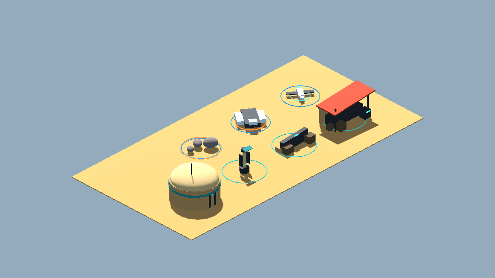
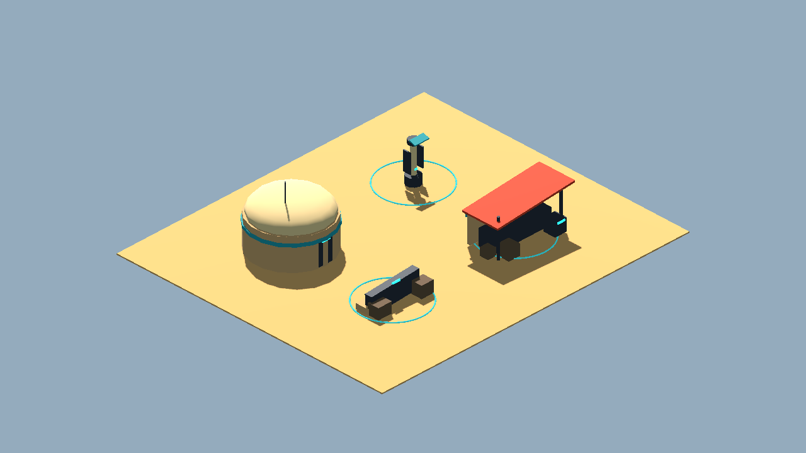
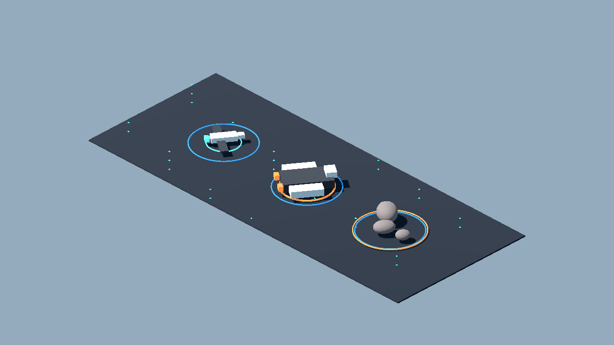
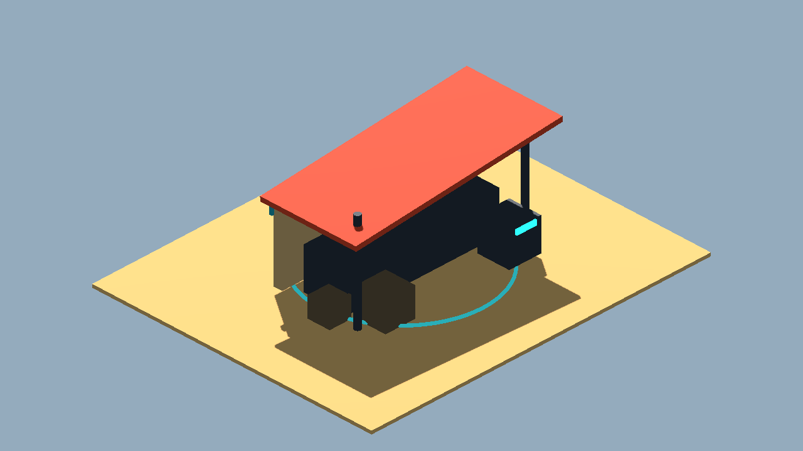
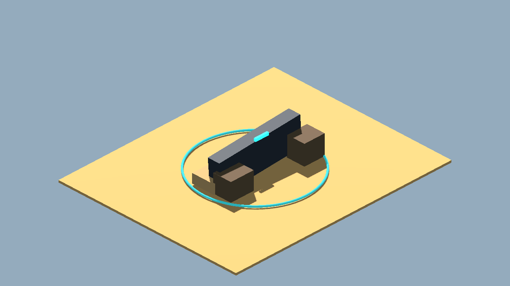
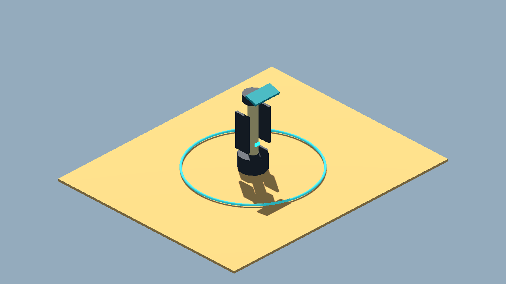
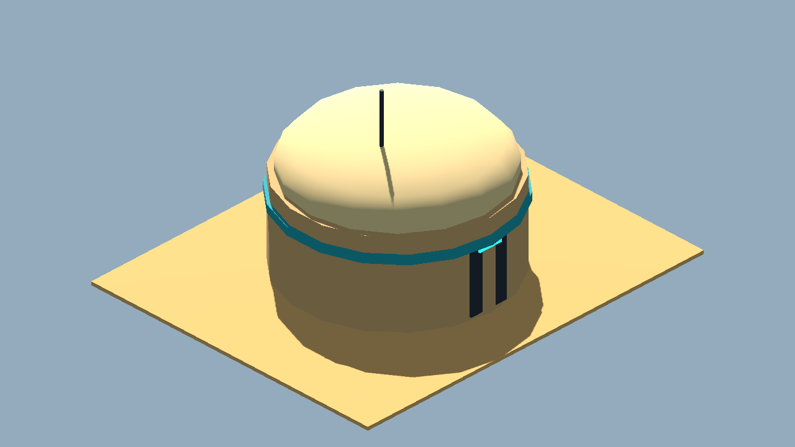
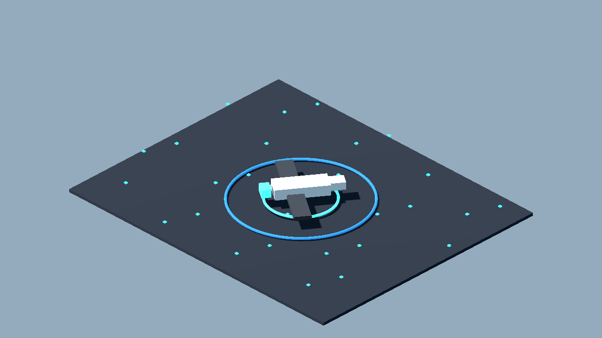
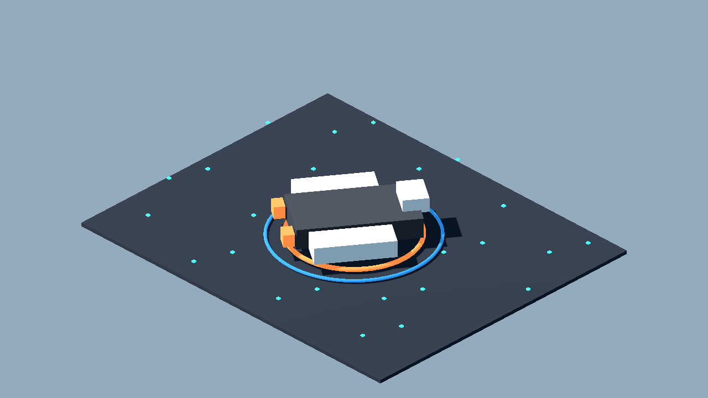
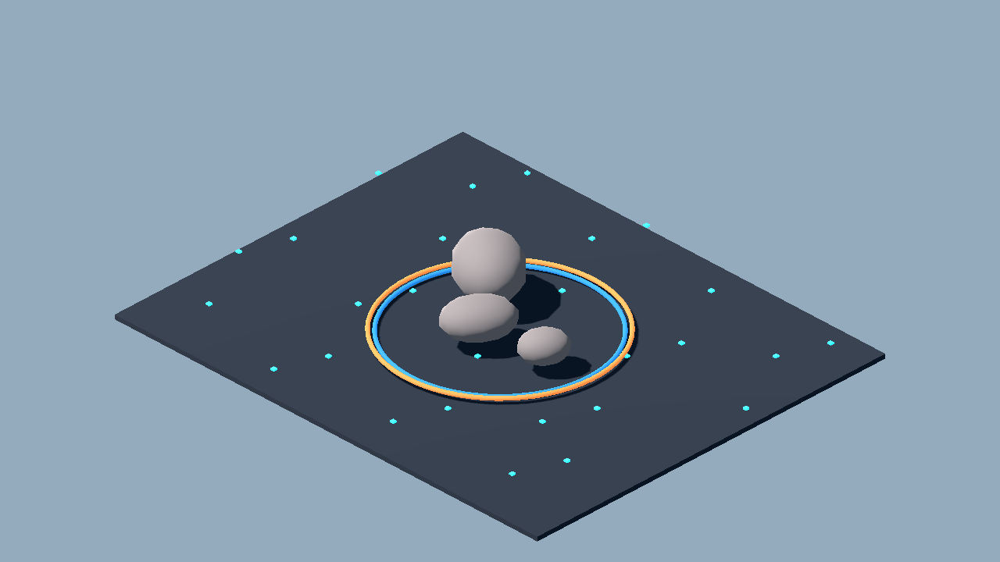

# Asset Factory Review Board

Generated: 2026-07-03  
Generator: `docs/gpt/asset_factory/scripts/godot_asset_factory.gd`  
Spec: `docs/gpt/asset_factory/specs/mos_eisley_chunky_v0.json`

## What This Is

These are Godot-rendered review captures from generated `.tscn` scenes. They are not bitmap source art. The source assets are Godot scene files under `generated/scenes`, and the review/camera scenes are under `generated/review_scenes`.

The point of this pass is to test an automated, low-cost geometry pipeline:

```text
JSON spec -> Godot procedural scene -> review scene -> PNG capture -> owner/Claude decision
```

## Contact Sheets

### All Assets



### Ground Assets



### Isometric Space Assets



The space sheet is the intended 2.5D direction: tactical movement on a flat plane, viewed through an isometric camera. It is not the old flat overlay approach.

## Individual Review Captures

| Asset | Capture |
| --- | --- |
| Mos Eisley Shade Stall 01 |  |
| Mos Eisley Cover Barricade 01 |  |
| Mos Eisley Vaporator 01 |  |
| Mos Eisley Dome Hut 01 |  |
| Isometric Space Fighter 01 |  |
| Isometric Space Freighter 01 |  |
| Isometric Space Asteroid Cluster 01 |  |

## Honest Read

This is a pipeline proof, not final art. The silhouettes are deliberately chunky and generic. The major win is that the workflow is deterministic, cheap, and testable inside Godot without requiring the owner to become a modeler.

What worked:

- Godot can generate reusable `.tscn` model-prefab scenes from a simple JSON grammar.
- Godot can render contact sheets and individual review thumbnails automatically.
- The isometric space view clearly separates itself from bitmap concept art and from the prior flat overlay idea.
- The generated files can carry gameplay intent: cover, landmark, ship token, hazard, vendor landmark.

What still needs work:

- Better material library and ambient lighting.
- Labels or an external gallery so review images identify assets without opening the manifest.
- More shape primitives, especially bevels, ramps, panels, antenna clusters, pipes, and modular wall pieces.
- Collision/export rules before runtime promotion.
- Blender/GLB lane for assets that need to leave Godot or be edited in DCC tools.

## Suggested Approval Tags

Use these labels when reviewing:

- `accept-prototype`: good enough to test in gameplay.
- `needs-style-pass`: useful silhouette but ugly materials/detail.
- `needs-remodel`: concept is useful, geometry is not.
- `api-candidate`: worth trying through Meshy/Tripo or another generator.
- `human-candidate`: too important or too hard for procedural generation.

## Reproduce

From the project root:

```powershell
.\docs\gpt\asset_factory\scripts\run_godot_factory.ps1
```

Or:

```powershell
& "C:\Godot 4\Godot_v4.6.3-stable_win64_console.exe" --path . --script res://docs/gpt/asset_factory/scripts/godot_asset_factory.gd
```
