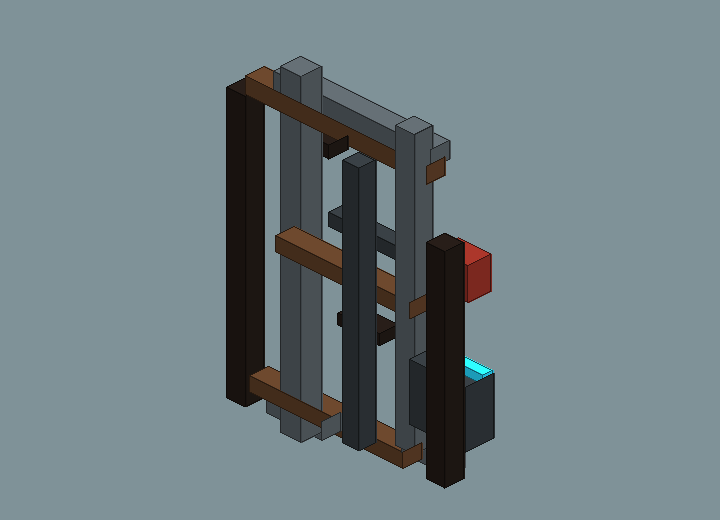
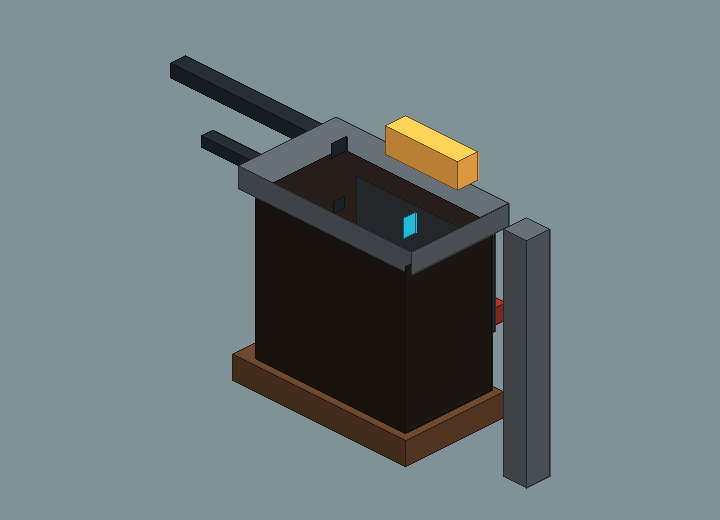
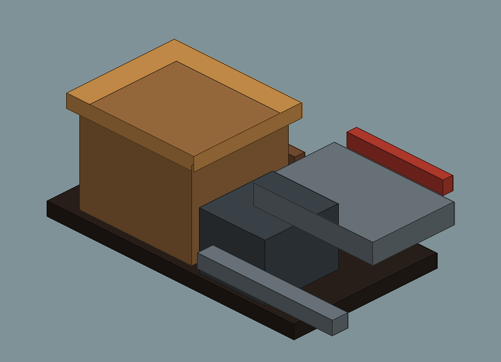
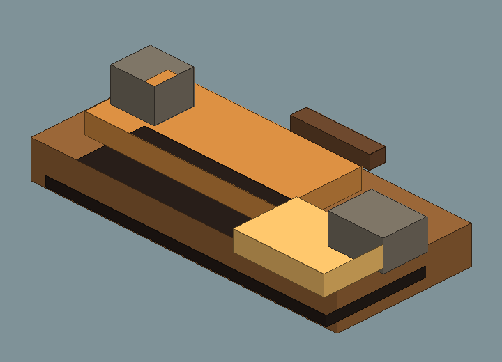

# Blockbench Cantina Exterior Clutter v1 Review Board

Generated: 2026-07-04T12:16:13.829Z
Generator: `docs/gpt/asset_factory/scripts/blockbench_cubecraft_factory.mjs`

## What This Is

This pass changes the authoring target: it generates Blockbench `.bbmodel` files plus PNG previews from the same cube data. The intent is to test a Cubecraft/Minecraft-like workflow rather than another Godot-first primitive pack.

## Contact Sheet

## Assets

| Asset | Role | Blockbench Source | Preview |
| --- | --- | --- | --- |
| Cantina Pipe Cluster v1 | wall-mounted utility silhouette that adds lived-in spaceport density beside adobe facade modules | [bbmodel](blockbench/cantina_pipe_cluster_v1.bbmodel) |  |
| Cantina Utility Box v1 | wall utility box with amber lamp and wire runs for frontier service infrastructure | [bbmodel](blockbench/cantina_utility_box_v1.bbmodel) |  |
| Cantina Crate Scrap Stack v1 | low street clutter and cover-scale scrap cluster for Cantina exterior approach | [bbmodel](blockbench/cantina_crate_scrap_stack_v1.bbmodel) |  |
| Cantina Dust Berm v1 | chunky dust buildup and rock scatter that breaks the clean toy-floor read around frontier buildings | [bbmodel](blockbench/cantina_dust_berm_v1.bbmodel) |  |

## Review Tags

- `open-in-blockbench`: check/edit the source model in Blockbench.
- `export-gltf-candidate`: good enough to export from Blockbench for Godot import testing.
- `needs-cubecraft-pass`: proportions/texture panels need stronger Cubecraft charm.
- `fallback-to-godot-spec`: the Godot primitive lane is faster/better for this asset.
