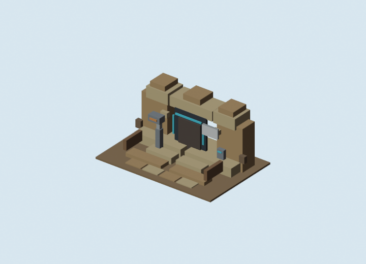

# Blockbench Cantina Sign Texture v1 GLB Review

Generated: 2026-07-04  
Adapter: `docs/gpt/asset_factory/adapters/blender_bbmodel_to_glb.py`

## Controlled Change

Only the no-droids sign workflow changed from the kept entrance baseline.

Baseline:

```text
generated/blockbench_cantina_entrance_v1/GLB_REVIEW.md
```

Changed variable:

```text
cube-only no-droids sign -> original pixel-texture sign plane
```

Kept fixed:

- entrance GLB geometry except removed cube glyphs on the sign;
- detector, door, threshold, walls, steps, palette;
- private/friends blockcraft target.

## Source Texture


## Blender GLB Preview



## Validation

Command:

```powershell
gltf-transform validate docs\gpt\asset_factory\generated\blockbench_cantina_sign_texture_v1\glb\blockbench_cantina_sign_texture_v1.glb
```

Result:

```text
No errors found.
No warnings found.
No infos found.
No hints found.
```

## Verdict

Candidate keep.

The texture-aware adapter path exported a clean GLB. The sign texture is an original blockcraft pictogram and should be judged through the Godot proof:

```text
generated/godot_cantina_sign_texture_v1/REVIEW.md
```

## Next One-Variable Recommendation

Use this texture-plane method only for tiny signs, decals, and role markings. The next asset-family slice should move away from the entrance sign and either build a small exterior-clutter kit or convert the bar/booth bay into Blockbench/GLB.

