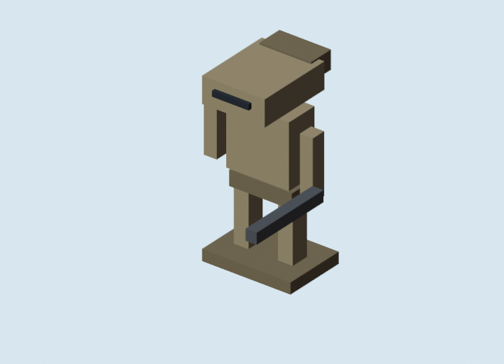
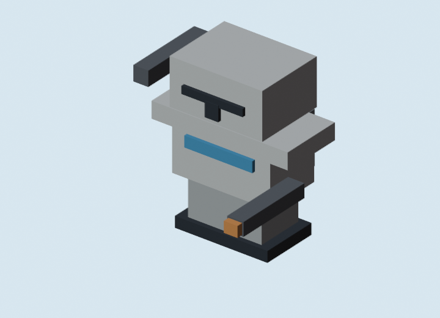
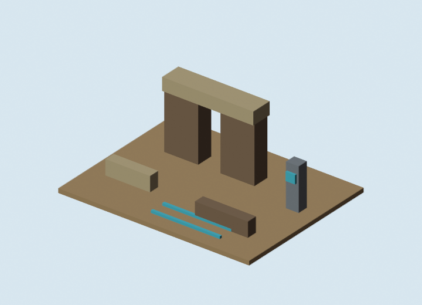

# Blockbench Cubecraft GLB Review Board

Generated: 2026-07-04  
Adapter: `docs/gpt/asset_factory/adapters/blender_bbmodel_to_glb.py`

## What This Is

This review board shows the Blender-converted GLB candidates from the Blockbench Cubecraft excursion. The PNG previews here are rendered by Blender from the actual generated geometry, not by the fast Node sketch renderer.

## Validation

The sample `cubecraft_clone_rifleman_01.glb` was checked with:

```powershell
gltf-transform validate docs\gpt\asset_factory\generated\blockbench_cubecraft_v0\glb\cubecraft_clone_rifleman_01.glb
```

Result:

```text
No errors found.
No warnings found.
No infos found.
No hints found.
```

## Assets

| Asset | GLB | Blender Preview |
| --- | --- | --- |
| Cubecraft B1 Droid 01 | [glb](glb/cubecraft_b1_droid_01.glb) |  |
| Cubecraft Clone Heavy 01 | [glb](glb/cubecraft_clone_heavy_01.glb) |  |
| Cubecraft Clone Rifleman 01 | [glb](glb/cubecraft_clone_rifleman_01.glb) |  |
| Cubecraft Outpost Gate Tile 01 | [glb](glb/cubecraft_outpost_gate_tile_01.glb) |  |
| Cubecraft Space Tableau 01 | [glb](glb/cubecraft_space_tableau_01.glb) |  |

## Review Notes

- The rifleman is the strongest proof that the Blockbench lane gets closer to "Star Wars Minecraft" than the Godot-first primitive lane.
- The B1 droid silhouette reads, but should get more asymmetry and stronger head/neck separation in the next pass.
- The heavy clone needs more distinctive backpack/weapon mass at game-camera scale.
- The outpost gate is usable as a modular kit seed, but it needs snap-point conventions before runtime promotion.
- The space tableau confirms the isometric flat-x/y direction, but the ship silhouettes need stronger faction grammar.
