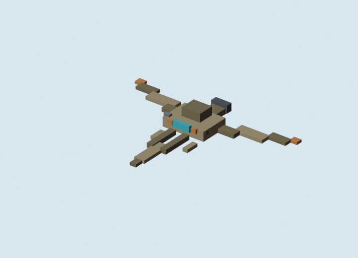

# Hostile Droid Ship v2 GLB Review

Generated: 2026-07-04  
Adapter: `docs/gpt/asset_factory/adapters/blender_bbmodel_to_glb.py`

## Controlled Change

Only the hostile droid ship changed from `blockbench_ship_micro_v1`.

Kept the same:

- Blockbench source generation;
- Blender GLB conversion;
- Blender material-color preview renderer;
- glTF validation workflow;
- broad tan/droid palette family.

Changed:

- flatter center profile;
- larger central eye;
- more forward prongs;
- clearer tri-wing / insect-like threat shape;
- smaller finer cuboids.

## Preview



## Validation

Command:

```powershell
gltf-transform validate docs\gpt\asset_factory\generated\blockbench_ship_droid_v2\glb\micro_tri_droid_stalker_v2.glb
```

Result:

```text
No errors found.
No warnings found.
No infos found.
No hints found.
```

## Verdict

Keep v2.

Compared with `blockbench_ship_micro_v1`'s droid fighter, v2 has a stronger hostile silhouette and better eye-forward read. It is still not final, but it is an improvement and should replace v1 as the baseline hostile droid ship direction.

Next controlled change should not touch the geometry. Test texture/panel detail only, or import both v1 and v2 into a docs-only Godot tactical camera scene to confirm the improvement survives runtime scale.
