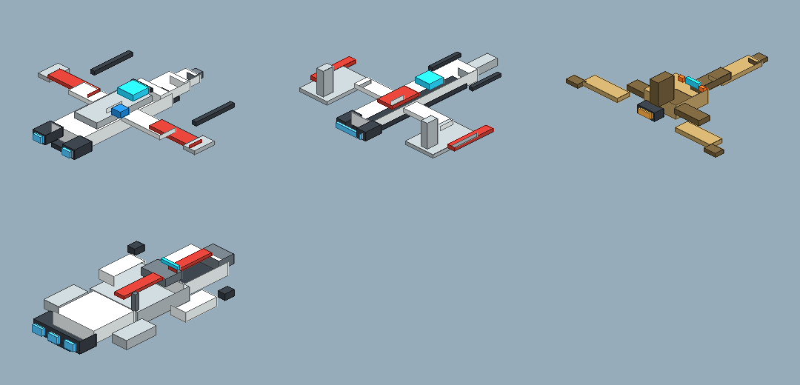
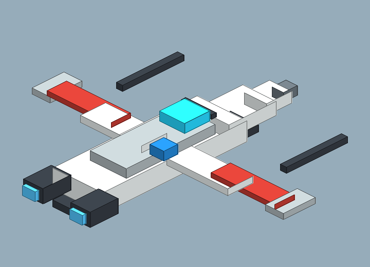
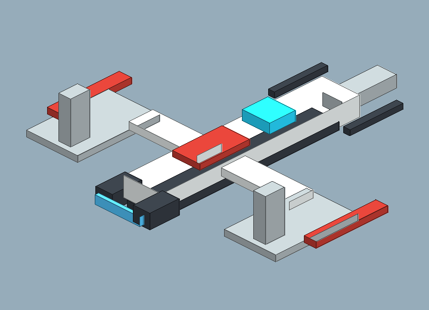
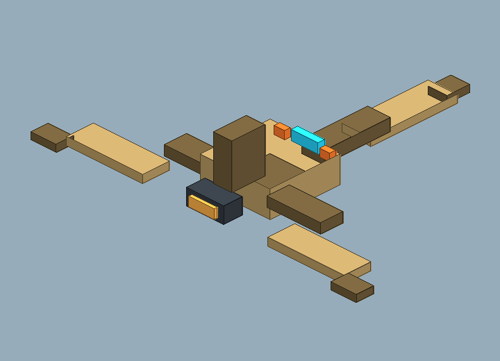
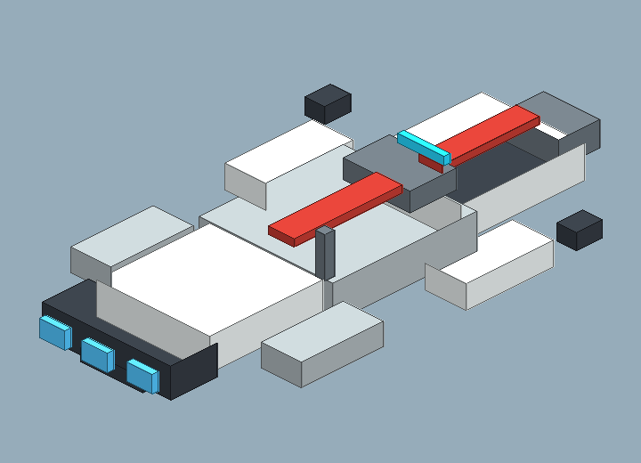

# Blockbench Ship Microfighter v1 Review Board

Generated: 2026-07-04T05:31:22.962Z
Generator: `docs/gpt/asset_factory/scripts/blockbench_cubecraft_factory.mjs`

## What This Is

This pass changes the authoring target: it generates Blockbench `.bbmodel` files plus PNG previews from the same cube data. The intent is to test a Cubecraft/Minecraft-like workflow rather than another Godot-first primitive pack.

## Contact Sheet

## Assets

| Asset | Role | Blockbench Source | Preview |
| --- | --- | --- | --- |
| Micro ARC Interceptor v1 | finer-resolution friendly interceptor token; compact toy-like cockpit, wings, astromech mark, and cannon reads | [bbmodel](blockbench/micro_arc_interceptor_v1.bbmodel) |  |
| Micro V Lancer v1 | friendly light attack craft; narrow central body, splayed fin read, blue engine glow | [bbmodel](blockbench/micro_v_lancer_v1.bbmodel) |  |
| Micro Tri Droid Stalker v1 | hostile droid fighter token; compact center eye, tri-fin threat shape, warm engine mark | [bbmodel](blockbench/micro_tri_droid_stalker_v1.bbmodel) |  |
| Micro Blockade Runner v1 | small capital/freighter token; readable bridge, long hull, side pods, engine cluster | [bbmodel](blockbench/micro_blockade_runner_v1.bbmodel) |  |

## Review Tags

- `open-in-blockbench`: check/edit the source model in Blockbench.
- `export-gltf-candidate`: good enough to export from Blockbench for Godot import testing.
- `needs-cubecraft-pass`: proportions/texture panels need stronger Cubecraft charm.
- `fallback-to-godot-spec`: the Godot primitive lane is faster/better for this asset.
