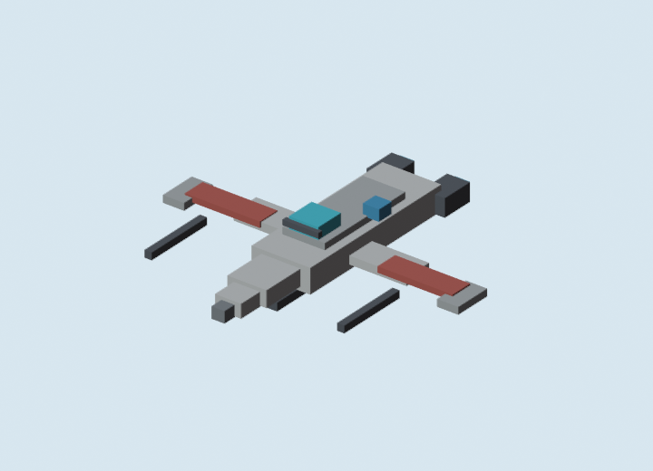
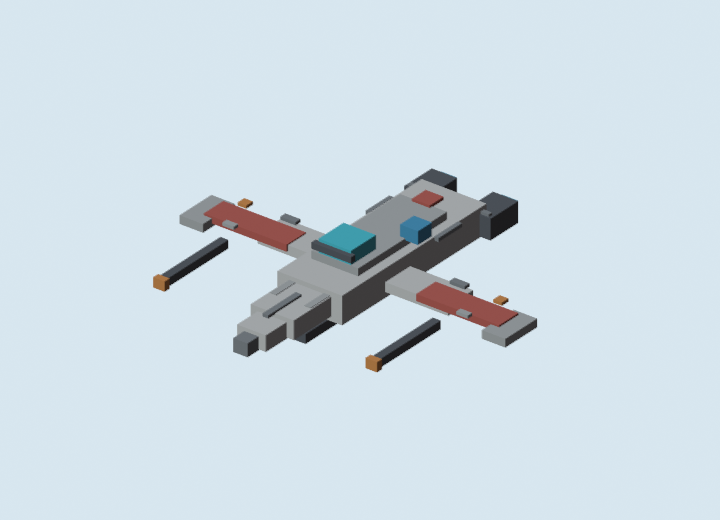

# Ship Panel Detail v2 GLB Review

Generated: 2026-07-04  
Adapter: `docs/gpt/asset_factory/adapters/blender_bbmodel_to_glb.py`

## Controlled Change

Only surface/panel detail changed from `micro_arc_interceptor_v1`.

Kept the same:

- ARC-style friendly ship silhouette;
- Blockbench source generation;
- Blender GLB conversion;
- Blender material-color preview renderer;
- glTF validation workflow.

Changed:

- Added thin cuboid panel ticks;
- added nose seam marks;
- added small wing warning tiles;
- added engine cap lines;
- added cannon muzzle color blocks.

This is a geometry-based stand-in for Minecraft-like surface detail. It does not yet use true pixel textures.

## Baseline



## Panel Variant



## Validation

Command:

```powershell
gltf-transform validate docs\gpt\asset_factory\generated\blockbench_ship_panel_v2\glb\micro_arc_interceptor_panel_v2.glb
```

Result:

```text
No errors found.
No warnings found.
No infos found.
No hints found.
```

## Verdict

Keep v2.

The extra panel geometry improves the ship without changing the silhouette. It makes the model feel more authored and closer to a small buildable craft. The detail is still readable in the Blender review camera and does not collapse into noise.

This should become the friendly ARC-style ship baseline before runtime camera testing.

## Next Controlled Change

Do not add more panel cubes yet. The next useful test is runtime camera only:

```text
same GLB -> docs-only Godot review scene -> intended isometric/tactical camera capture
```

If the panel detail disappears at runtime distance, then the project should use fewer, larger panel marks or true texture panels instead of more small cuboids.
