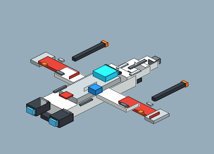
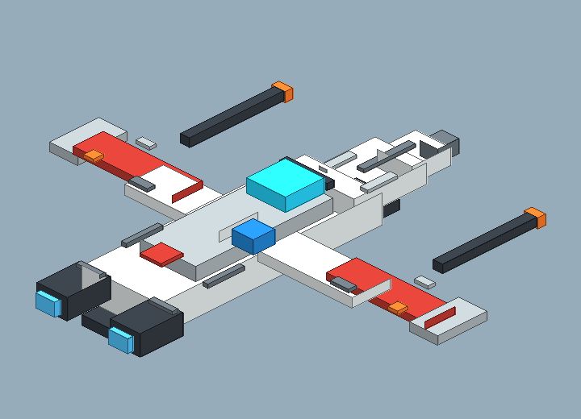

# Blockbench Ship Panel Detail v2 Review Board

Generated: 2026-07-04T05:39:20.612Z
Generator: `docs/gpt/asset_factory/scripts/blockbench_cubecraft_factory.mjs`

## What This Is

This pass changes the authoring target: it generates Blockbench `.bbmodel` files plus PNG previews from the same cube data. The intent is to test a Cubecraft/Minecraft-like workflow rather than another Godot-first primitive pack.

## Contact Sheet

## Assets

| Asset | Role | Blockbench Source | Preview |
| --- | --- | --- | --- |
| Micro ARC Interceptor Panel v2 | same ARC-style friendly ship silhouette as v1, with Minecraft-like surface panel detail only | [bbmodel](blockbench/micro_arc_interceptor_panel_v2.bbmodel) |  |

## Review Tags

- `open-in-blockbench`: check/edit the source model in Blockbench.
- `export-gltf-candidate`: good enough to export from Blockbench for Godot import testing.
- `needs-cubecraft-pass`: proportions/texture panels need stronger Cubecraft charm.
- `fallback-to-godot-spec`: the Godot primitive lane is faster/better for this asset.
