# Blockcraft Space Opera Prototype Pack v0 Review Board

Generated: 2026-07-03 23:34:04
Generator: `docs/gpt/asset_factory/scripts/godot_asset_factory.gd`
Spec pack: `blockcraft_space_opera_v0`

## What This Is

These images are captures from generated Godot `.tscn` scenes, not bitmap source art. The source scenes are in `scenes/`; the review camera scenes are in `review_scenes/`.

Pipeline:

```text
JSON spec -> Godot procedural scene -> review scene -> PNG capture -> approve/reject/polish
```

## Contact Sheets

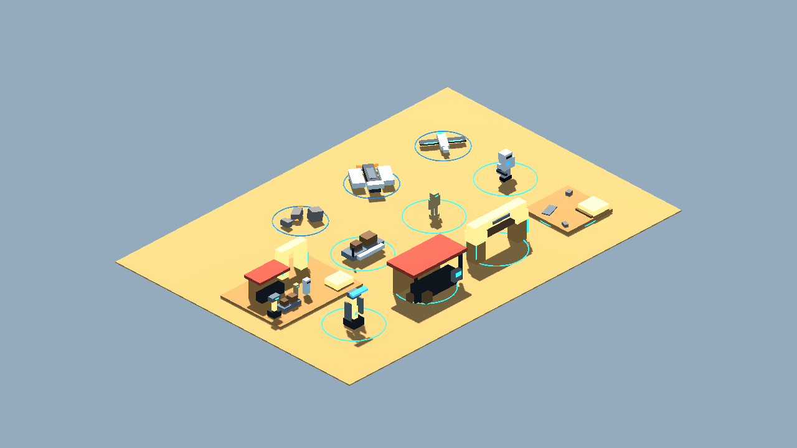

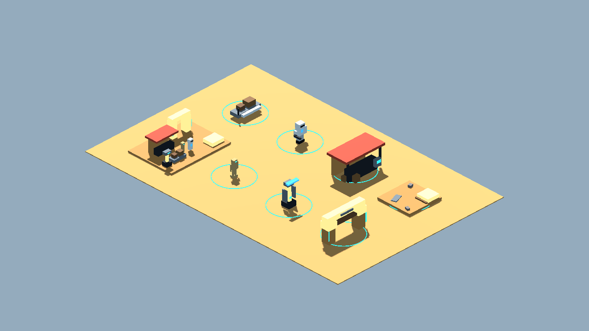

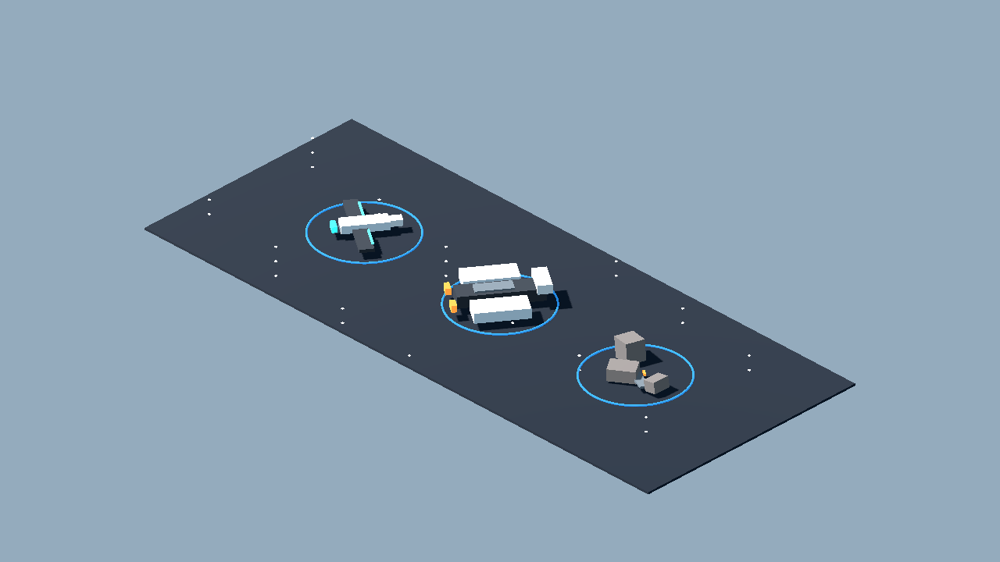

## Individual Captures

| Asset | Category | Gameplay Role | Capture |
| --- | --- | --- | --- |
| Blockcraft Desert Tile 4x4 01 | terrain_tile | repeatable desert ground tile with height-step readability | 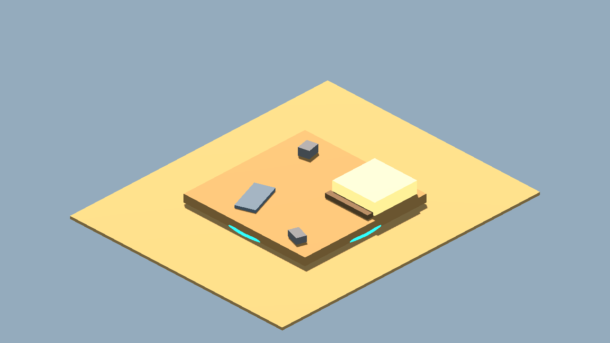 |
| Blockcraft Frontier Gate 01 | settlement_module | starter district threshold or checkpoint landmark | 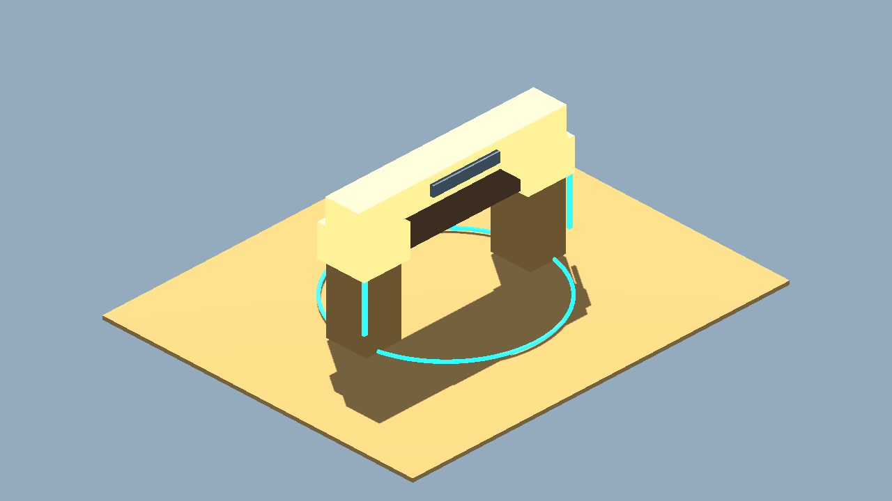 |
| Blockcraft Market Stall 01 | vendor_stall | vendor, quest-giver, or repair terminal landmark | 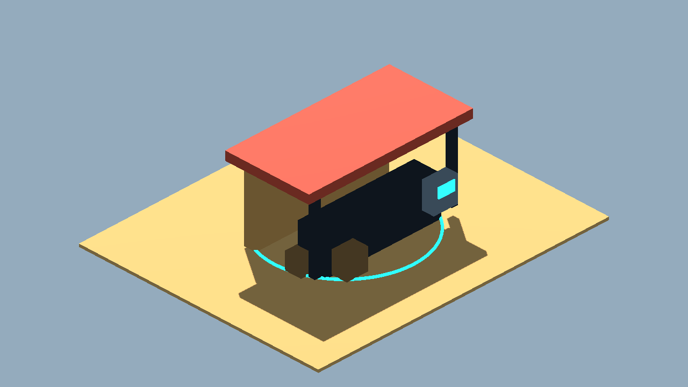 |
| Blockcraft Moisture Stack 01 | landmark_prop | repair/harvest interaction prop | 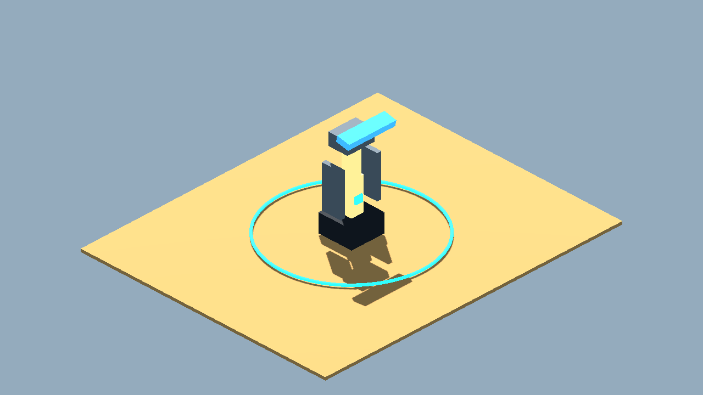 |
| Blockcraft White Armored Pawn 01 | character_token | generic friendly infantry pawn scale test | 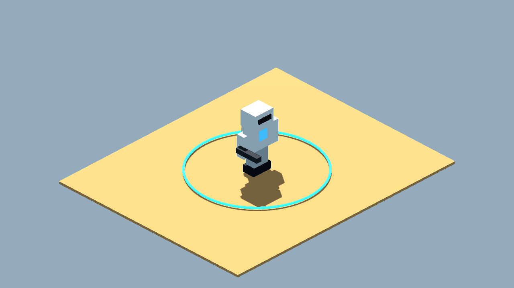 |
| Blockcraft Tan Service Droid 01 | character_token | generic neutral or hostile thin droid pawn scale test | 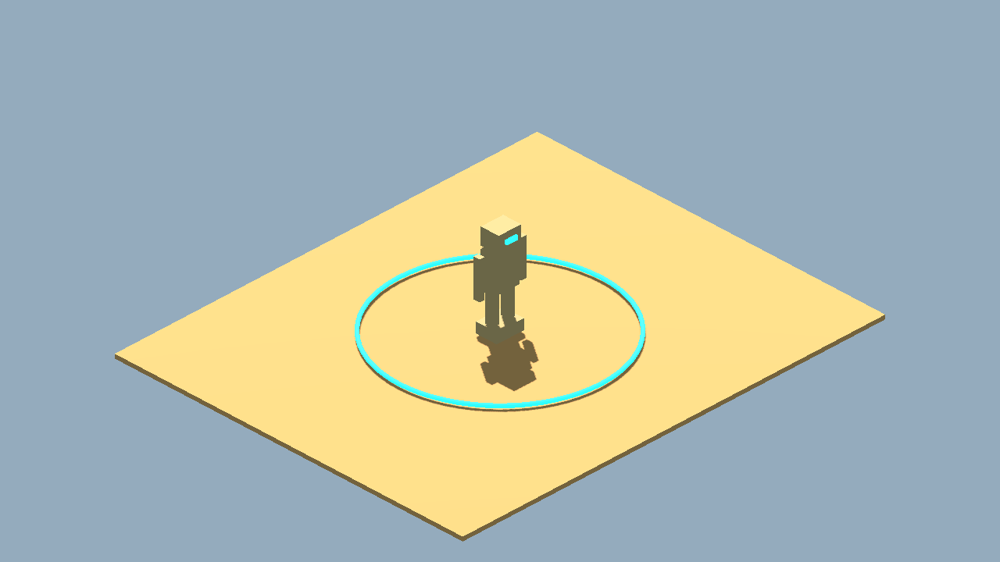 |
| Blockcraft Hover Sled 01 | vehicle_prop | small vehicle prop, cargo escort objective, or travel pad marker | 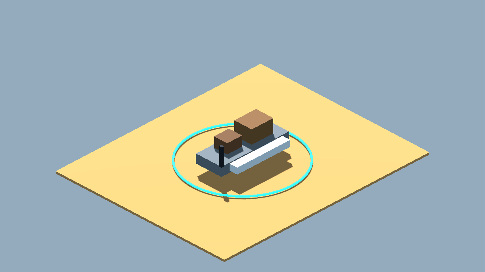 |
| Blockcraft Frontier Micro Slice 01 | scene_slice | one-screen proof of the blockcraft MMO visual direction | 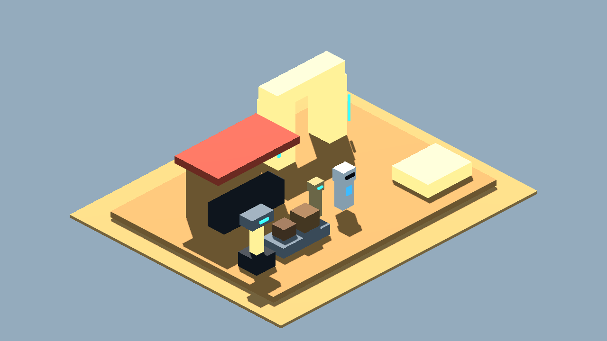 |
| Blockcraft Isometric Fighter 02 | space_ship_token | flat-plane tactical ship token | 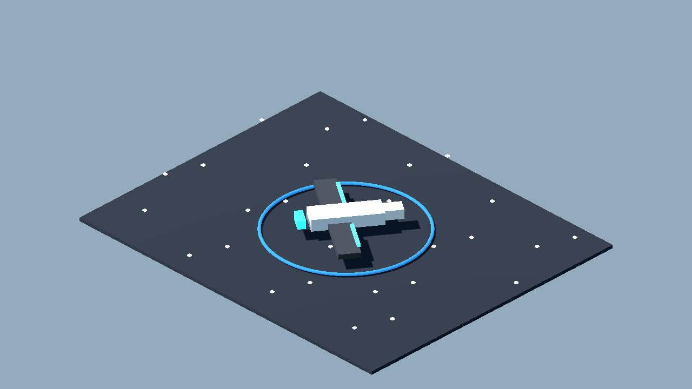 |
| Blockcraft Isometric Freighter 02 | space_ship_token | larger flat-plane tactical ship token | 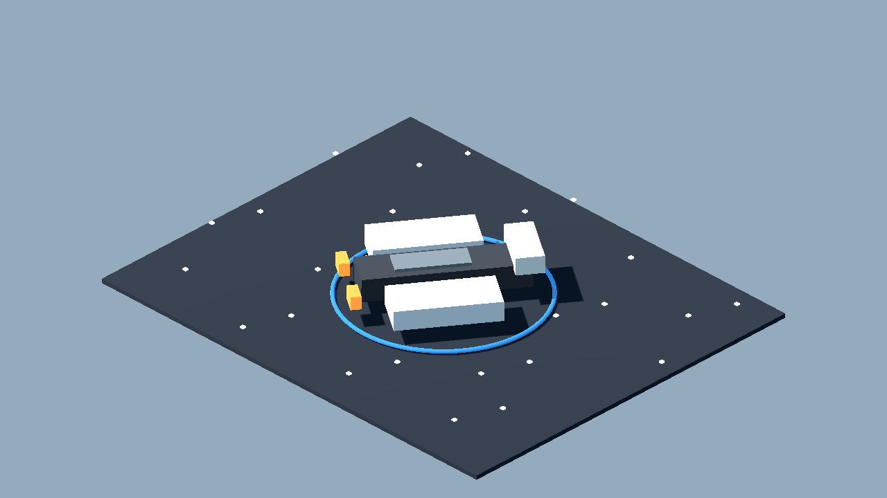 |
| Blockcraft Isometric Debris Field 01 | space_hazard | flat-plane obstacle, cover, or sensor occlusion marker | 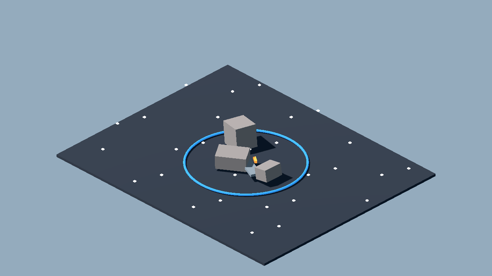 |

## Review Tags

- `accept-prototype`: good enough to test in gameplay.
- `needs-style-pass`: useful silhouette but ugly detail/materials.
- `needs-remodel`: concept is useful, geometry is not.
- `api-candidate`: worth trying through a 3D generation provider.
- `human-candidate`: too important or too hard for procedural generation.
