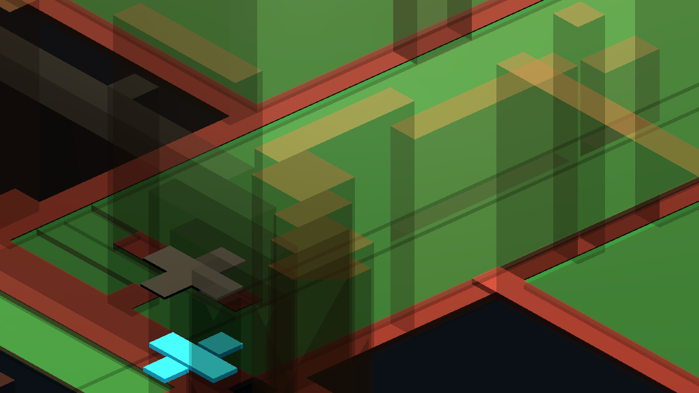
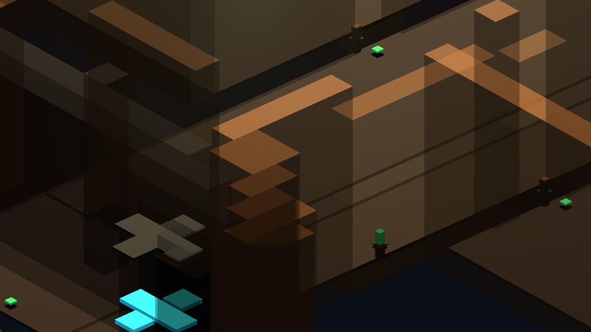
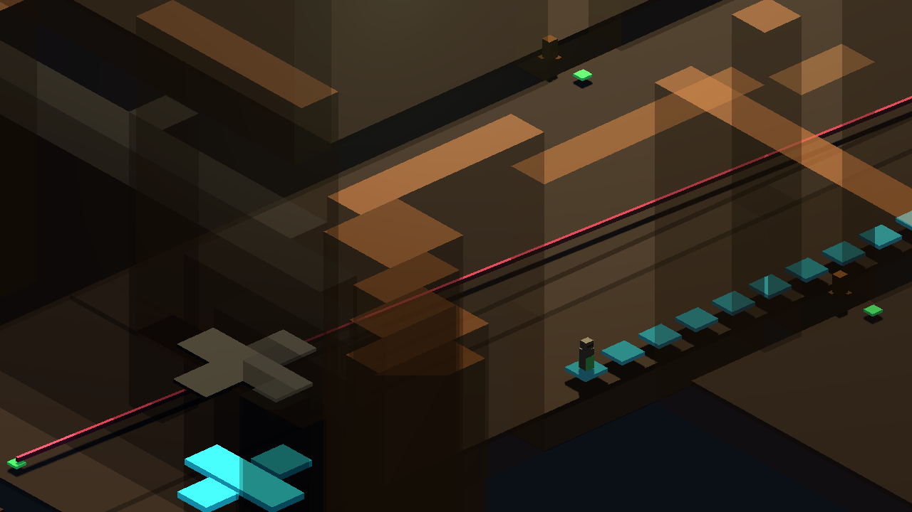
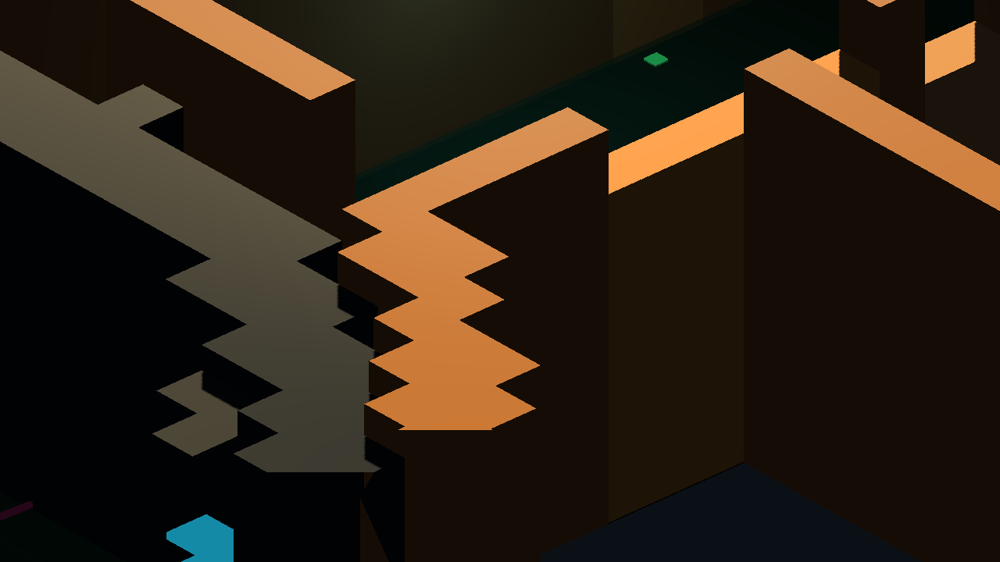

# Chalmun's Cantina - Back Hallway & Sabacc Room - Voxel Generation Review

Generated: 2026-07-04 22:56:41
Generator: `docs/google/modeling/asset_factory/scripts/godot_pixel_cantina_generator.gd`

## Purpose

Reusable pixel-to-GDScript generator pass for Chalmun's Cantina - Back Hallway & Sabacc Room. Synthesizes geometry, masks, and named sockets.

## Source Images

- Floorplan: `source_images/cantina_floorplan_96x96.png`
- Detail Layout: `source_images/cantina_detail_elevation_96x96.png`
- Walkable Mask: `source_images/cantina_walkable_mask_96x96.png`
- Collision Mask: `source_images/cantina_collision_mask_96x96.png`

## Runtime Stats

| Metric | Value |
| --- | ---: |
| Grid size | `96x96` |
| Walkable pixels | 866 |
| Walkable rectangles | 19 |
| Blocker pixels | 741 |
| Collision rectangles/shapes | 124 |
| Socket count | 8 |
| Non-walkable raw sockets | 7 |
| Sockets resolved to walk cells | 7 |
| Path Route Cells | 28 |
| Composite Route Cells | 0 |
| Walk mask reduction vs pixels | 97.8% |
| Collision reduction vs pixels | 83.3% |

## Named Sockets

| Id | Kind | Raw grid | Walkable | Resolved path grid | Tags |
| --- | --- | --- | --- | --- | --- |
| `hallway_entry` | `spawn` | `48,43` | `true` | `48,43` | `entry, player` |
| `restroom_a` | `transition` | `18,42` | `false` | `18,41` | `restroom, door` |
| `restroom_b` | `transition` | `30,42` | `false` | `30,41` | `restroom, door` |
| `restroom_c` | `transition` | `42,42` | `false` | `42,41` | `restroom, door` |
| `cellar_trapdoor` | `interaction` | `23,48` | `false` | `23,46` | `cellar, floor` |
| `office_door` | `transition` | `40,53` | `false` | `40,52` | `office, door` |
| `sabacc_table` | `social_table` | `70,48` | `false` | `59,48` | `sabacc, seated` |
| `sabacc_light` | `light_socket` | `70,48` | `false` | `59,48` | `sabacc, light` |

## Captures

### runtime_collision_nav_overlay

Walkable rectangles in green and merged collision rectangles in red, generated from the same layered Cantina cards.

### runtime_socket_map

Named interaction and spawn sockets generated from the semantic room cards: entrance, bar, booths, service door, lights, and clutter sockets.

### runtime_actor_path_probe

Grid-routed actor/path probe using nearest-walkable socket resolution and the generated walkable mask.

### runtime_room_pipeline_composite

Layered room geometry, collision/walkable overlay, sockets, and placeholder actors together as a runtime-pipeline proof.

