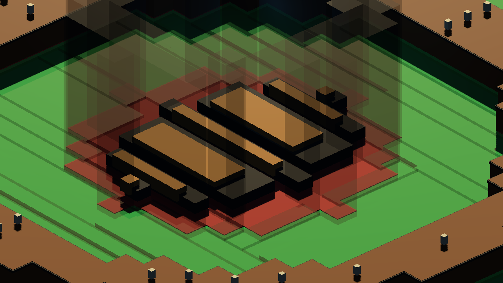
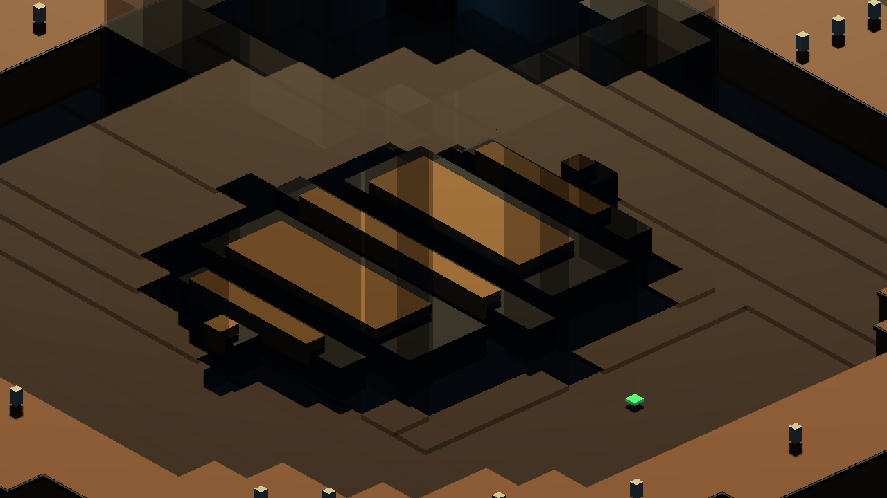
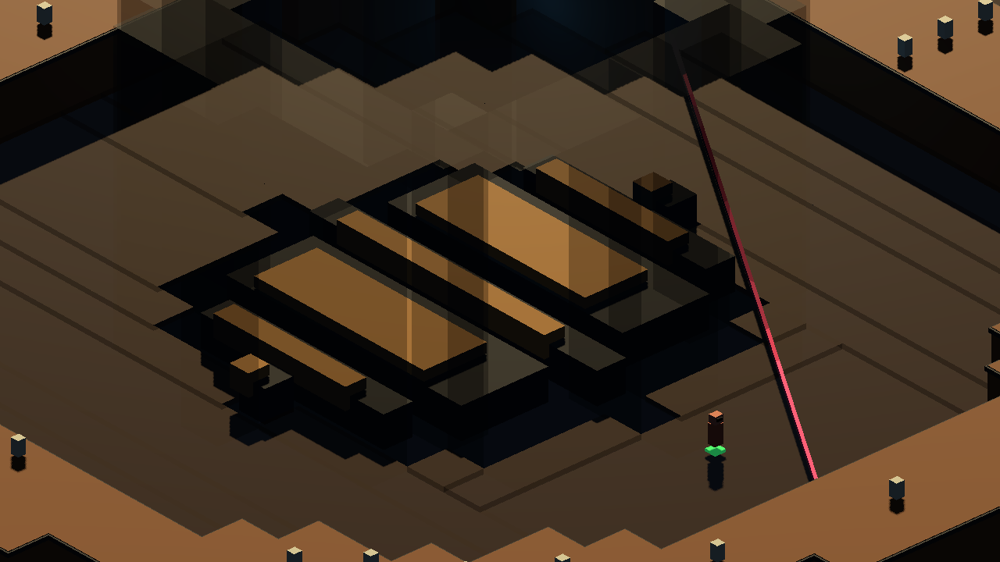
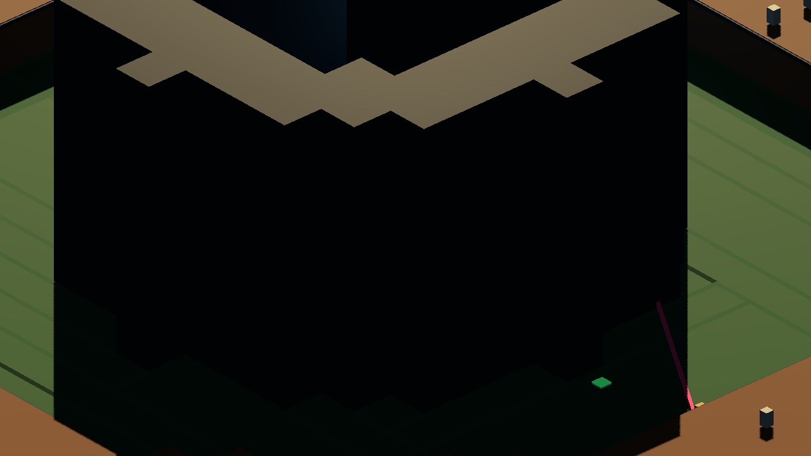

# Chalmun's Cantina - Main Bar - Voxel Generation Review

Generated: 2026-07-04 22:56:35
Generator: `docs/google/modeling/asset_factory/scripts/godot_pixel_cantina_generator.gd`

## Purpose

Reusable pixel-to-GDScript generator pass for Chalmun's Cantina - Main Bar. Synthesizes geometry, masks, and named sockets.

## Source Images

- Floorplan: `source_images/cantina_floorplan_96x96.png`
- Detail Layout: `source_images/cantina_detail_elevation_96x96.png`
- Walkable Mask: `source_images/cantina_walkable_mask_96x96.png`
- Collision Mask: `source_images/cantina_collision_mask_96x96.png`

## Runtime Stats

| Metric | Value |
| --- | ---: |
| Grid size | `96x96` |
| Walkable pixels | 3150 |
| Walkable rectangles | 112 |
| Blocker pixels | 1393 |
| Collision rectangles/shapes | 247 |
| Socket count | 12 |
| Non-walkable raw sockets | 8 |
| Sockets resolved to walk cells | 8 |
| Path Route Cells | 40 |
| Composite Route Cells | 88 |
| Walk mask reduction vs pixels | 96.4% |
| Collision reduction vs pixels | 82.3% |

## Named Sockets

| Id | Kind | Raw grid | Walkable | Resolved path grid | Tags |
| --- | --- | --- | --- | --- | --- |
| `entrance_spawn` | `spawn` | `48,88` | `true` | `48,88` | `entry, player` |
| `bar_order_anchor` | `interaction` | `48,38` | `true` | `48,38` | `bar, social` |
| `bartender_anchor` | `npc_anchor` | `48,45` | `false` | `48,41` | `bar, staff` |
| `left_booth_table` | `social_table` | `15,29` | `false` | `19,29` | `booth, seated` |
| `rear_booth_table` | `social_table` | `15,67` | `false` | `19,67` | `booth, seated` |
| `center_table_a` | `social_table` | `30,30` | `true` | `30,30` | `table, seated` |
| `center_table_b` | `social_table` | `30,66` | `true` | `30,66` | `table, seated` |
| `service_door_anchor` | `transition` | `48,10` | `false` | `48,9` | `service, door` |
| `no_droids_sign_socket` | `prop_socket` | `46,82` | `false` | `46,81` | `sign, wall` |
| `bar_light_socket` | `light_socket` | `48,48` | `false` | `48,41` | `bar, light` |
| `clutter_socket_left` | `prop_socket` | `10,48` | `false` | `20,47` | `clutter` |
| `clutter_socket_rear` | `prop_socket` | `86,48` | `false` | `76,47` | `clutter` |

## Captures

### runtime_collision_nav_overlay

Walkable rectangles in green and merged collision rectangles in red, generated from the same layered Cantina cards.

### runtime_socket_map

Named interaction and spawn sockets generated from the semantic room cards: entrance, bar, booths, service door, lights, and clutter sockets.

### runtime_actor_path_probe

Grid-routed actor/path probe using nearest-walkable socket resolution and the generated walkable mask.

### runtime_room_pipeline_composite

Layered room geometry, collision/walkable overlay, sockets, and placeholder actors together as a runtime-pipeline proof.

