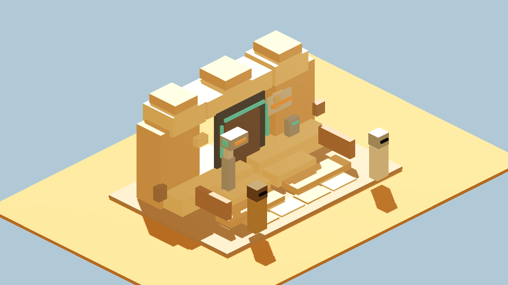
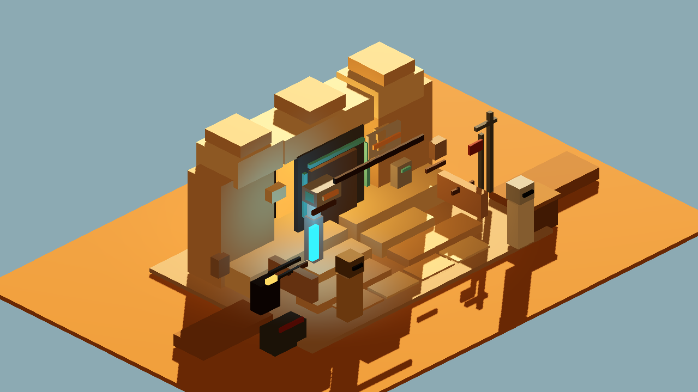
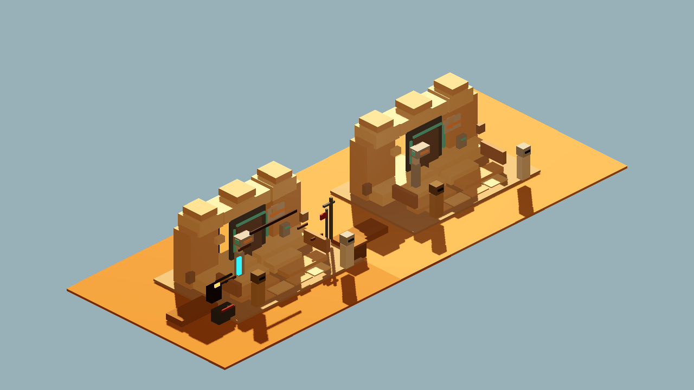

# Cantina Mood A/B v1

Generated: 2026-07-04 07:14:34
Generator: `docs/gpt/asset_factory/scripts/godot_cantina_mood_ab_proof.gd`

## Purpose

Test the candidate Cantina material/lighting/clutter mood pass without changing the kept entrance model.

Source GLB:

```text
res://docs/gpt/asset_factory/generated/blockbench_cantina_entrance_v1/glb/blockbench_cantina_entrance_v1.glb
```

## Controlled Change

Baseline:

```text
generated/godot_cantina_entrance_camera_v1/REVIEW.md
```

Changed variable:

```text
Lighting, material mood, exterior clutter, grime chips, and dim doorway context only.
The imported entrance GLB is unchanged.
```

Kept fixed:

- `blockbench_cantina_entrance_v1.glb` source model
- entrance orientation
- threshold/detector/sign gameplay read
- camera family
- private/friends blockcraft target

## Captures

### cantina_mood_baseline_control

Control capture: kept entrance GLB, clean prototype lighting, minimal context.



### cantina_mood_warm_grime_pass

Mood capture: same entrance GLB, changed only lighting, exterior clutter, grime chips, and dim doorway context.



### cantina_mood_side_by_side

Side-by-side A/B: one clean control and one mood pass. Camera perspective can flip screen order, so use the individual captures as the authoritative baseline/mood comparison.



## Initial Verdict

Candidate keep.

The mood pass improves the frontier-cantina read by adding warmer exterior light, a darker interior threshold, pipes, utility clutter, wall grime, and dust berms while preserving the same entrance GLB. The detector/sign/threshold still read from the camera.

Caution: the extra clutter is still simple proof geometry. It should be converted into a small Blockbench exterior-clutter kit or normalized filler pass before runtime promotion.

Visual-inspection note: the side-by-side camera perspective can make screen left/right ambiguous. Treat `cantina_mood_baseline_control` and `cantina_mood_warm_grime_pass` as the authoritative comparison captures.

## Next One-Variable Recommendation

Keep the mood lighting and clutter composition as a candidate baseline, then change only the no-droids sign workflow: cube-only sign versus texture/manual Blockbench sign panel.
