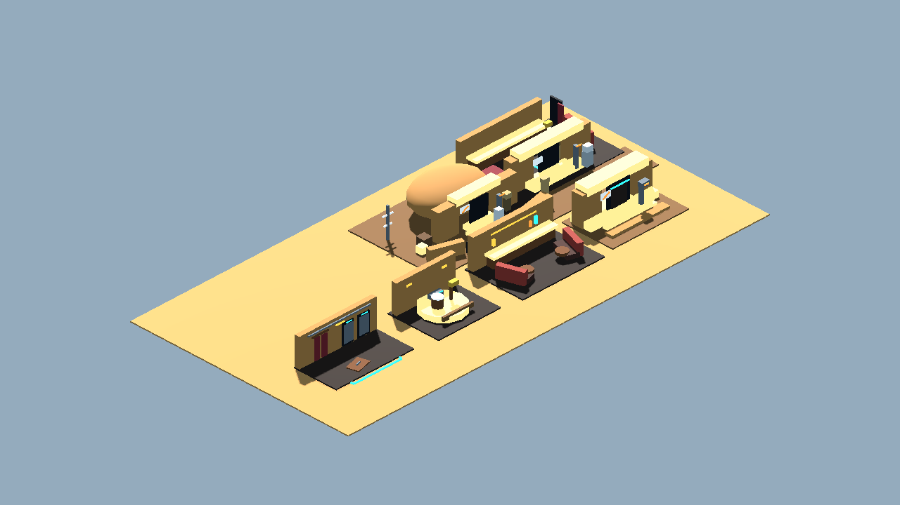
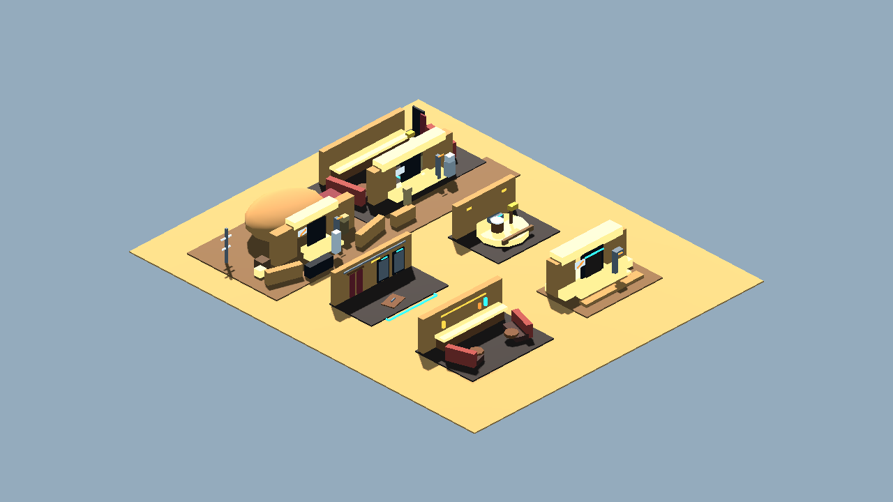
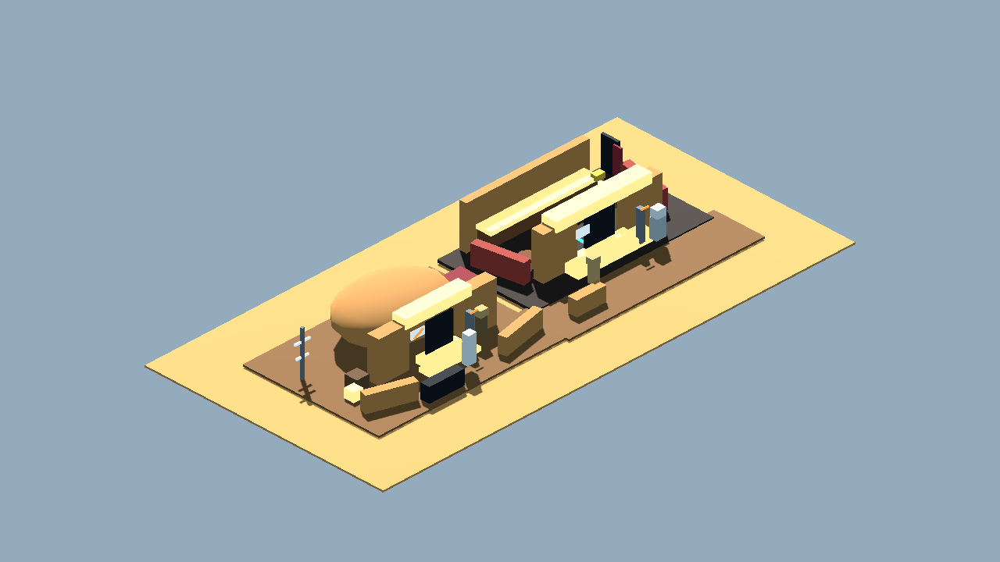
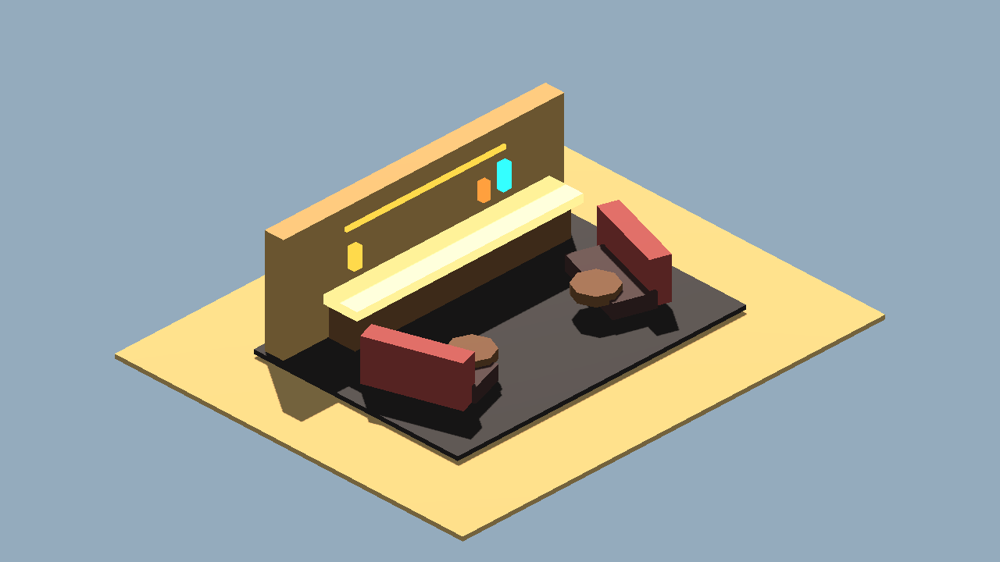
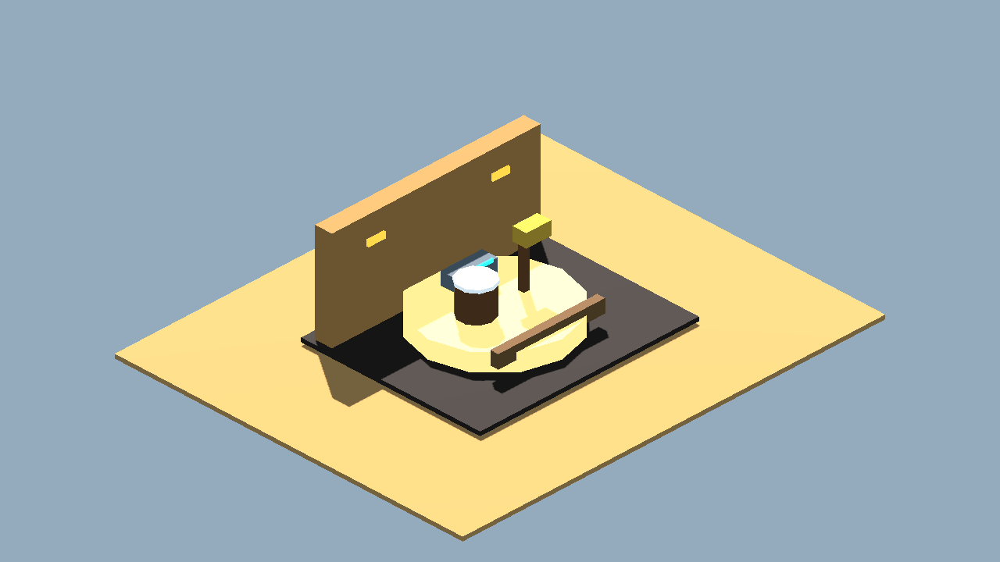
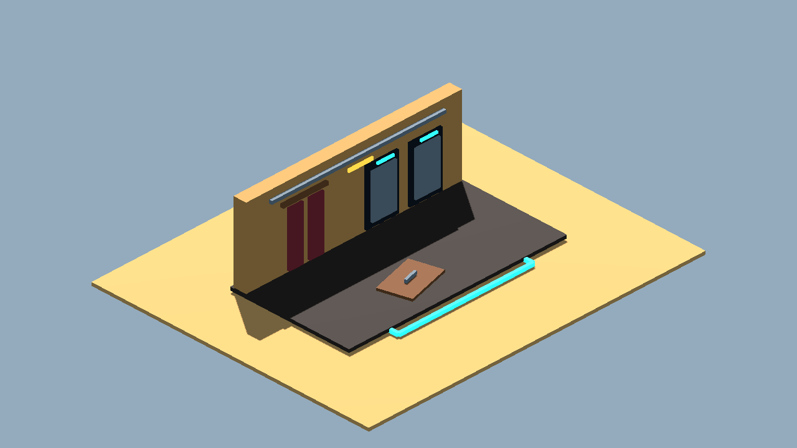
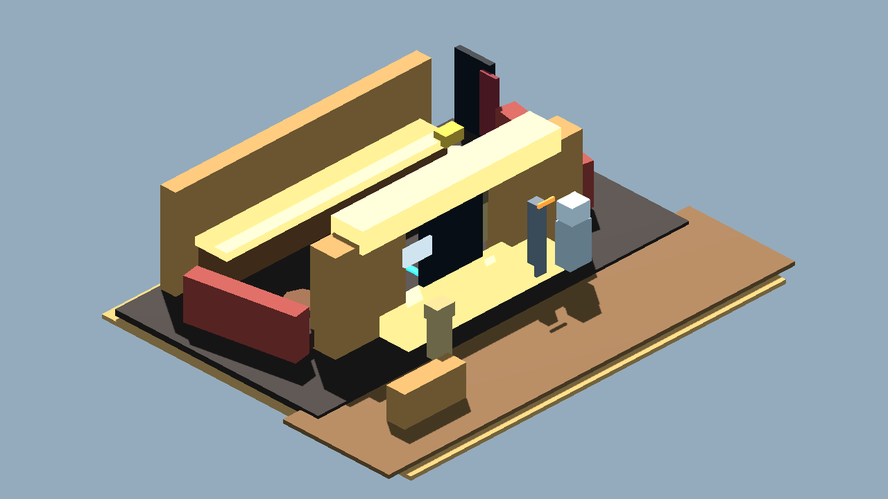
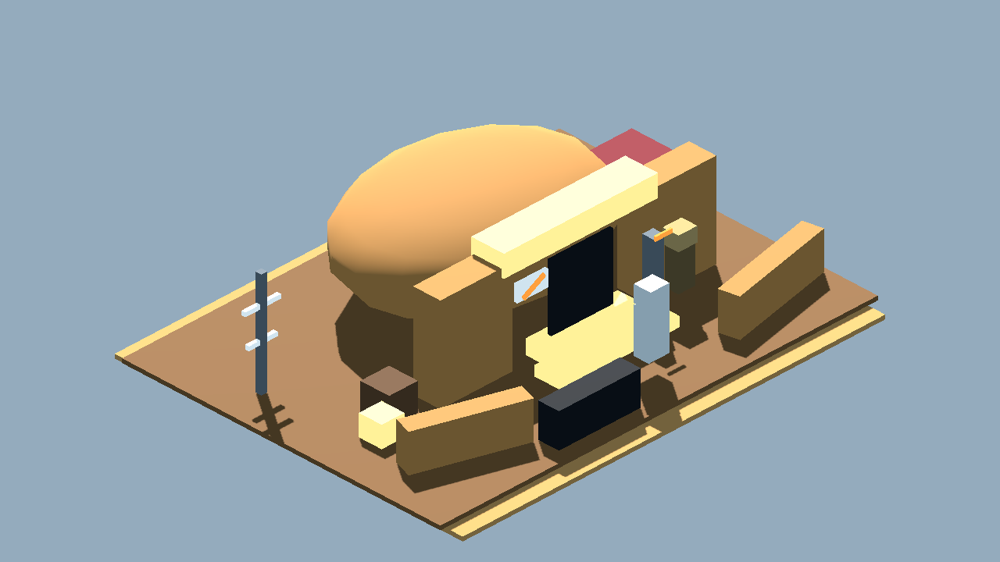

# Cantina Terrain Kit V0 Review Board

Generated: 2026-07-04 02:14:24
Generator: `docs/gpt/asset_factory/scripts/godot_asset_factory.gd`
Spec pack: `cantina_terrain_kit_v0`

## What This Is

These images are captures from generated Godot `.tscn` scenes, not bitmap source art. The source scenes are in `scenes/`; the review camera scenes are in `review_scenes/`.

Pipeline:

```text
JSON spec -> Godot procedural scene -> review scene -> PNG capture -> approve/reject/polish
```

## Contact Sheets








## Individual Captures

| Asset | Category | Gameplay Role | Capture |
| --- | --- | --- | --- |
| Cantina Entrance Threshold 01 | terrain_module | elevated no-droids entrance threshold |  |
| Cantina Bar Booth Bay 01 | terrain_module | main bar wall and curved booth-ring read |  |
| Cantina Bandstand Corner 01 | terrain_module | music/bandstand identity corner |  |
| Cantina Back Hallway Service 01 | terrain_module | back hallway with restrooms, cellar trapdoor, and curtained office |  |
| Cantina Multiroom Slice 01 | scene_slice | one-screen proof of outside -> entrance -> bar -> back hallway readability |  |
| Cantina Exterior Plaza Slice 01 | scene_slice | outside approach and social doorstep terrain |  |

## Review Tags

- `accept-prototype`: good enough to test in gameplay.
- `needs-style-pass`: useful silhouette but ugly detail/materials.
- `needs-remodel`: concept is useful, geometry is not.
- `api-candidate`: worth trying through a 3D generation provider.
- `human-candidate`: too important or too hard for procedural generation.
