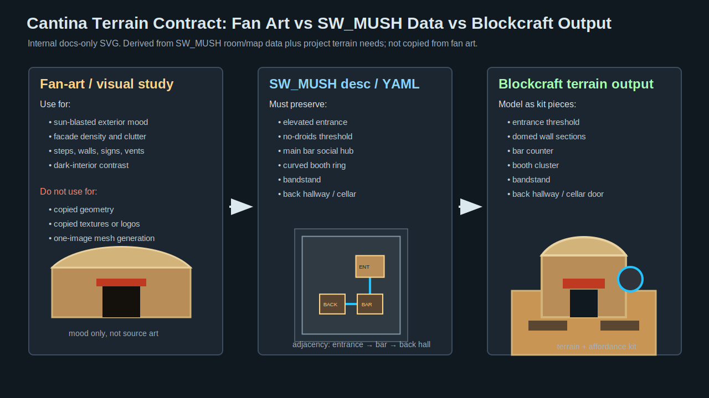
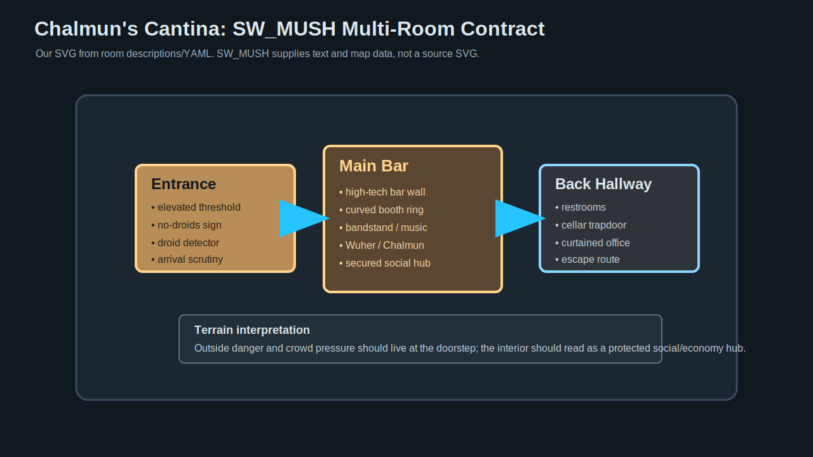

# Cantina Terrain Reference V0

Generated: 2026-07-04  
Scope: docs-only visual contract for a future Cantina terrain/blockcraft pass

## What This Is

This is not final art and not copied from fan art. It is an internal SVG comparison artifact created by Codex from:

- read-only SW_MUSH room descriptions;
- read-only SW_MUSH `chalmuns_cantina.yaml` area geometry;
- the current Godot prototype's need for a readable terrain/social landmark.

There are no source SVGs from SW_MUSH in this pass. The SVG here is our own description-derived visual contract.

## Source Comparison SVG



## Room Graph SVG



## Key Verdict

Use fan art as mood/reference input only. Use SW_MUSH room descriptions and map/YAML as the playable contract.

The Cantina is a multi-room play space, not a single exterior prop. The terrain target should read:

```text
outside trouble -> elevated no-droids entrance -> dim main bar -> booth ring -> bandstand -> back hallway/cellar
```

## What To Build Next

Create a focused Blockbench/Godot terrain kit request:

- entrance threshold;
- domed wall section;
- bar counter;
- booth cluster;
- bandstand;
- back hallway/cellar door;
- plaza low wall;
- dust steps;
- no-droids sign;
- droid detector / power box.

Do not build one giant uneditable model.
