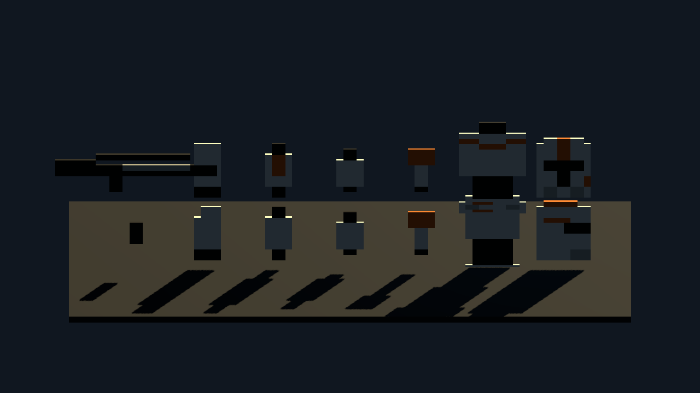
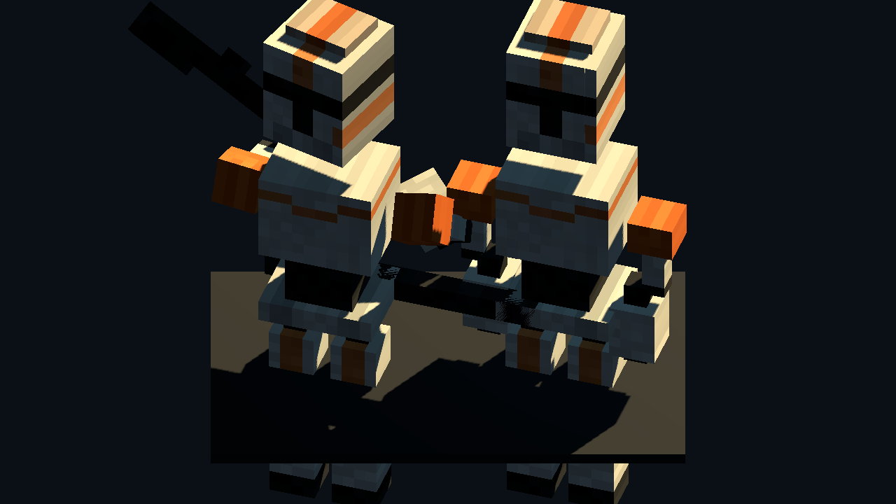
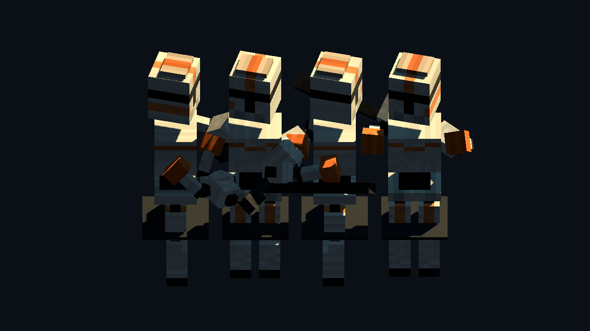
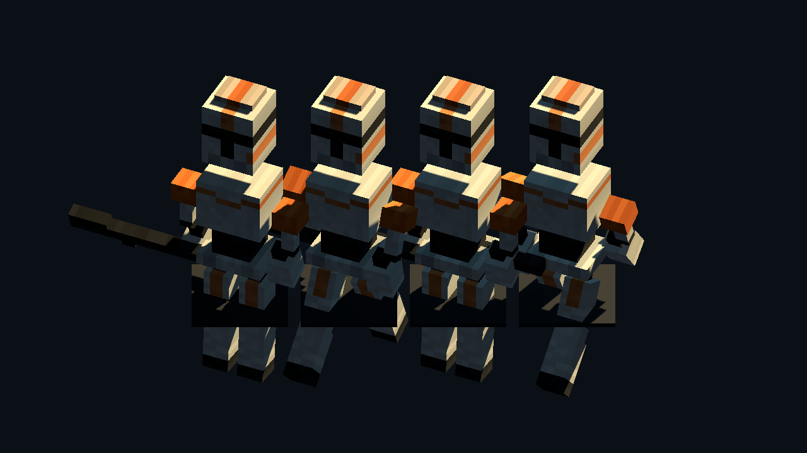

# Clone Commander (High Fidelity) - Voxel Character Review

Generated: 2026-07-04 17:35:40
Generator: `docs/google/modeling/asset_factory/scripts/godot_pixel_actor_generator.gd`

## Purpose

Synthesizes a full 3D visual hull character assembled into a hierarchical bone-and-pivot joint rig and equipped with native Godot animations.

## Part Voxel Stats

| Part Name | Box Count | Raw Voxels |
| --- | ---: | ---: |
| `torso_mesh` | 130 | 980 |
| `head_mesh` | 86 | 670 |
| `left_upper_arm_mesh` | 22 | 68 |
| `left_forearm_mesh` | 26 | 92 |
| `right_upper_arm_mesh` | 22 | 68 |
| `right_forearm_mesh` | 26 | 92 |
| `left_thigh_mesh` | 32 | 112 |
| `left_shin_mesh` | 40 | 152 |
| `right_thigh_mesh` | 32 | 112 |
| `right_shin_mesh` | 40 | 152 |
| `blaster_mesh` | 56 | 112 |

## Captures

### body_part_source_cards

Original B1 Battle Droid body-part front and side pixel cards, generated programmatically from the spec JSON.

### body_part_neutral_vs_aim

B1 Battle Droid model. Left: neutral structural assembly using local bone pivots. Right: aim pose with E-5 blaster aimed forward.

### body_part_rotation_contact_sheet

Four yaw angles (0, 90, 180, 270) of the assembled B1 Battle Droid model, demonstrating full 3D visual volume consistency.

### body_part_walk_cycle_contact_sheet

Four frames of the B1 Battle Droid walk animation (0.0s, 0.3s, 0.6s, 0.9s), demonstrating keyframe interpolation on joint nodes.

