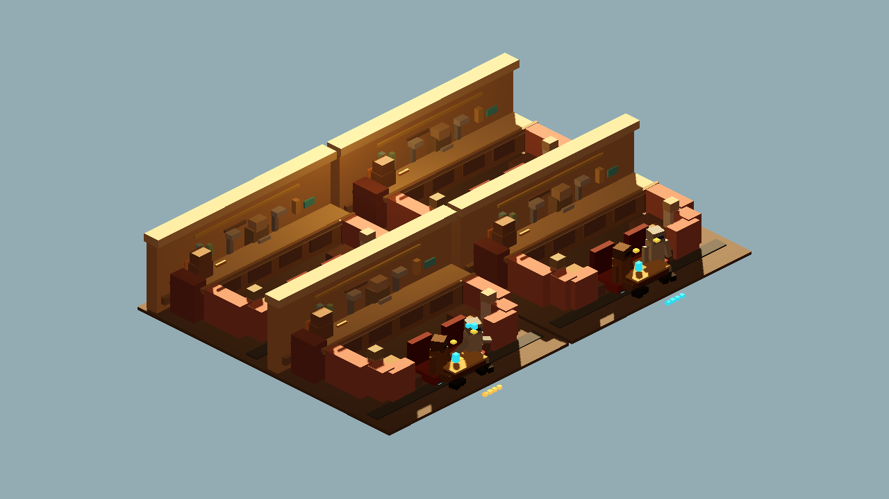
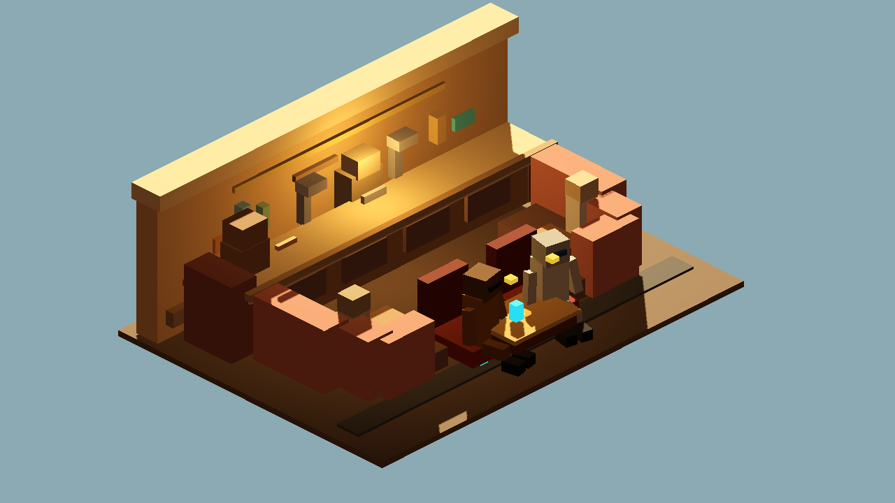
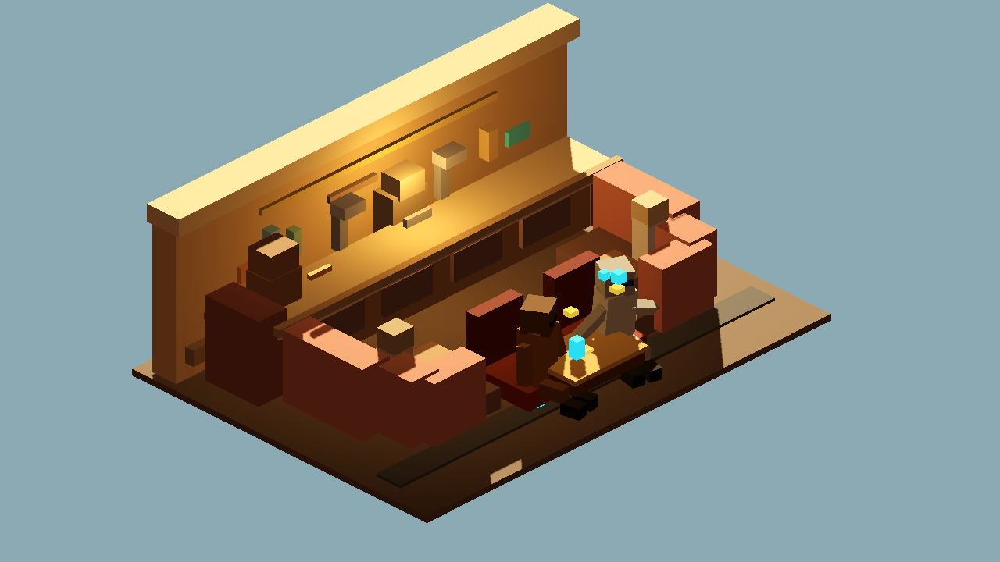

# Godot Cantina Seated Social Animation v0

Generated: 2026-07-04 08:48:16
Generator: `docs/gpt/asset_factory/scripts/godot_cantina_seated_social_animation_proof.gd`

## Purpose

Answer the first animation-protocol question with a concrete docs-only proof: two blockcraft actors can sit, talk, drink, and turn toward each other in the kept Cantina bar/booth module without changing the module GLB.

## Controlled Change

Baseline: `generated/godot_cantina_bar_booth_bay_v1/REVIEW.md`

Changed variable: static social props -> named seated anchors, procedural blockcraft actors, key poses, and a saved Godot `AnimationPlayer` proof scene.

Kept fixed:

- `blockbench_cantina_bar_booth_bay_v1.glb` source and orientation
- bar/booth material family
- Godot review camera family
- docs-only boundary

## Generated Animation Proof Scene

`review_scenes/cantina_seated_social_animation_player.tscn`

Clip names in the proof scene:

- `sit_idle_loop`
- `lean_talk_loop`
- `drink_loop`
- `turn_to_speaker_loop`

Anchor names used:

- `seat_anchor_a`
- `seat_anchor_b`
- `table_anchor`
- `look_target_a`
- `look_target_b`

Actor part names used:

- `Actors/LeftPatron/Torso`
- `Actors/LeftPatron/Head`
- `Actors/LeftPatron/LeftArm`
- `Actors/LeftPatron/RightArm`
- matching `RightPatron` parts

## Captures

### seated_social_contact_sheet

Contact sheet: four key poses using the same booth anchors and kept bar/booth GLB.

### seated_idle_pair

Two blockcraft actors seated at named booth anchors. This proves scale and default sit posture.

### lean_talk_keyframe

Talk keyframe: the left actor leans forward and gestures while the right actor listens.

### drink_loop_keyframe

Drink keyframe: right-hand cup socket and arm lift tested from the same camera.

### turn_to_speaker_keyframe

Turn-to-speaker keyframe: heads and torsos rotate toward the active speaker.

## Verdict

Candidate protocol keep, not a final animation pack.

This proof is useful because it gives Claude a concrete request shape for social/environment animation: name the scene baseline, name anchors, name clip loops, capture key poses, and save a Godot proof. It is not enough for clone-trooper combat movement, which still needs a shared rig and Blender/glTF animation validation.

## Next One-Variable Recommendation

Create a `shared_blockcraft_humanoid_rig_v0` contract and test only two clone rifleman clips next: `idle_rifle_loop` and `fire_rifle_once`. Keep the rifleman body scale fixed and validate the clip names after Godot import.
