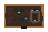
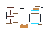
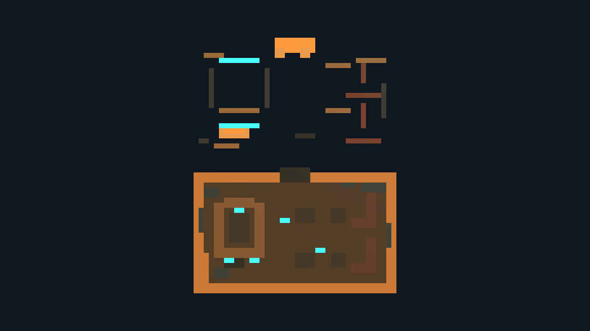
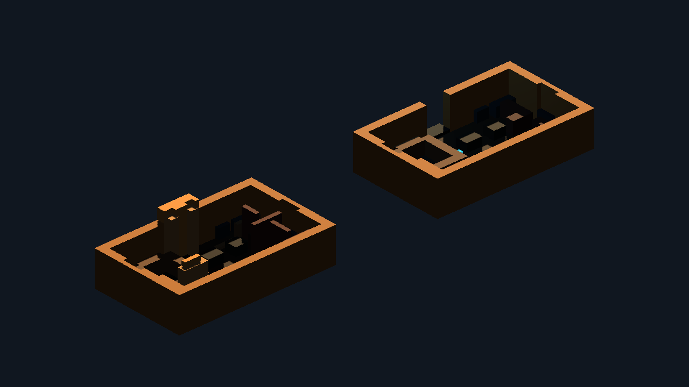
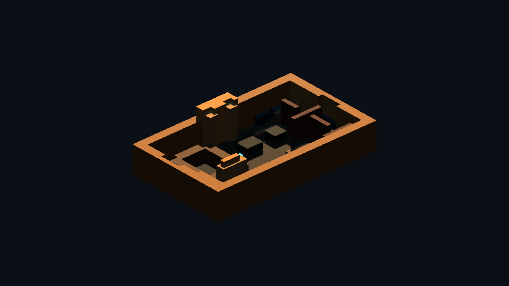
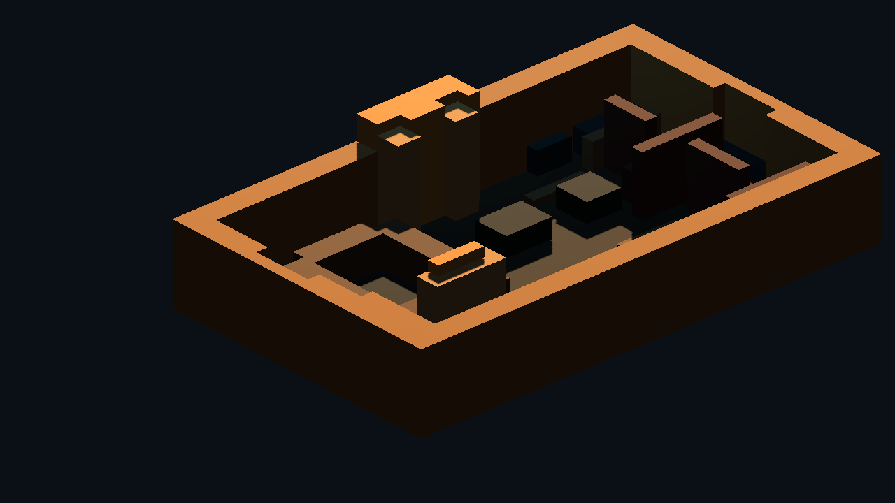

# Godot Layered Pixel Cantina Kit Proof v1

Generated: 2026-07-04 15:39:41
Generator: `docs/gpt/asset_factory/scripts/godot_pixel_cantina_layered_kit_proof.gd`

## Purpose

Test the next one-variable improvement after the pixel Cantina v0: add a second semantic detail/elevation card while keeping rectangle merge and material batching.

## Source Cards

- `source_images/cantina_floorplan_48x32.png`
- `source_images/cantina_detail_elevation_48x32.png`

## Efficiency Stats

| Metric | Value |
| --- | ---: |
| Grid size | `48x32` |
| Floor non-empty pixels | 966 |
| Detail non-empty pixels | 141 |
| Combined non-empty pixels | 1107 |
| Floor rectangles | 74 |
| Detail rectangles | 27 |
| Combined rectangles | 101 |
| Material-batched mesh nodes | 16 |
| Rectangle reduction vs per-pixel | 90.9% |
| Node reduction vs per-pixel | 98.6% |
| Per-pixel triangle estimate | 13284 |
| Batched triangle estimate | 1212 |

Used categories: `arch, bar, booth, booth_back, clutter, door, floor, frame, lamp, light, pipe, raised, sign, socket, table, wall`

## Captures

### layered_cantina_source_cards

Two original semantic pixel cards. Top: floorplan/layout. Bottom: elevation/detail hooks for arches, frames, booth backs, pipes, sockets, lamps, signs, and raised platforms.

### layered_cantina_v0_vs_v1

Left: floorplan-only merged room kit. Right: layered floorplan plus detail/elevation card. Same room, one added semantic layer.

### layered_cantina_v1_isometric

Layered material-batched Cantina v1 from the isometric review camera.

### layered_cantina_v1_closeup

Close review of the added arches, frames, booth backs, lamps, pipes, sockets, and raised floor detail.

## Verdict

Candidate keep. The second semantic card adds visible room identity hooks without breaking the compute model. It is still not a replacement for authored Blockbench hero modules, but it is now strong enough to be considered a scalable room-production backbone: floorplan/layout/collision/LOD from pixels, detail sockets/elevation from a second card, and hero props layered in as authored assets.

Next improvement: generate collision/navigation shapes and named interaction sockets from the same cards, proving this lane is runtime-useful rather than only visual.
