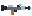
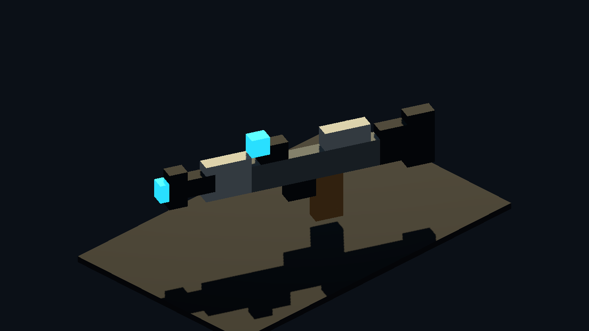
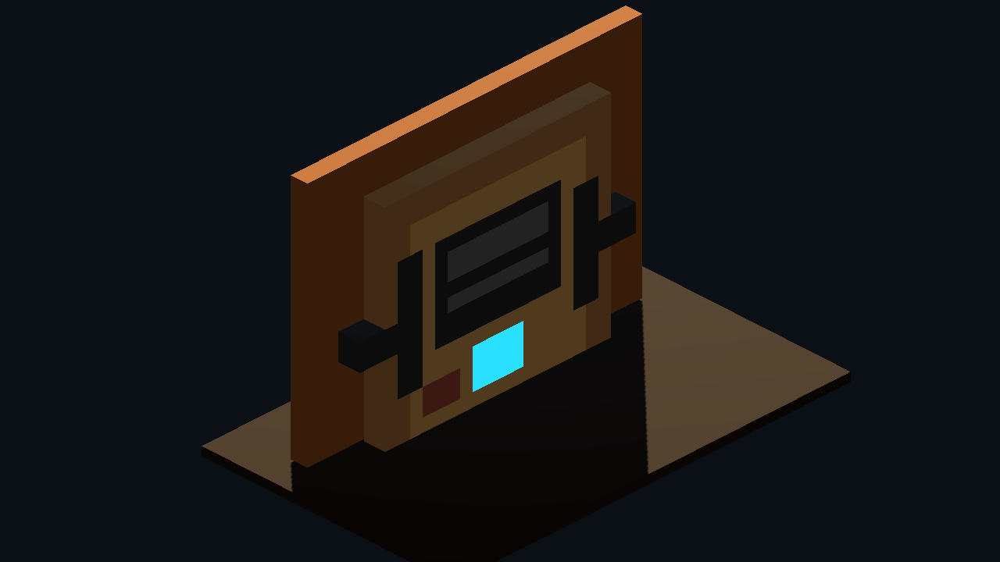
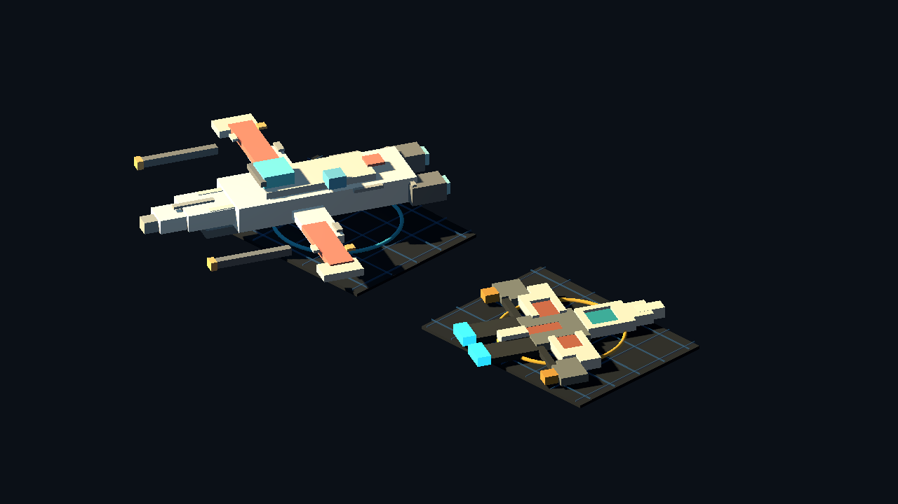
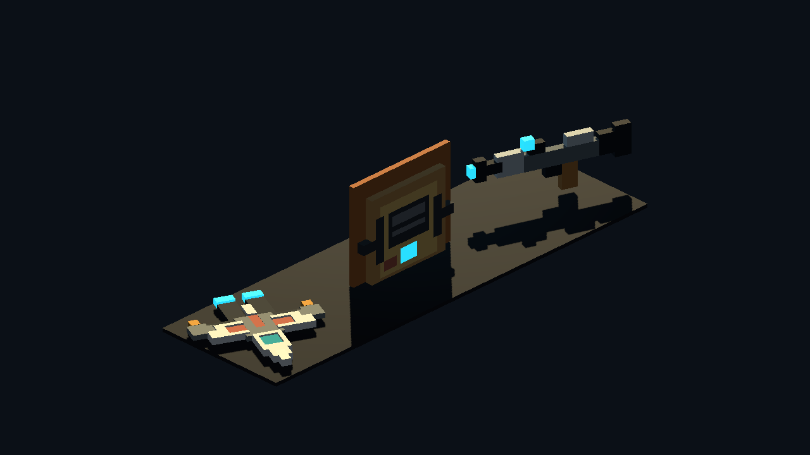
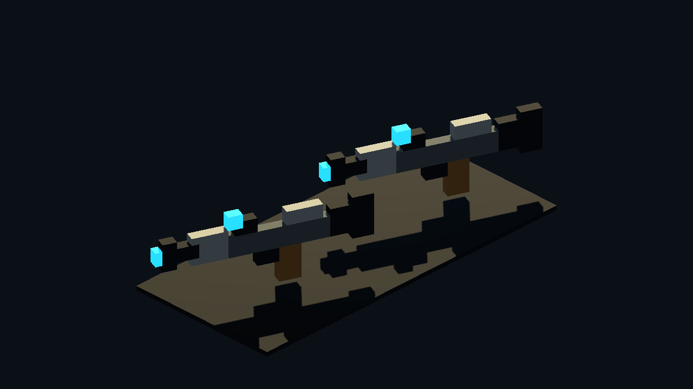
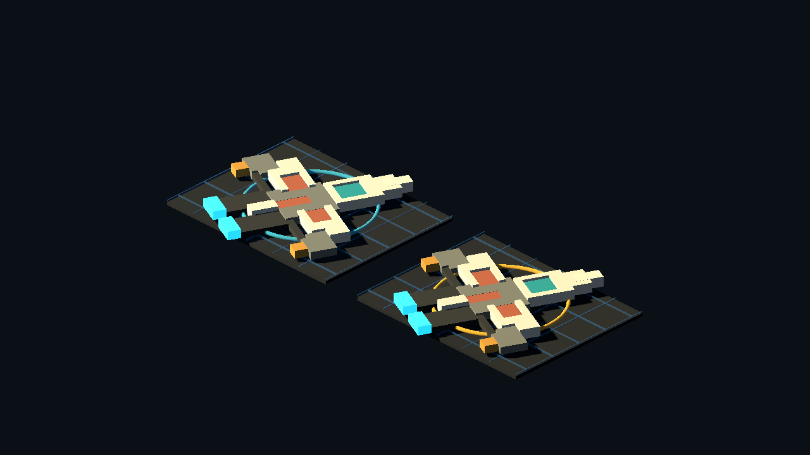

# Godot Pixel Extrude Proof v0

Generated: 2026-07-04 14:26:47
Generator: `docs/gpt/asset_factory/scripts/godot_pixel_extrude_proof.gd`

## Purpose

Test Gemini's Option 3 in the actual Godot review environment: use a 2D pixel image as source data and spawn one strict grid cube for every non-transparent pixel.

This is deliberately not Meshy. It spends zero credits and produces true discrete voxel geometry.

A second sub-test keeps the exact same source images and changes only the emission strategy: per-pixel cubes versus same-color horizontal run boxes. This tests whether the lane can stay visually voxel while reducing object count and feeling less papercut.

## Source Images

- `source_images/pixel_blaster_side_32x16.png`
- `source_images/pixel_service_terminal_front_24x24.png`
- `source_images/pixel_patrol_ship_top_32x32.png`

## Cube Counts

| Node | Mode | Source pixels | Cubes |
| --- | --- | ---: | ---: |
| `pixel_blaster` | `front_extrude_meshinstance_per_pixel` | 512 | 146 |
| `pixel_terminal` | `front_extrude_meshinstance_per_pixel` | 576 | 332 |
| `pixel_ship_token` | `top_extrude_meshinstance_per_pixel` | 1024 | 322 |
| `family_blaster` | `front_extrude_meshinstance_per_pixel` | 512 | 146 |
| `family_terminal` | `front_extrude_meshinstance_per_pixel` | 576 | 332 |
| `family_ship` | `top_extrude_meshinstance_per_pixel` | 1024 | 322 |
| `pixel_blaster_per_pixel_ab` | `front_extrude_meshinstance_per_pixel` | 512 | 146 |
| `pixel_blaster_runmerge_ab` | `front_extrude_same_color_horizontal_runs` | 512 | 32 |
| `pixel_ship_per_pixel_ab` | `top_extrude_meshinstance_per_pixel` | 1024 | 322 |
| `pixel_ship_runmerge_ab` | `top_extrude_same_color_horizontal_runs` | 1024 | 94 |

## Captures

### pixel_blaster_per_pixel_cubes

A 32x16 side-view pixel blaster extruded into one MeshInstance3D cube per non-transparent pixel. This tests the strictest version of Gemini's Option 3.

### pixel_terminal_wall_module

A 24x24 front-view service terminal pixel image extruded into a chunky wall module. This is the zero-credit alternative to a Meshy terminal prompt.

### pixel_ship_vs_blockbench_isometric

Left: kept Blockbench microfighter baseline. Right: a 32x32 top-down pixel ship extruded into true grid cubes for isometric tactical space.

### pixel_extrude_three_family_sheet

Contact sheet for the three tested pixel-to-cube families: weapon, wall prop, and tactical ship token.

### pixel_blaster_pixel_vs_runmerge

Same 32x16 blaster source image. Left: one MeshInstance3D cube per pixel. Right: contiguous same-color pixels merged into rectangular voxel bars.

### pixel_ship_pixel_vs_runmerge

Same 32x32 top-down ship source image. Left: one cube per pixel. Right: same-color horizontal runs merged before extrusion.

## Verdict

Candidate lane keep for strict voxel props and tactical tokens.

This does what Meshy lowpoly could not: it guarantees cube-grid geometry. The best uses are flat-ish assets where a pixel source is naturally meaningful: weapon pickups, signs, icons, datapads, wall terminals, decals with depth, and isometric ship tokens.

The same-color run merge is the better production direction for most non-pixel-art source cards: it preserves the silhouette, reduces cube count sharply, and creates cleaner Blockbench-like bars. Keep per-pixel cubes when the pixel-grid look itself is the point.

Do not treat it as a full character/building replacement yet. Humanoids need a front/side/body-part layer contract, and large buildings need modular wall/roof kits rather than thousands of one-pixel cubes.

## Next One-Variable Recommendation

Try one AI-generated or Codex-generated 32x32 source card for a real requested asset, then route it through run-merge extrusion and compare against a hand-authored Blockbench version. Do not use copied fan art as the source image.
