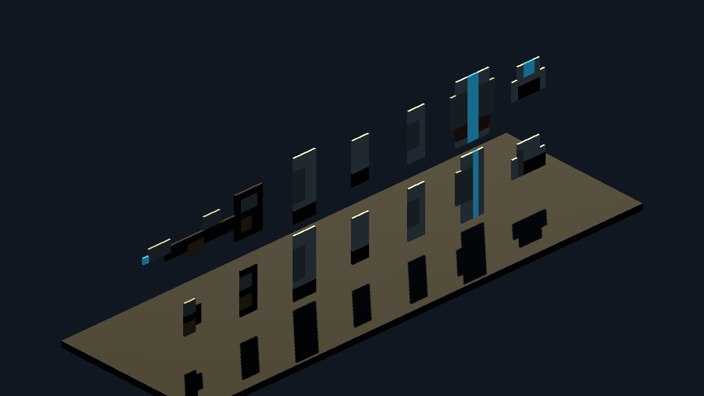
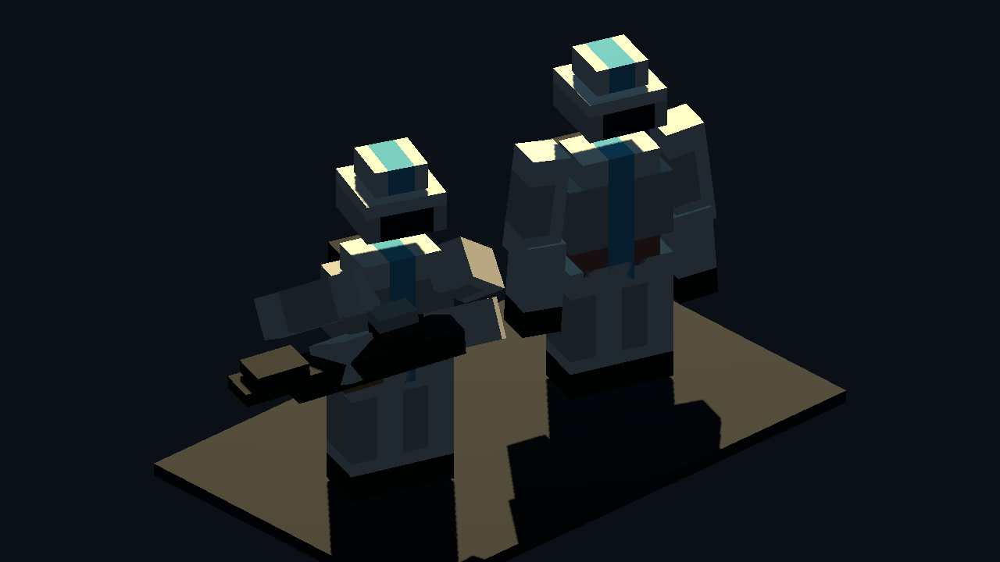
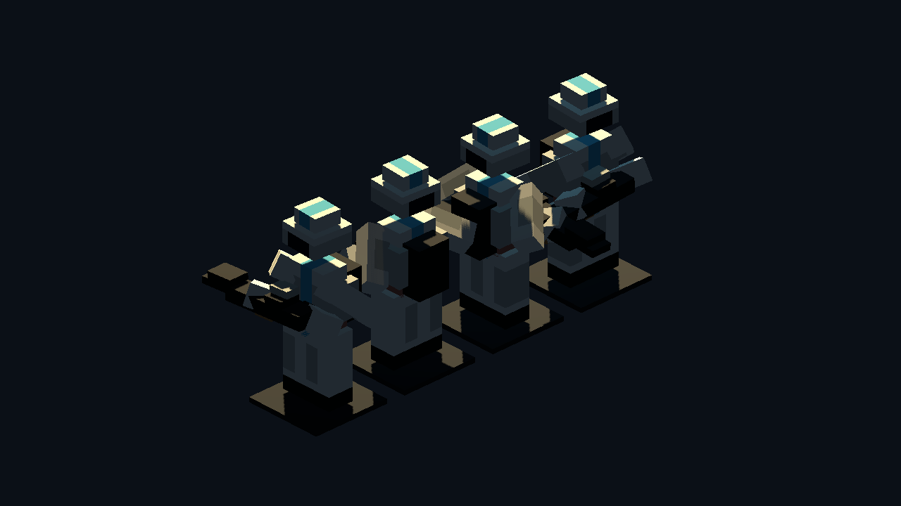
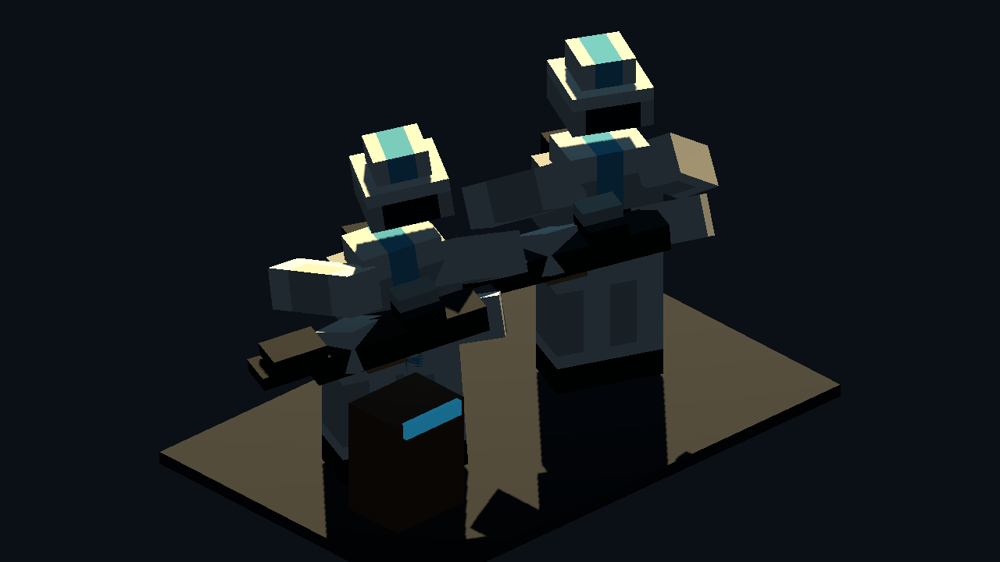

# Godot Body-Part Pixel Hull Proof v0

Generated: 2026-07-04 15:12:00
Generator: `docs/gpt/asset_factory/scripts/godot_pixel_hull_body_parts_proof.gd`

## Purpose

Test the next step after the whole-body pixel hull: split a trooper-like blockcraft actor into deterministic voxel body parts so animation can rotate rigid pieces instead of bending one fused statue.

Each part is built from original project-owned front and side pixel cards. The generator fills the front/side visual hull and z-run merges the result into rectangular voxel bars.

## Source Card Families

- `head`: `source_images/head_front.png`, `source_images/head_side.png`
- `torso`: `source_images/torso_front.png`, `source_images/torso_side.png`
- `upper_arm`: `source_images/upper_arm_front.png`, `source_images/upper_arm_side.png`
- `forearm`: `source_images/forearm_front.png`, `source_images/forearm_side.png`
- `leg`: `source_images/leg_front.png`, `source_images/leg_side.png`
- `backpack`: `source_images/backpack_front.png`, `source_images/backpack_side.png`
- `rifle`: `source_images/rifle_front.png`, `source_images/rifle_side.png`

## Captures

### body_part_source_cards

Original project-owned per-body-part pixel cards. Each body part has separate front and side silhouettes so it can become a rigid animation piece.

### body_part_neutral_vs_ready

Same voxel parts, two poses. Left: neutral test assembly. Right: rifle-ready pose using rotations/translations on separate head, torso, arm, leg, backpack, and weapon nodes.

### body_part_rotation_contact_sheet

Four yaw angles for the assembled body-part hull. This checks whether the split parts read as one 3D actor instead of a paper cutout.

### body_part_cover_pose_ab

Rifle-ready versus simple cover-lean pose. This tests whether the deterministic hull pieces expose enough handles for MMO combat animation requests.

## Stats

| Node | Mode | Boxes | Raw voxels |
| --- | --- | ---: | ---: |
| `head_front_card` | `source_card_same_color_runs` | 13 |  |
| `head_side_card` | `source_card_same_color_runs` | 12 |  |
| `torso_front_card` | `source_card_same_color_runs` | 30 |  |
| `torso_side_card` | `source_card_same_color_runs` | 30 |  |
| `upper_arm_front_card` | `source_card_same_color_runs` | 12 |  |
| `upper_arm_side_card` | `source_card_same_color_runs` | 12 |  |
| `forearm_front_card` | `source_card_same_color_runs` | 7 |  |
| `forearm_side_card` | `source_card_same_color_runs` | 7 |  |
| `leg_front_card` | `source_card_same_color_runs` | 15 |  |
| `leg_side_card` | `source_card_same_color_runs` | 15 |  |
| `backpack_front_card` | `source_card_same_color_runs` | 15 |  |
| `backpack_side_card` | `source_card_same_color_runs` | 11 |  |
| `rifle_front_card` | `source_card_same_color_runs` | 10 |  |
| `rifle_side_card` | `source_card_same_color_runs` | 7 |  |
| `torso` | `body_part_front_side_visual_hull_z_runs` | 70 | 320 |
| `head` | `body_part_front_side_visual_hull_z_runs` | 26 | 140 |
| `backpack` | `body_part_front_side_visual_hull_z_runs` | 35 | 105 |
| `left_upper_arm` | `body_part_front_side_visual_hull_z_runs` | 24 | 72 |
| `left_forearm` | `body_part_front_side_visual_hull_z_runs` | 21 | 63 |
| `right_upper_arm` | `body_part_front_side_visual_hull_z_runs` | 24 | 72 |
| `right_forearm` | `body_part_front_side_visual_hull_z_runs` | 21 | 63 |
| `left_leg` | `body_part_front_side_visual_hull_z_runs` | 40 | 160 |
| `right_leg` | `body_part_front_side_visual_hull_z_runs` | 40 | 160 |
| `rifle` | `body_part_front_side_visual_hull_z_runs` | 43 | 123 |

## Verdict

Candidate keep for the deterministic animation lane.

This is materially better than the fused whole-body hull for animation because head, torso, arms, legs, backpack, and weapon are addressable nodes. It does not yet replace a Blockbench hero character: shoulder/elbow pivots are approximate, poses are rigid, and the silhouette still needs hand-authored polish. It does establish a cheap, repeatable protocol for background NPCs, low-detail troopers, droids with segmented limbs, and quick animation request proofs.

Recommended next check: build the same body-part protocol for a non-humanoid droid, where rigid segmented limbs are a better natural fit than organic humanoid animation.
