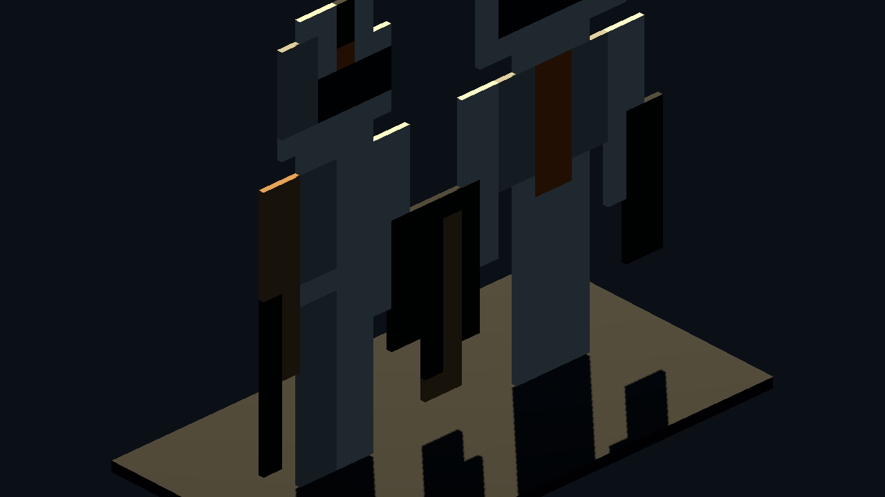
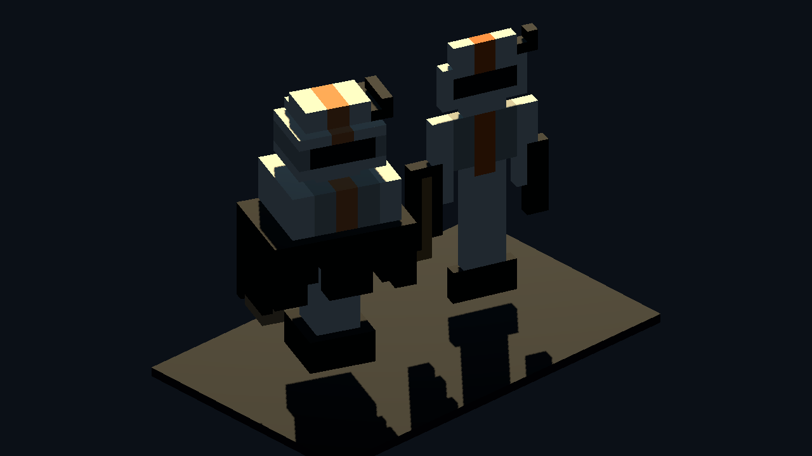
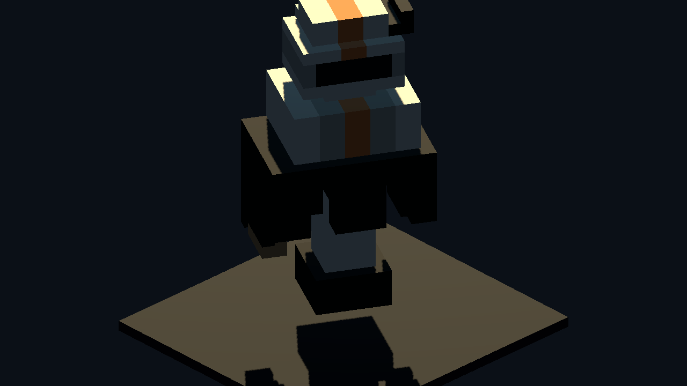
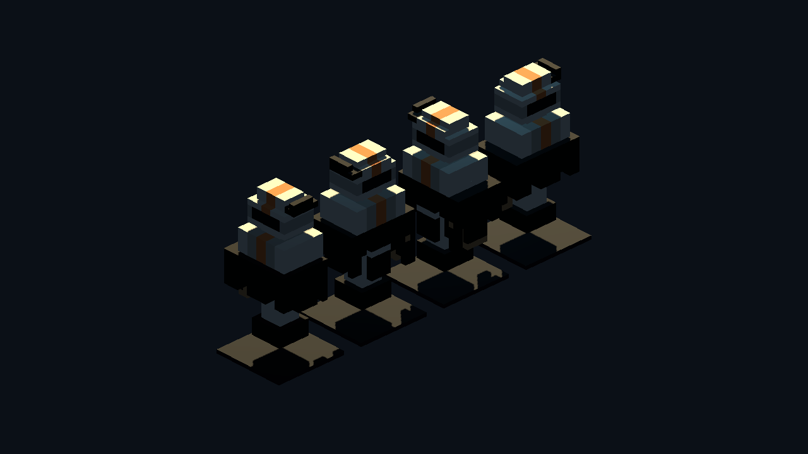

# Google Pixel Hull Character Recreation v0

Generated: 2026-07-04 17:14:05
Generator: `docs/google/modeling/asset_factory/scripts/google_pixel_hull_character_recreation.gd`

## Purpose

Google's recreation of the Clone Trooper model using Codex's pixel-hull generator strategy.
We transitioned the team markings to orange (212th Attack Battalion style) and added a helmet rangefinder accessory.

## Source Cards

- `source_images/commander_front_card_16x28.png`
- `source_images/commander_side_card_10x28.png`

## Stats

| Node | Mode | Boxes | Raw voxels |
| --- | --- | ---: | ---: |
| `front_card_display` | `front_card_same_color_horizontal_runs` | 94 |  |
| `side_card_display` | `front_card_same_color_horizontal_runs` | 72 |  |
| `flat_front_extrude` | `front_card_same_color_horizontal_runs` | 94 |  |
| `front_side_visual_hull` | `front_side_visual_hull_z_runs` | 250 | 1390 |
| `trooper_visual_hull` | `front_side_visual_hull_z_runs` | 250 | 1390 |
| `trooper_visual_hull_yaw_0` | `front_side_visual_hull_z_runs` | 250 | 1390 |
| `trooper_visual_hull_yaw_90` | `front_side_visual_hull_z_runs` | 250 | 1390 |
| `trooper_visual_hull_yaw_180` | `front_side_visual_hull_z_runs` | 250 | 1390 |
| `trooper_visual_hull_yaw_270` | `front_side_visual_hull_z_runs` | 250 | 1390 |

## Captures

### recreation_source_cards

Google recreation front and side pixel cards. Designed with 212th Orange markings and a helmet rangefinder.

### recreation_flat_vs_volume

Orange Clone Commander recreation. Left: flat front extrusion. Right: front+side visual hull with z-run merged voxels.

### recreation_three_quarter

Three-quarter Godot camera proof for the Google Clone Commander rangefinder recreation.

### recreation_rotation_contact_sheet

Rotation contact sheet at 0, 90, 180, and 270 degree yaw for the Google Clone Commander recreation.

## Comparison with Codex Trooper

The Google rangefinder commander recreation successfully maps the orange command markings and rangefinder accessory using the same visual hull intersection mechanics.
This shows the flexibility of the pixel-hull method for rapidly swapping colors, textures, and geometric accessories (like rangefinders, pauldrons, or antennas) without manual mesh modification.
