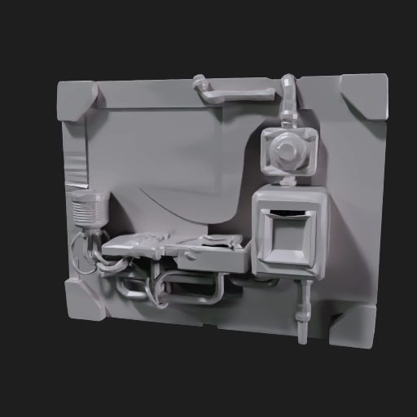

# Meshy Evaluation v0

Generated: 2026-07-04  
Scope: first Meshy Premium preview test for SW_MMO_Prototype asset factory

## Purpose

Test whether Meshy Premium changes the asset pipeline enough to become a serious lane.

The first test used one conservative text-to-3D preview for a generic sci-fi Cantina service terminal / utility wall prop.

## Prompted Asset

```text
meshy_cantina_service_terminal_v0
```

Prompt:

```text
Chunky low-poly blockcraft sci-fi desert cantina back hallway service terminal prop. Squat wall console with pipes, vent slats, cable bundle, cyan scanner light, beige worn plaster shell, dark metal panels. Game asset, readable silhouette, no text, no logos, no characters, no famous franchise shapes.
```

## Generated Files

```text
meshy_cantina_service_terminal_v0/model.glb
meshy_cantina_service_terminal_v0/thumbnail.png
meshy_cantina_service_terminal_v0/alpha_thumbnail.png
meshy_cantina_service_terminal_v0/provider_response_redacted.json
meshy_cantina_service_terminal_v0/STATUS.md
godot_proof/REVIEW.md
```

## Cost and Validation

Meshy status:

```text
SUCCEEDED
```

Credits consumed:

```text
20
```

GLB validation:

```text
No errors.
No warnings.
One info: NODE_MATRIX_DEFAULT on /nodes/0/matrix.
```

## Provider Thumbnail

The provider thumbnail is the strongest view of the result.



## Godot Proof

Godot proof:

```text
godot_proof/REVIEW.md
```

Key capture:


Orientation check:


## Verdict

Candidate lesson keep, not a direct runtime/model keep.

Meshy produced useful asymmetrical sci-fi shape language very quickly: wall plate, cable bundle, vent stack, inset box, and uneven edge rhythm. It also produced a clean GLB preview with no validation warnings.

But the Godot-tinted import does not yet fit the blockcraft style. It reads softer and more organic than the current authored Blockbench modules, and the useful detail is much clearer in the provider thumbnail than in the current gameplay-camera proof.

## What This Changes

Meshy should become a serious experiment lane for:

- concepting hard props;
- machinery and clutter inspiration;
- creatures and organic aliens;
- hero object silhouette exploration;
- possible source geometry for human/Blender cleanup.

Meshy should not become the default lane for:

- modular buildings;
- simple blockcraft props;
- core characters;
- weapons needing exact silhouette;
- anything we need Claude/the owner to tweak block-by-block.

## Credit and Lane Update

Latest owner question:

```text
Could we use the 4 Meshy 5 draft variants, then fix/rebuild the best one ourselves?
```

Current answer:

```text
Yes, probably useful as option mining.
No, not yet proof of direct runtime style fit.
```

The owner screenshot shows Meshy 5 legacy model stage as 10 credits for 4 draft variants, while low poly is 20 credits. That makes Meshy 5 interesting for silhouette selection: generate options, choose the best composition, then rebuild it in Blockbench or repair/normalize it in Blender if the GLB is unusually strong.

For direct blockcraft compatibility, `model_type: "lowpoly"` remains the fair style-first test. The next strict lowpoly prompt dry-run is:

```text
meshy_cantina_service_terminal_voxel_lowpoly_v1
```

The Meshy 5 draft-selection dry-run is:

```text
meshy_cantina_service_terminal_meshy5_draft_v1
```

Both request bodies were dry-run locally before paid calls.

## Paid Follow-Up Results

### Strict Lowpoly Voxel Prompt

```text
meshy_cantina_service_terminal_voxel_lowpoly_v1
```

Cost:

```text
20 credits
```

Validation:

```text
No errors.
No warnings.
One info: NODE_MATRIX_DEFAULT.
```

Verdict:

```text
Rejected as a direct keep; useful as a negative prompt lesson.
```

The stricter cuboid prompt made the output more block-like, but it flattened the asset into a plain service wall and lost the weird asymmetrical character of the first prompt. It does not beat the Blockbench baseline or the Meshy 5 seed.

### Meshy 5 API Probe

```text
meshy_cantina_service_terminal_meshy5_draft_v1
```

Cost:

```text
5 credits
```

Validation:

```text
No errors.
No warnings.
One info: UNUSED_OBJECT on TEXCOORD_0.
```

Observed API behavior:

```text
Returned one GLB in model_urls.glb.
No drafts or variants fields were present.
```

Verdict:

```text
Candidate option-mining keep.
```

The Meshy 5 result is the best cost/value shape seed so far. It is not direct cubecraft art, but it gives a more useful terminal mass than either lowpoly prompt for only 5 credits.

### Meshy 5 Refine / Texture Test

```text
meshy_cantina_service_terminal_meshy5_draft_v1_refine_v1
```

Cost:

```text
10 credits
```

Validation:

```text
No errors.
No warnings.
One info: NODE_MATRIX_DEFAULT.
```

Key outputs:

```text
meshy_cantina_service_terminal_meshy5_draft_v1_refine_v1/model.glb
meshy_cantina_service_terminal_meshy5_draft_v1_refine_v1/thumbnail.png
godot_proof/captures/meshy5_refined_material_geometry.png
godot_proof/captures/meshy5_preview_vs_refined_material_ab.png
godot_proof/captures/meshy5_refined_rotation_contact_sheet.png
```

Verdict:

```text
Candidate texture/refine keep, not direct runtime keep.
```

The refine step materially improves the visual read and proves Meshy textures can import into Godot. It does not make the model fully blockcraft-cohesive. Best use is still: Meshy 5 seed/refine for high-entropy concepting, then rebuild or normalize the winner before promotion.

## Free Retry / Refund Note

The owner screenshot says successful-but-disappointing web generations should use plan free retries, while Meshy-side technical failures should be refunded automatically.

Meshy's help center says the API does not currently support retry functionality for individual or studio teams:

```text
https://help.meshy.ai/en/articles/9992034-does-the-meshy-api-support-retry-for-generations
```

Therefore:

```text
Manual Meshy web UI free retries may help.
API resubmits should be treated as new paid calls.
```

## Next One-Variable Meshy Test

Do not refine this automatically.

Next fair quality test after this pass:

```text
Try a different high-entropy asset family, probably a small alien/creature or ship greeble, using Meshy 5 preview first.
```

Do not spend more on this exact service-terminal shape unless testing a manual free retry in the web UI or a rebuild-from-reference Blockbench pass.
Keep Meshy as a direct candidate only if the Godot camera proof becomes more cohesive with the Blockbench modules. Otherwise, use Meshy thumbnails/refines as rebuild references for Blockbench.
