# Godot Meshy Evaluation v0

Generated: 2026-07-04 12:38:42
Generator: `docs/gpt/asset_factory/scripts/godot_meshy_eval_proof.gd`

## Purpose

Test whether one Meshy text-to-3D preview changes the asset pipeline for Cantina set dressing.

## Controlled Change

Baseline: `blockbench_cantina_exterior_clutter_v1` utility module and `blockbench_cantina_bar_booth_bay_v1` interior style.

Changed variable: manual Blockbench utility/clutter geometry -> one Meshy preview GLB, material-tinted in Godot for geometry evaluation.

Import note: the orientation contact sheet shows the most useful generated detail at 0 and 270 degree yaw. The comparison scene uses 0 degree yaw and leaves the GLB source unchanged.

## Source

`generated/meshy_eval_v0/meshy_cantina_service_terminal_v0/model.glb`
`generated/meshy_eval_v0/meshy_cantina_service_terminal_voxel_lowpoly_v1/model.glb`
`generated/meshy_eval_v0/meshy_cantina_service_terminal_meshy5_draft_v1/model.glb`
`generated/meshy_eval_v0/meshy_cantina_service_terminal_meshy5_draft_v1_refine_v1/model.glb`

The two lowpoly previews consumed 20 Meshy credits each. The Meshy 5 preview consumed 5 credits through the API, and the refine consumed 10 credits. `gltf-transform validate` found no errors or warnings for the lowpoly GLBs, only a default matrix info; the Meshy 5 preview GLB has no errors or warnings and one unused TEXCOORD info; the refined GLB has no errors or warnings and one default matrix info.

## Captures

### meshy_service_terminal_geometry

Meshy preview GLB in a simple Cantina wall context. Materials are a neutral preview tint; this evaluates geometry only.

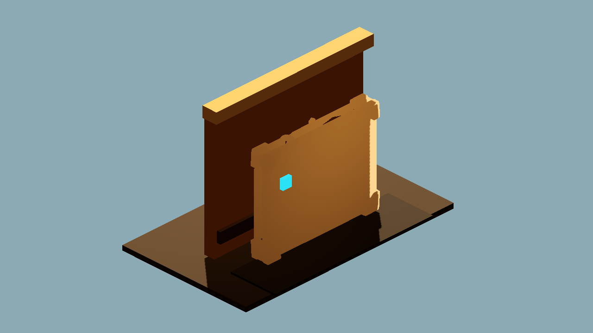

### meshy_voxel_lowpoly_geometry

Strict cuboid/voxel prompt GLB in the same Cantina wall context. Same lowpoly route, changed prompt only.

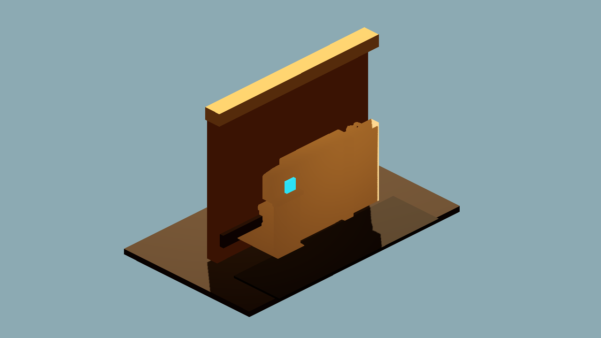

### meshy5_draft_geometry

Meshy 5 standard preview in the same Cantina wall context. This tests the cheap draft/option-mining route rather than the lowpoly style route.

### meshy5_refined_material_geometry

Meshy 5 refined GLB with imported materials preserved. This evaluates the texture/refine step rather than pure geometry.

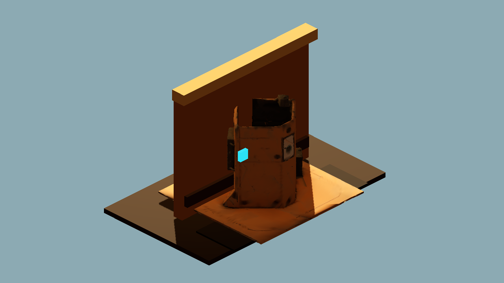

### meshy_rotation_contact_sheet

Orientation contact sheet: Meshy GLB at 0, 90, 180, and 270 degree yaw. This checks which face actually carries the generated detail.

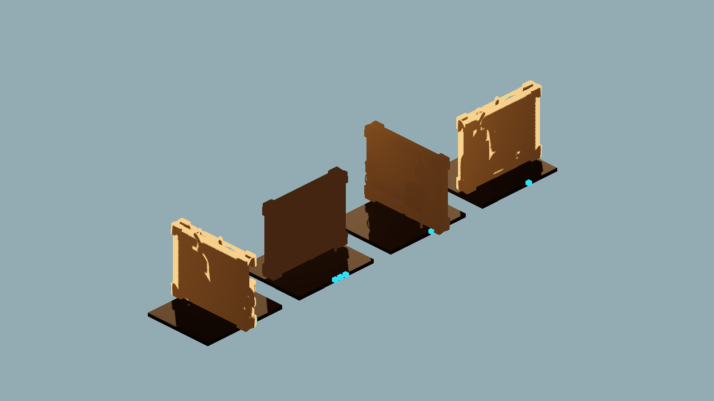

### meshy_voxel_rotation_contact_sheet

Orientation contact sheet for the stricter cuboid/voxel lowpoly prompt at 0, 90, 180, and 270 degree yaw.

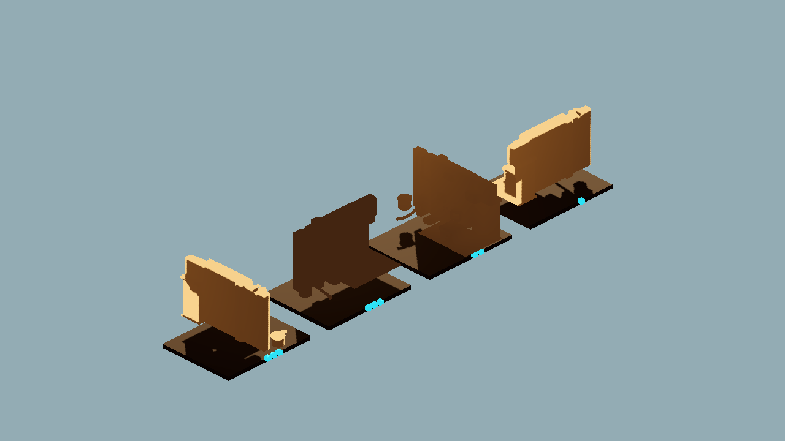

### meshy5_rotation_contact_sheet

Orientation contact sheet for the Meshy 5 draft-selection probe at 0, 90, 180, and 270 degree yaw.

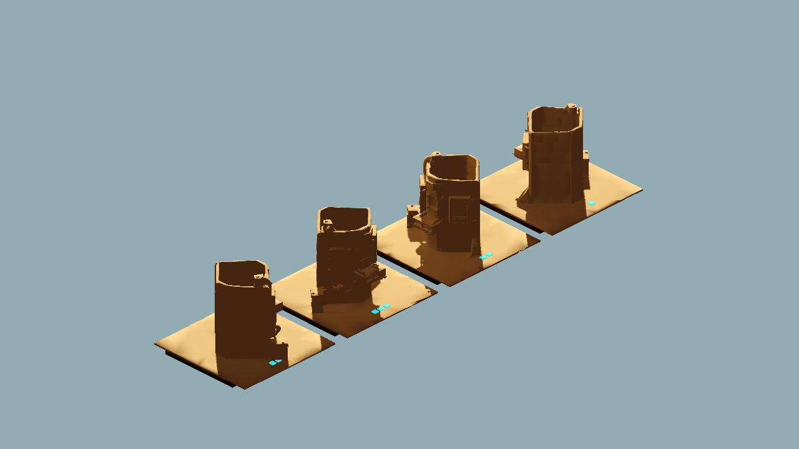

### meshy5_refined_rotation_contact_sheet

Orientation contact sheet for the refined Meshy 5 textured GLB at 0, 90, 180, and 270 degree yaw with imported materials preserved.

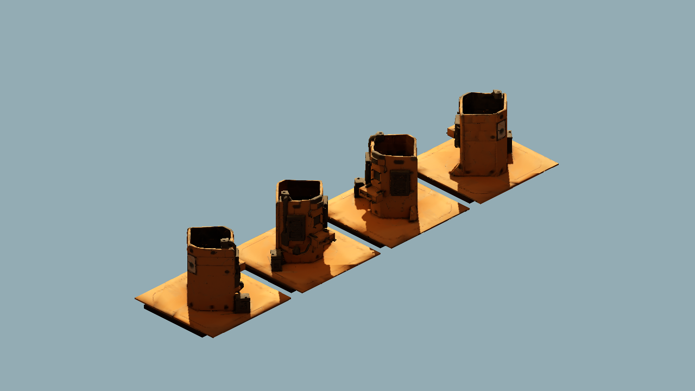

### meshy_lowpoly_prompt_ab

Left: first lowpoly prompt. Right: stricter cuboid/voxel lowpoly prompt. This isolates prompt wording while keeping the Meshy lowpoly route.

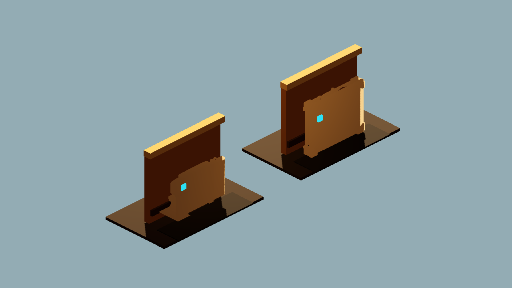

### meshy_vs_blockbench_utility_ab

Left: existing Blockbench utility module. Right: Meshy preview service terminal. This tests whether Meshy adds useful medium-detail shape language.

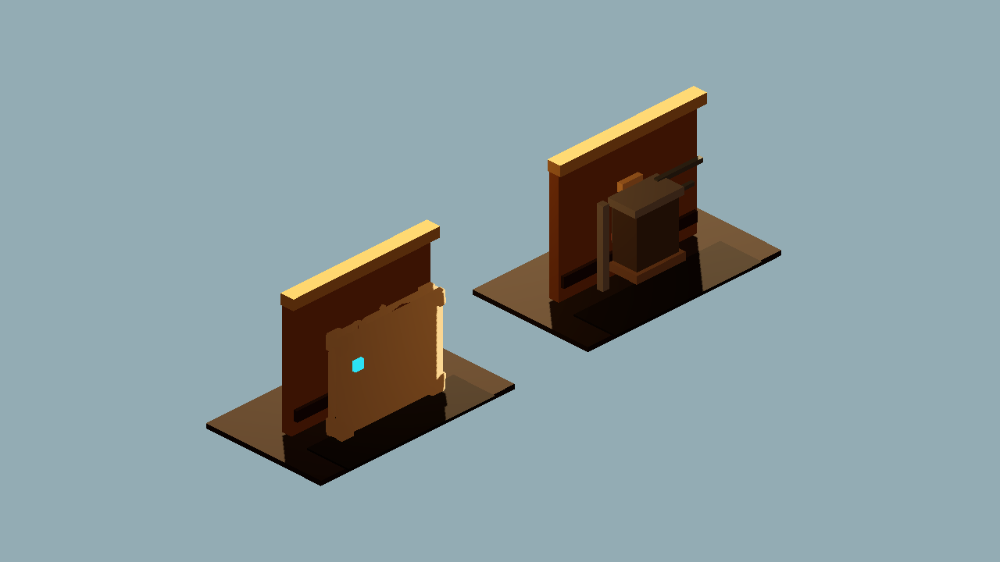

### meshy_three_way_blockbench_ab

Left: existing Blockbench utility module. Center: first Meshy lowpoly prompt. Right: strict voxel lowpoly prompt.

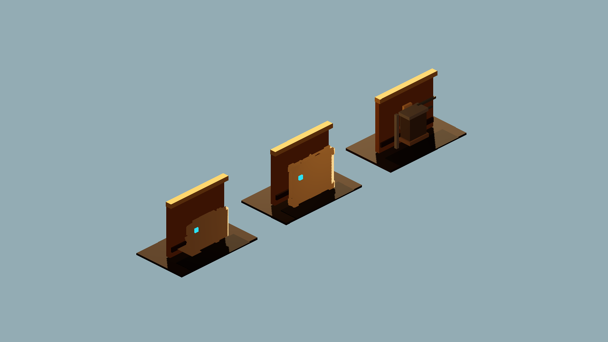

### meshy_route_four_way_ab

Left to right: Blockbench utility, first lowpoly prompt, strict lowpoly/voxel prompt, and Meshy 5 draft probe.

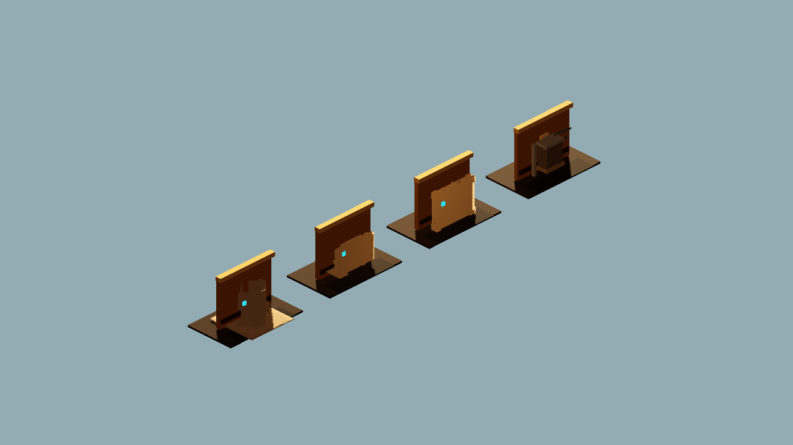

### meshy5_preview_vs_refined_material_ab

Left: Meshy 5 preview material. Right: Meshy 5 refined material. This isolates the refine/texture value after choosing a geometry seed.

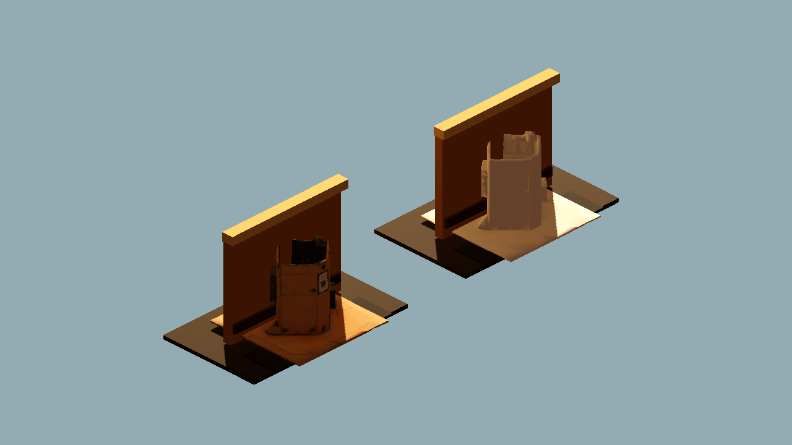

## Verdict

Candidate lesson keep, not a direct runtime keep yet.

Meshy generated richer greeble shape language than our utility-box blocks with one prompt and clean GLB validation. It is not blockcraft-cohesive enough to replace authored modules directly, and the preview has no materials, but it is useful as a medium-detail reference or cleanup candidate.

## Next One-Variable Recommendation

Run one image/reference-guided or refine test only after deciding whether this geometry is worth spending more credits. If not, rebuild its best features in Blockbench: asymmetrical wall plate, cable bundle, vent stack, and inset service box.
