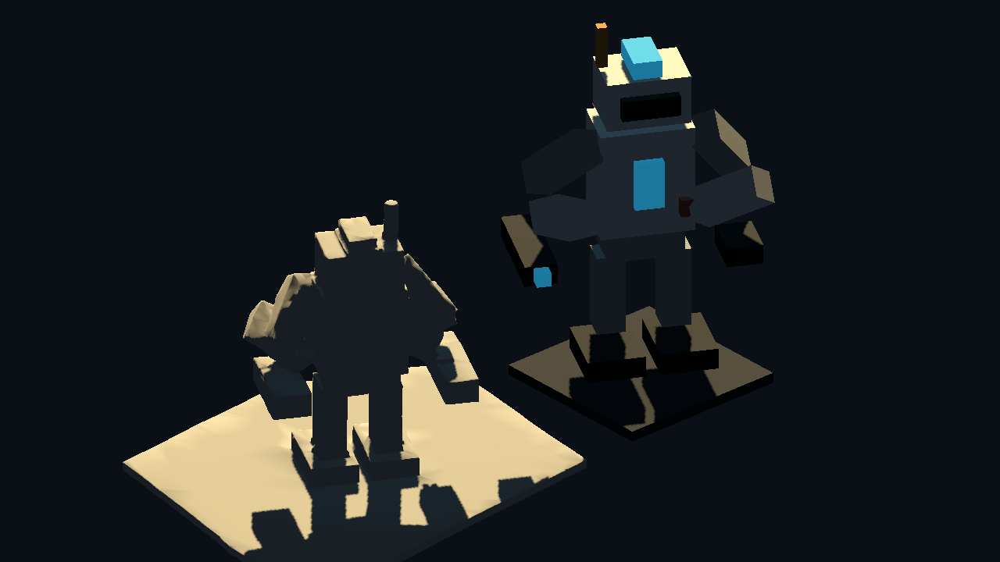
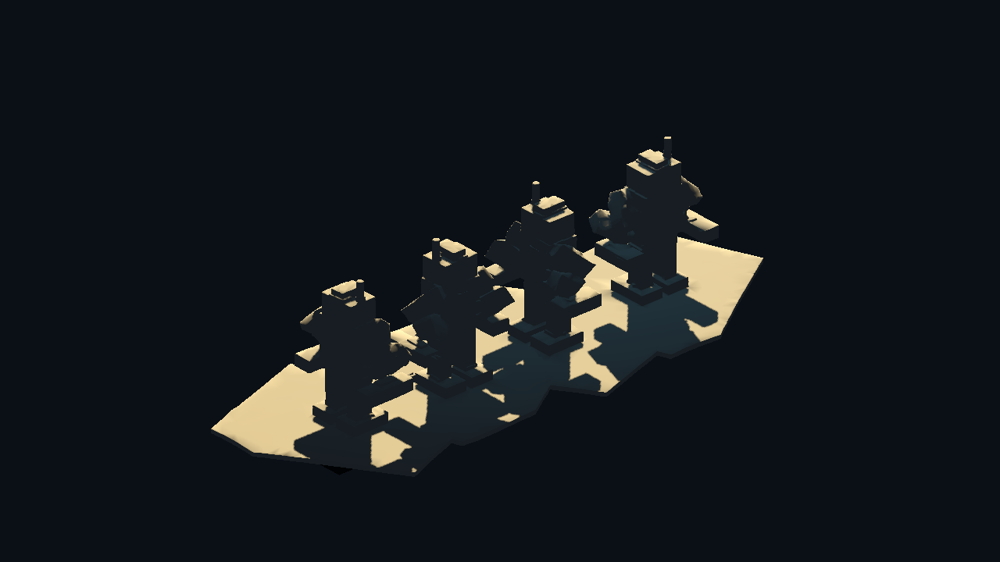

# Meshy Image Droid Godot Proof v0

Generated: 2026-07-04 15:25:42
Generator: `docs/gpt/asset_factory/scripts/godot_meshy_image_droid_eval_proof.gd`

## Purpose

Import the 5-credit Meshy image-to-3D segmented droid probe into Godot and compare it against the deterministic source droid baseline.

## Captures

### meshy_image_droid_baseline_ab

Left: Meshy image-to-3D GLB generated from the source render. Right: deterministic source droid baseline. This layout exposes the Meshy platform-fusion issue clearly.

### meshy_image_droid_rotation_contact_sheet

Meshy image-to-3D GLB at four yaw angles. Checks whether the generated model has usable back/side geometry and whether the source platform became unwanted mesh.

## Verdict

Candidate lesson keep, not a direct runtime keep. The image-to-3D result preserved the basic droid silhouette for only 5 credits, but it softened the cube grammar and absorbed the source presentation platform into the mesh. A tighter next test should use a cropped/transparent source with no floor and stronger silhouette separation.
