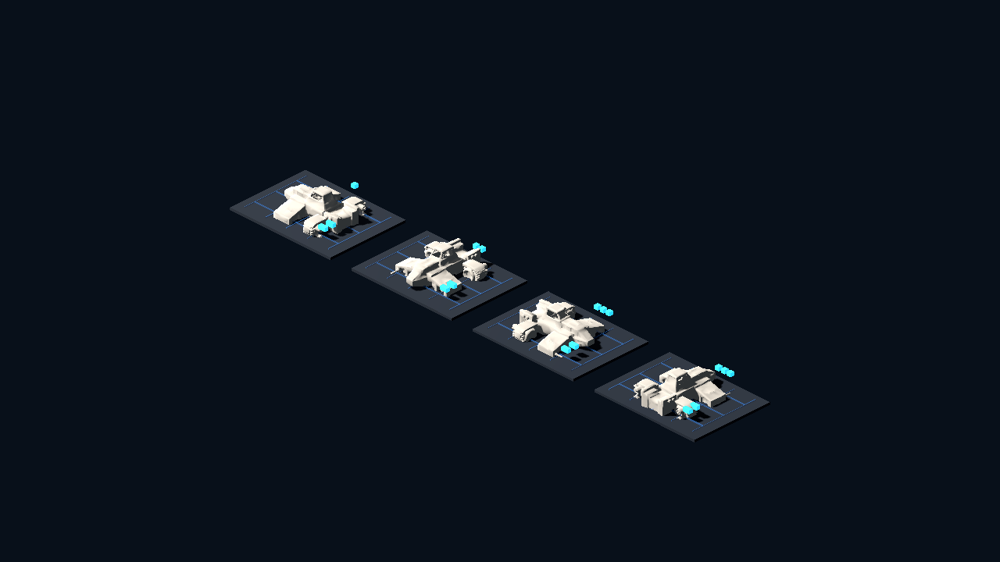
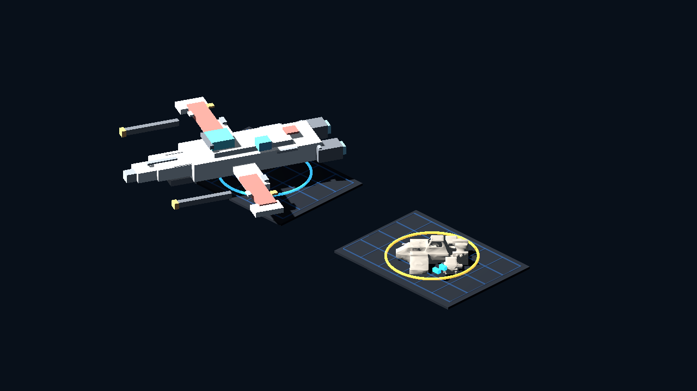
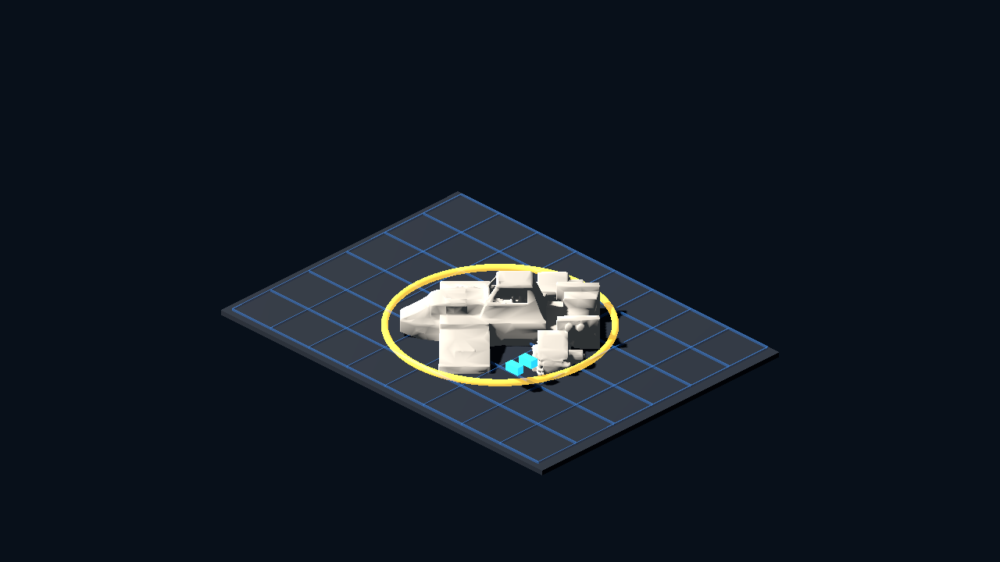

# Meshy Ship Evaluation v0

Generated: 2026-07-04 12:47:40
Generator: `docs/gpt/asset_factory/scripts/godot_meshy_ship_eval_proof.gd`

## Purpose

Test whether the cheap Meshy 5 API preview lane helps the difficult ship/vehicle silhouette problem more than the service-terminal prop problem.

## Sources

- `generated/blockbench_ship_panel_v2/glb/micro_arc_interceptor_panel_v2.glb`
- `generated/meshy_eval_v0/meshy_blockcraft_patrol_skiff_meshy5_v1/model.glb`

The Meshy preview consumed 5 credits. `gltf-transform validate` found no errors or warnings, only one unused TEXCOORD info.

## Captures

### meshy_patrol_skiff_rotation_contact_sheet

Meshy 5 patrol-skiff vehicle seed at 0, 90, 180, and 270 degree yaw. This checks whether the generated silhouette has a useful tactical-facing angle.

### meshy_ship_vs_blockbench_isometric

Left: kept Blockbench microfighter baseline. Right: Meshy 5 patrol-skiff seed. This tests whether Meshy helps ship/vehicle silhouette option mining.

### meshy_ship_close_read

Close isometric read of the Meshy 5 patrol-skiff seed with neutral material tint and engine glow markers.

## Verdict

Candidate lesson keep, not direct starfighter/runtime keep.

The Meshy 5 seed produces a useful chunky cockpit/engine mass, but it reads more like a ground hover-skiff or utility speeder than a clean isometric starfighter. It is better as vehicle/prop silhouette inspiration than as direct tactical-space art.

Next one-variable recommendation: either refine this only if the owner wants a ground-speeder/vehicle mood sample, or run a new Meshy 5 prompt explicitly asking for a flatter top-down tactical ship token with wing silhouette and no cabin/truck read.
