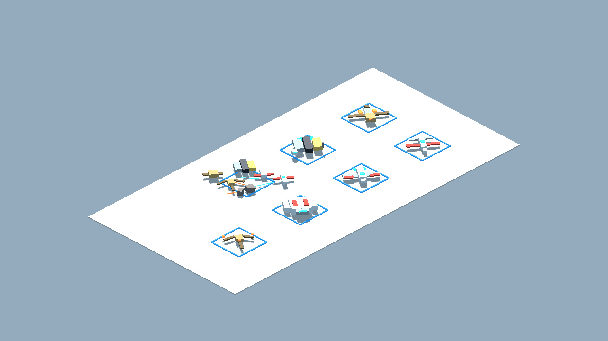
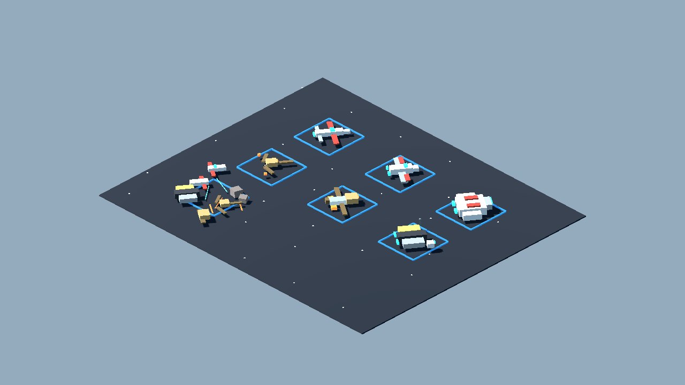
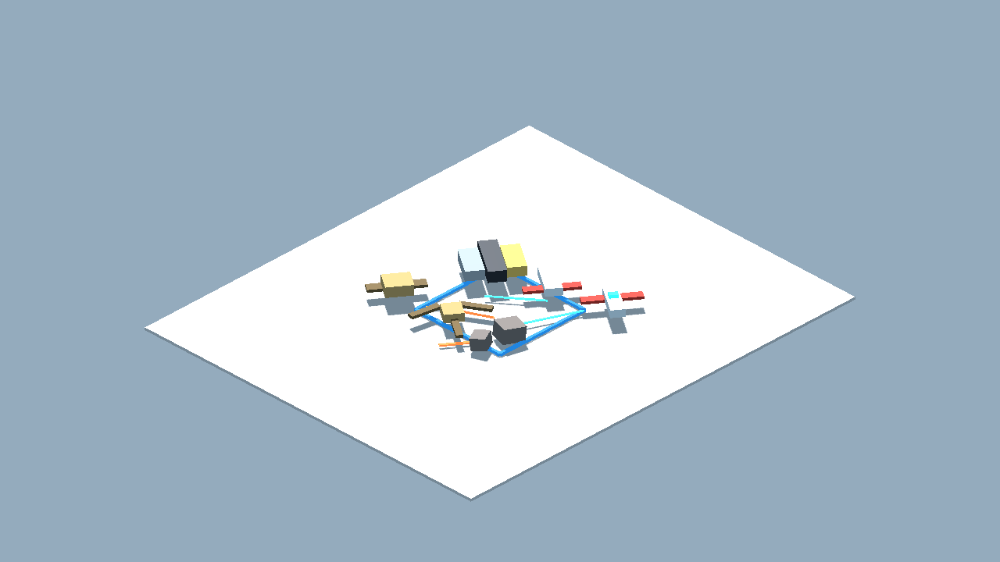
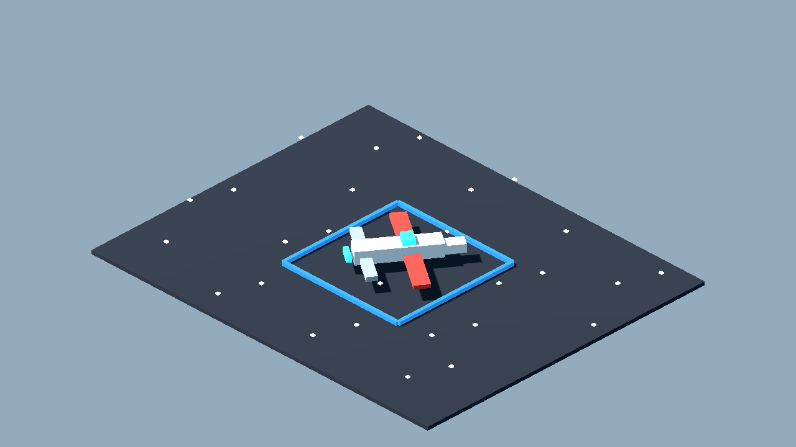
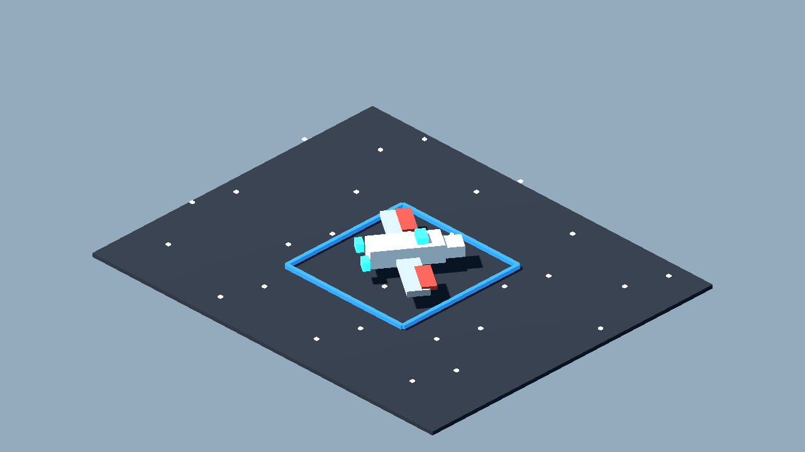
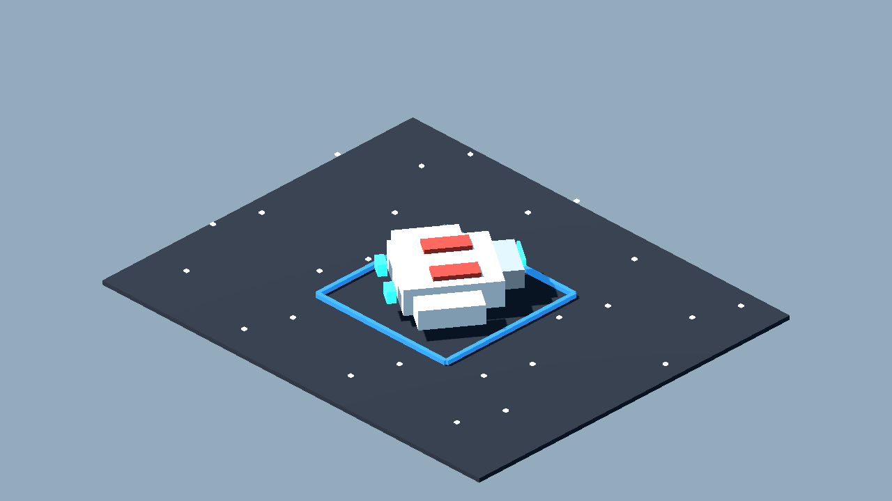
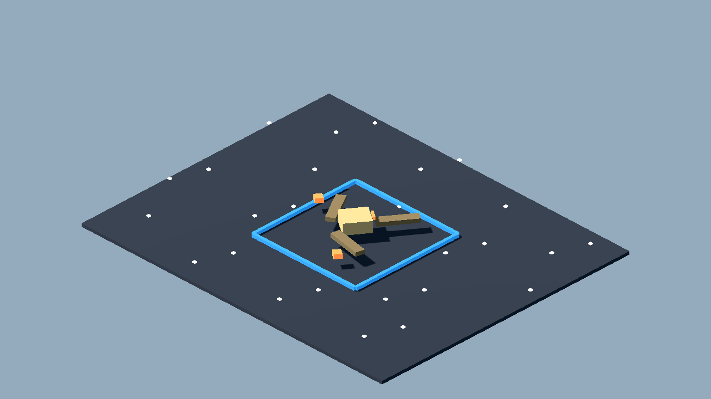
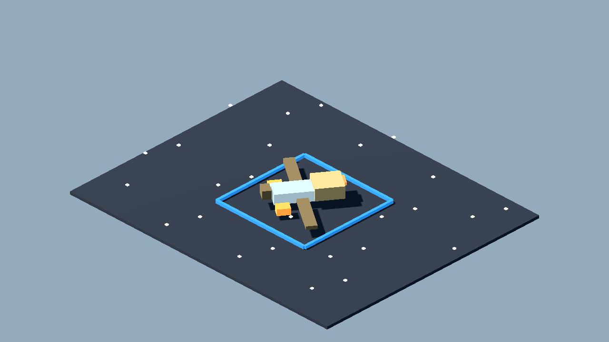
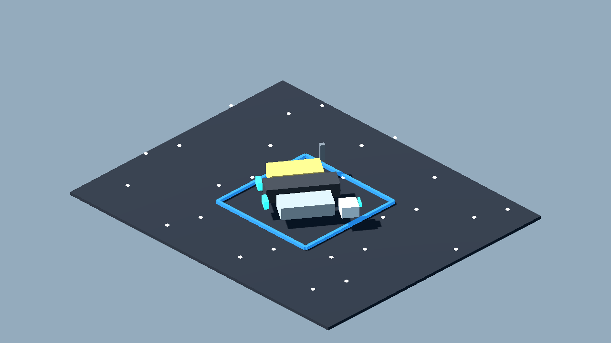
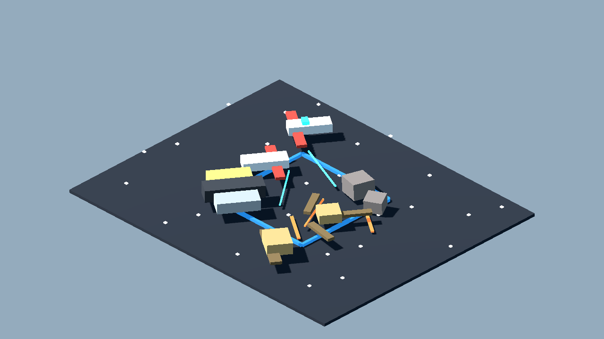

# Private Clone Wars Spacecraft Fan Pack v0 Review Board

Generated: 2026-07-03 23:58:47
Generator: `docs/gpt/asset_factory/scripts/godot_asset_factory.gd`
Spec pack: `private_clone_wars_spacecraft_v0`

## What This Is

These images are captures from generated Godot `.tscn` scenes, not bitmap source art. The source scenes are in `scenes/`; the review camera scenes are in `review_scenes/`.

Pipeline:

```text
JSON spec -> Godot procedural scene -> review scene -> PNG capture -> approve/reject/polish
```

## Contact Sheets









## Individual Captures

| Asset | Category | Gameplay Role | Capture |
| --- | --- | --- | --- |
| Fan Republic Arrow Fighter Token 01 | spacecraft_token | nimble Republic-friendly starfighter token for private fan table |  |
| Fan Republic Broadwing Fighter Token 01 | spacecraft_token | sturdier Republic-friendly heavy fighter token for private fan table |  |
| Fan Clone Patrol Gunship Space 01 | spacecraft_token | small patrol transport/gunship token for private fan space map |  |
| Fan Droid Tri-Fighter Token 01 | spacecraft_token | CIS-style nimble droid fighter token for private fan table |  |
| Fan CIS Bomber Token 01 | spacecraft_token | CIS-style bomber/heavy drone token for private fan table |  |
| Fan Frontier Light Freighter Token 01 | spacecraft_token | civilian smuggler/freighter token for private fan table |  |
| Fan Clone Wars Space Tableau 02 | space_scene_slice | 2.5D isometric space combat composition test with clearer factions |  |

## Review Tags

- `accept-prototype`: good enough to test in gameplay.
- `needs-style-pass`: useful silhouette but ugly detail/materials.
- `needs-remodel`: concept is useful, geometry is not.
- `api-candidate`: worth trying through a 3D generation provider.
- `human-candidate`: too important or too hard for procedural generation.
