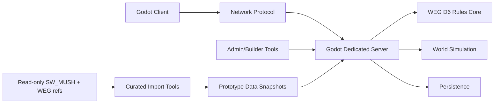

# Architecture

## Engine Choice

Godot is the current default because it is free, open-source, cross-platform, supports 3D and 2D well enough for this art direction, and can run dedicated headless servers. Official Godot downloads list 4.6.3 as the latest stable Windows version on 2026-06-14.

Use Godot 4.6.x standard unless C# becomes materially useful. GDScript is faster for early iteration and avoids .NET deployment friction.

## High-Level Shape

## Runtime Boundaries

- Client owns presentation, camera, local prediction, UI, audio, animation.
- Server owns position truth, interaction truth, dice, combat, economy, inventory, missions, faction state, and persistence.
- Clone Wars data snapshots live inside this project after explicit import. The live `C:\SW_MUSH` tree is never a runtime dependency.

## Cost Posture

- Engine: Godot, free.
- Assets: generated/prototype assets first; free/open assets only when license is clean.
- Hosting early: local/LAN or one small VPS.
- Hosting later: containerized dedicated server, PostgreSQL, object storage for logs/backups if needed.
- LLMs: use existing subscriptions for design/content assistance, not runtime dependency.

## Data Strategy

Start with local Resources/JSON/YAML snapshots for:

- skills
- species
- weapons
- starships
- schematics
- factions/guilds
- planets/zones

Move to database-backed state for:

- accounts
- characters
- inventory
- ships
- world objects
- economy ledgers
- faction state
- admin audit events

## First Technical Risks

- Real-time visuals can accidentally erase WEG turn logic. Keep server rounds explicit even if animations are smooth.
- Large-community ambition can cause premature infrastructure spend. Use authoritative boundaries now, scale hardware later.
- This is a personal Clone Wars-era project; public distribution would require avoiding packaged copyrighted assets/text.
- Sourcebook OCR can be noisy. Verify exact rules against PDFs when implementing precise mechanics.
