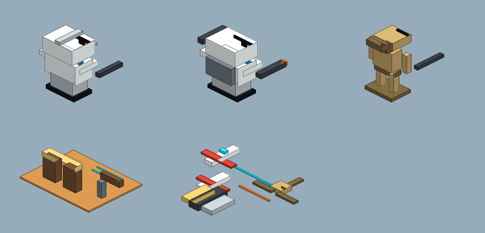
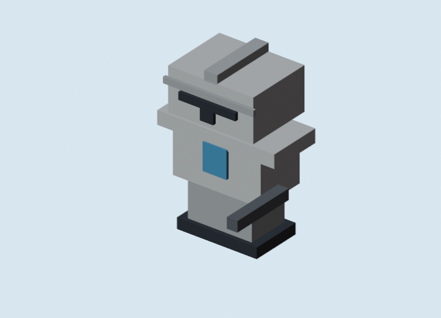
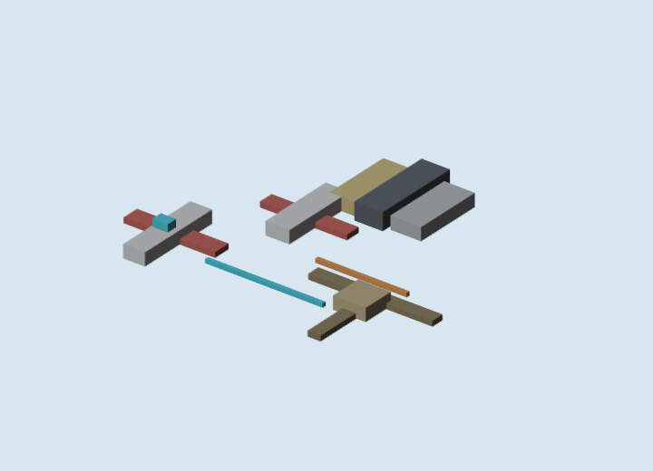

# Blockbench Cubecraft Pipeline Excursion

Date: 2026-07-04  
Status: tested locally with Blockbench source generation, Blender 5.1.2 GLB export, Blender review previews, and glTF Transform validation

## Short Answer

The SVG/JPEG intermediary idea is not naive. It is useful, but it should not be the final model source.

My recommended asset process is:

```text
written art direction
  -> structured JSON asset grammar
  -> optional SVG/bitmap concept sheet for silhouette and palette approval
  -> Blockbench .bbmodel source for cube/blockcraft assets
  -> Blender headless batch export to GLB
  -> glTF validation
  -> Godot import/review scene
  -> runtime promotion only after owner approval
```

This is different from the earlier Godot-first lane. The earlier lane was:

```text
JSON spec -> Godot procedural .tscn -> Godot capture
```

That lane is still good for fast blockouts, map kits, tactical space markers, and review slices. It is weaker for charming characters, because pure Godot primitive assembly tends to look like debug geometry unless a lot of character-specific grammar is added.

The Blockbench lane is currently the better "Star Wars Minecraft" / Cubecraft direction for characters and small props. It gives the assets a source format that a non-modeler can open, edit, and export. It also makes the geometry constrained enough that Codex/Claude can generate, inspect, and revise it without pretending to be a sculptor.

## What Was Installed

Blockbench:

```text
C:\Users\btgla\AppData\Local\Programs\Blockbench\Blockbench.exe
```

Blender portable:

```text
C:\Users\btgla\AppData\Local\CodexTools\blender-5.1.2\blender-5.1.2-windows-x64\blender.exe
```

Verified:

```text
Blender 5.1.2
```

glTF Transform CLI:

```text
gltf-transform 4.4.1
```

Note: the first `npm install -g @gltf-transform/cli` attempt hit a local certificate-chain error. Retrying with `NODE_OPTIONS=--use-system-ca` succeeded. I did not disable SSL verification.

## Tested Artifact

New spec:

```text
docs/gpt/asset_factory/specs/blockbench_cubecraft_v0.json
```

New generator:

```text
docs/gpt/asset_factory/scripts/blockbench_cubecraft_factory.mjs
```

New Blender adapter:

```text
docs/gpt/asset_factory/adapters/blender_bbmodel_to_glb.py
```

New runner:

```text
docs/gpt/asset_factory/scripts/run_blockbench_to_glb.ps1
```

Generated review root:

```text
docs/gpt/asset_factory/generated/blockbench_cubecraft_v0/
```

Main review boards:

```text
docs/gpt/asset_factory/generated/blockbench_cubecraft_v0/REVIEW.md
docs/gpt/asset_factory/generated/blockbench_cubecraft_v0/GLB_REVIEW.md
```

Fast Node preview contact sheet:



Blender-rendered GLB candidate preview:



Blender-rendered isometric space preview:



## What Was Generated

The excursion generated five editable Blockbench source models:

- `cubecraft_clone_rifleman_01.bbmodel`
- `cubecraft_clone_heavy_01.bbmodel`
- `cubecraft_b1_droid_01.bbmodel`
- `cubecraft_outpost_gate_tile_01.bbmodel`
- `cubecraft_space_tableau_01.bbmodel`

It then converted those five `.bbmodel` sources into five `.glb` files:

- `cubecraft_clone_rifleman_01.glb`
- `cubecraft_clone_heavy_01.glb`
- `cubecraft_b1_droid_01.glb`
- `cubecraft_outpost_gate_tile_01.glb`
- `cubecraft_space_tableau_01.glb`

It also generated:

- Blockbench palette textures for the `.bbmodel` files;
- fast Node-rendered isometric PNG previews;
- Blender-rendered PNG previews from actual converted geometry;
- `blockbench_manifest.json`;
- `glb/glb_manifest.json`.

## Commands

Generate `.bbmodel` sources and fast preview PNGs:

```powershell
node docs\gpt\asset_factory\scripts\blockbench_cubecraft_factory.mjs docs\gpt\asset_factory\specs\blockbench_cubecraft_v0.json
```

Batch-convert `.bbmodel` to `.glb` and render Blender previews:

```powershell
.\docs\gpt\asset_factory\scripts\run_blockbench_to_glb.ps1
```

Inspect a generated GLB:

```powershell
gltf-transform inspect docs\gpt\asset_factory\generated\blockbench_cubecraft_v0\glb\cubecraft_clone_rifleman_01.glb
```

Validate a generated GLB:

```powershell
gltf-transform validate docs\gpt\asset_factory\generated\blockbench_cubecraft_v0\glb\cubecraft_clone_rifleman_01.glb
```

Validation result for `cubecraft_clone_rifleman_01.glb`:

```text
No errors found.
No warnings found.
No infos found.
No hints found.
```

## Honest Read

This pipeline is better than the earlier Godot-only model generation for characters.

The Godot-generated private Clone Wars pack was useful, but the characters still felt like primitives placed in a scene. The Blockbench lane produces something closer to a toy/blockcraft character that could plausibly belong to a Minecraft-like MMO. The rifleman silhouette is the strongest proof so far: big helmet, readable visor, simple block body, minimal color accents, and a weapon that reads from a game camera.

The space tableau is directionally right, but not done. It solves the user's "flat x/y, isometric view" correction better than the old flat overlay idea. It still needs stronger ship silhouettes, clearer faction reads, and a tactical-space presentation layer with range rings, sensor pings, target locks, and movement ghosts.

The biggest takeaway:

```text
Do not chase beautiful AI bitmap concepts as if they can become the game directly.
Use them as approval art and style pressure.
Make the actual game assets through a constrained blockcraft grammar.
```

## Why This Gets Closer To "Cubecraft"

My inference about fast Cubecraft-like projects is that the speed comes from constraint, not magic:

- low element count;
- reusable proportions;
- block-model editors instead of sculpting;
- strong silhouettes over surface detail;
- texture panels and palette accents instead of realistic materials;
- a tiny number of asset archetypes copied and varied many times;
- ruthless acceptance that "coherent and readable" beats "high fidelity."

The new lane copies that production reality. It asks for asset grammar, not one-off artistry.

## Where SVG/Bitmap Fits

SVG/JPEG/PNG is useful for:

- contact sheets;
- silhouette approvals;
- color-language boards;
- orthographic guides;
- texture-panel ideas;
- UI icons;
- tactical space markers;
- top-down/isometric battle diagrams.

It is not ideal as:

- the canonical 3D model source;
- a direct mesh-generation input;
- the runtime asset without a conversion/rebuild step.

The best use is:

```text
SVG/bitmap concept = visual contract
JSON grammar = build instructions
Blockbench .bbmodel = editable source model
Blender/Godot = executable game asset path
```

So yes, Codex being strong at SVG/JPEG is valuable. The trick is to make those outputs steer the model grammar rather than replace it.

## Recommended Lanes Going Forward

Primary character/small prop lane:

```text
JSON asset spec
  -> Blockbench .bbmodel
  -> Blender GLB export
  -> glTF validation
  -> Godot import review
```

Primary blockout/world-kit lane:

```text
JSON asset spec
  -> Godot procedural .tscn
  -> Godot contact sheet
```

Primary isometric space lane:

```text
JSON tactical-space spec
  -> Blockbench/Blender ship tokens for major silhouettes
  -> Godot procedural overlays for sensors/range/targeting
  -> runtime 3D/isometric camera over flat x/y gameplay plane
```

Concept lane:

```text
Codex SVG/PNG or external AI bitmap
  -> owner/Claude visual review
  -> rebuild as Blockbench/Blender/Godot grammar
```

Selective API lane:

```text
Meshy/Tripo/etc.
  -> only for difficult hero silhouettes or inspiration
  -> never bulk-import raw output as house style
```

## Tooling Recommendation

Keep using:

- Blockbench for cube/blockcraft source editing;
- Blender headless for automated GLB export and preview rendering;
- glTF Transform for validation and future optimization;
- Godot for final import/render/runtime evaluation.

Do not depend on AI 3D APIs for the core library until a small paid/free test proves:

- predictable style;
- acceptable license terms;
- clean topology;
- Godot import health;
- low enough cost per accepted asset;
- easy cleanup path.

The cheap winning move is not "AI makes everything." It is:

```text
AI writes a strict model grammar, then tools execute that grammar.
```

## What Claude Should Evaluate Next

1. Open `generated/blockbench_cubecraft_v0/REVIEW.md`.
2. Open `generated/blockbench_cubecraft_v0/GLB_REVIEW.md`.
3. Compare the Node preview vs the Blender preview.
4. Open one `.bbmodel` in Blockbench and confirm it is editable.
5. Import one `.glb` into a docs-only Godot review scene.
6. Capture it from the intended MMO ground camera.
7. Capture the space tableau from the intended isometric tactical space camera.
8. Decide whether to continue this lane for 20 more character/prop/ship archetypes.

## Next Iteration I Would Run

If continuing this exact lane, I would create:

- 3 more friendly armored silhouettes with different helmet fins/pauldrons/backpacks;
- 3 more battle-droid silhouettes, including a heavier blue-gray unit and a rolling shield unit;
- 3 settlement kit pieces that snap together at grid scale;
- 4 isometric fighter silhouettes with clearer faction shapes;
- 2 space UI overlays as Godot-native procedural assets, not baked into the model.

Then I would build a docs-only Godot scene that imports the generated GLBs and renders them from actual gameplay camera distances. That is the next important truth test.

## References

- Blender download: <https://www.blender.org/download/>
- Blender 5.1 release notes: <https://www.blender.org/download/releases/5-1/>
- Blockbench export formats: <https://www.blockbench.net/wiki/guides/export-formats/>
- glTF Transform CLI: <https://gltf-transform.dev/>
