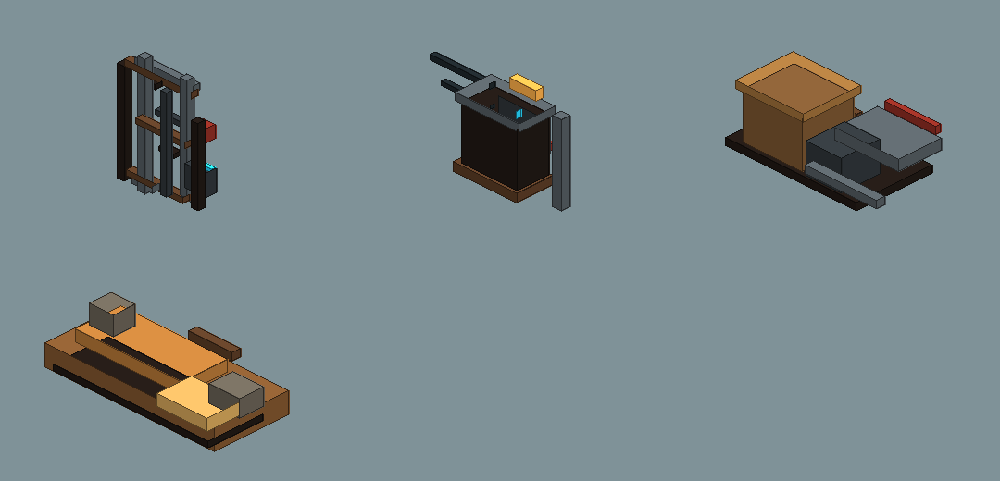
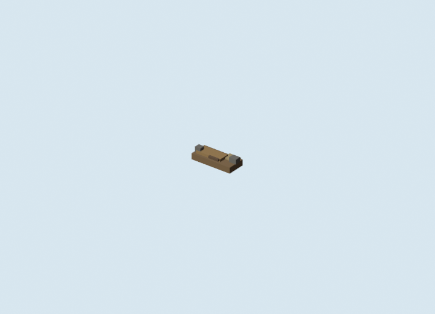
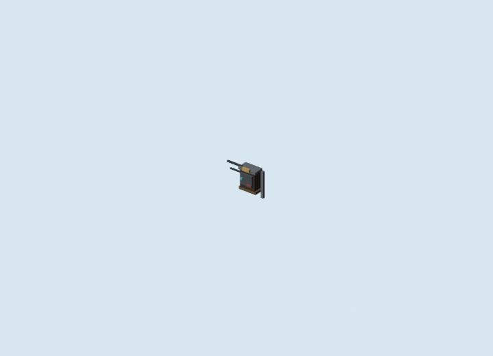

# Blockbench Cantina Exterior Clutter v1 GLB Review

Generated: 2026-07-04  
Adapter: `docs/gpt/asset_factory/adapters/blender_bbmodel_to_glb.py`

## Controlled Change

Baseline:

```text
generated/cantina_mood_ab_v1/REVIEW.md
```

Changed variable:

```text
Exterior clutter proof boxes -> reusable Blockbench .bbmodel modules and Blender GLBs.
```

Kept fixed:

- kept Cantina entrance model;
- no-droids sign workflow;
- mood/camera family;
- original blockcraft grammar;
- no copied official or fan-art assets.

## Blockbench Fast Preview



## Blender GLB Previews

### cantina_crate_scrap_stack_v1


### cantina_dust_berm_v1



### cantina_pipe_cluster_v1


### cantina_utility_box_v1



## Validation

Command:

```powershell
$files = Get-ChildItem docs\gpt\asset_factory\generated\blockbench_cantina_exterior_clutter_v1\glb -Filter *.glb
foreach ($f in $files) { gltf-transform validate $f.FullName }
```

Result:

```text
cantina_crate_scrap_stack_v1.glb: no errors, warnings, infos, or hints.
cantina_dust_berm_v1.glb: no errors, warnings, infos, or hints.
cantina_pipe_cluster_v1.glb: no errors, warnings, infos, or hints.
cantina_utility_box_v1.glb: no errors, warnings, infos, or hints.
```

## Godot Proof

```text
generated/godot_cantina_exterior_clutter_kit_v1/REVIEW.md
```

## Verdict

Candidate keep.

The kit should replace the mood-pass proof boxes when Claude needs reusable Cantina exterior dressing. Use sparingly and re-capture each room/exterior chunk; the kit is meant to add density, not become visual wallpaper.
