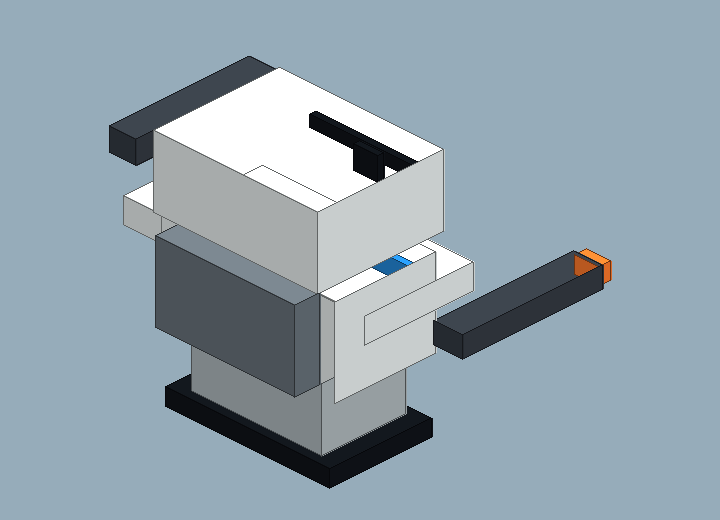
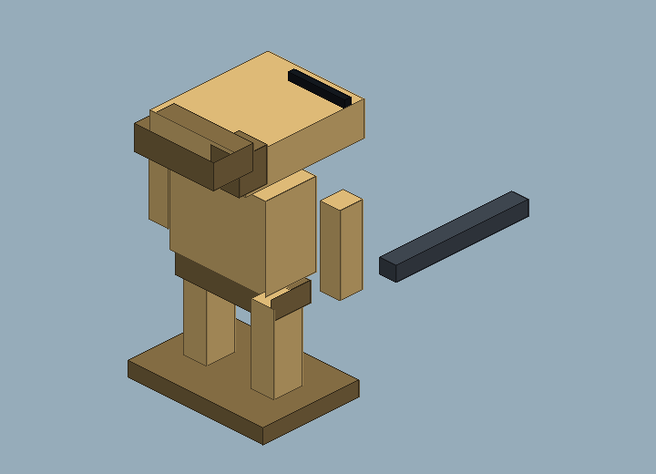
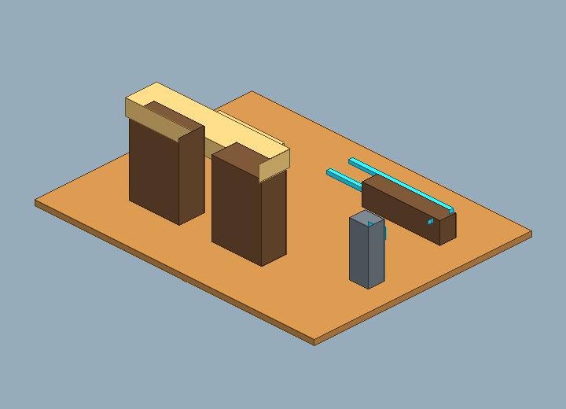
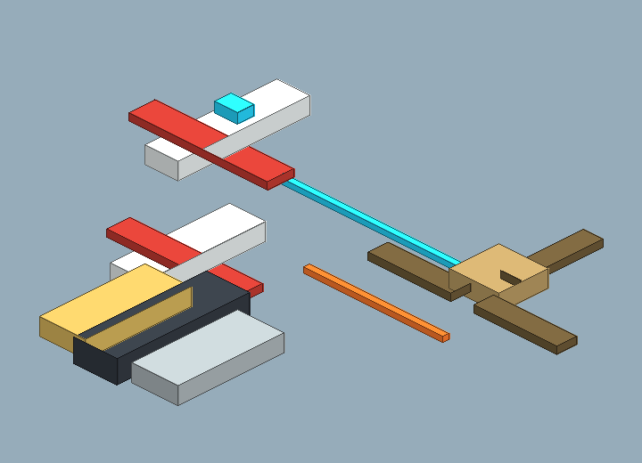

# Blockbench Cubecraft Excursion v0 Review Board

Generated: 2026-07-04T04:54:22.447Z
Generator: `docs/gpt/asset_factory/scripts/blockbench_cubecraft_factory.mjs`

## What This Is

This pass changes the authoring target: it generates Blockbench `.bbmodel` files plus PNG previews from the same cube data. The intent is to test a Cubecraft/Minecraft-like workflow rather than another Godot-first primitive pack.

## Contact Sheet

## Assets

| Asset | Role | Blockbench Source | Preview |
| --- | --- | --- | --- |
| Cubecraft Clone Rifleman 01 | low-element clone rifleman source model | [bbmodel](blockbench/cubecraft_clone_rifleman_01.bbmodel) |  |
| Cubecraft Clone Heavy 01 | low-element clone heavy source model | [bbmodel](blockbench/cubecraft_clone_heavy_01.bbmodel) |  |
| Cubecraft B1 Droid 01 | low-element skinny battle droid source model | [bbmodel](blockbench/cubecraft_b1_droid_01.bbmodel) |  |
| Cubecraft Outpost Gate Tile 01 | editable Blockbench desert gate kit tile | [bbmodel](blockbench/cubecraft_outpost_gate_tile_01.bbmodel) |  |
| Cubecraft Space Tableau 01 | Blockbench-authored 2.5D tactical space tableau source model | [bbmodel](blockbench/cubecraft_space_tableau_01.bbmodel) |  |

## Review Tags

- `open-in-blockbench`: check/edit the source model in Blockbench.
- `export-gltf-candidate`: good enough to export from Blockbench for Godot import testing.
- `needs-cubecraft-pass`: proportions/texture panels need stronger Cubecraft charm.
- `fallback-to-godot-spec`: the Godot primitive lane is faster/better for this asset.
