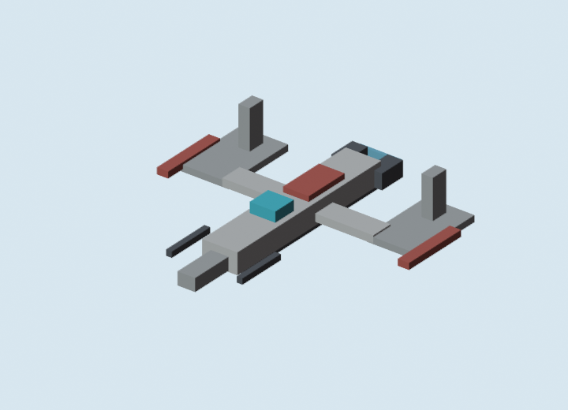

# Blockbench Ship Microfighter v1 GLB Review

Generated: 2026-07-04  
Adapter: `docs/gpt/asset_factory/adapters/blender_bbmodel_to_glb.py`

## What Changed

This pass changes one major thing from `blockbench_cubecraft_v0`: ships are no longer simple tableau pieces. They are individual Blockbench-authored microfighter-style model candidates with finer cube resolution, clear cockpit/engine/weapon beats, and Blender-converted GLB outputs.

## Contact Sheet

## GLB Candidates

| Asset | Blockbench Source | GLB | Blender Preview |
| --- | --- | --- | --- |
| Micro ARC Interceptor v1 | [bbmodel](blockbench/micro_arc_interceptor_v1.bbmodel) | [glb](glb/micro_arc_interceptor_v1.glb) |  |
| Micro V Lancer v1 | [bbmodel](blockbench/micro_v_lancer_v1.bbmodel) | [glb](glb/micro_v_lancer_v1.glb) |  |
| Micro Tri Droid Stalker v1 | [bbmodel](blockbench/micro_tri_droid_stalker_v1.bbmodel) | [glb](glb/micro_tri_droid_stalker_v1.glb) |  |
| Micro Blockade Runner v1 | [bbmodel](blockbench/micro_blockade_runner_v1.bbmodel) | [glb](glb/micro_blockade_runner_v1.glb) |  |

## Current Verdict

Keep this lane.

The friendly ships read better than the previous space tableau. The finer cube resolution, cockpit blocks, engine glow blocks, and weapon nubs give them more "space toy" identity. This is closer to the desired Star Wars Minecraft direction than the first Blockbench space tableau.

The hostile droid fighter is readable but weaker than the friendly ships. It needs a second pass focused only on hostile shape language: stronger central eye, more insect/tri-fin threat geometry, and perhaps a flatter top-down silhouette for tactical readability.

The blockade runner/freighter token is promising but should be tested at actual tactical-space camera distance. It may be too plate-like from some angles.

## Implication

Do not assume the Godot JSON pipeline is better for ships.

The current split should be:

- Blockbench/Blender for actual ship silhouettes.
- Godot procedural generation for sensors, range rings, target locks, movement ghosts, firing arcs, and temporary tactical overlays.
- SVG/bitmap references for approval and silhouette planning, not as final assets.
