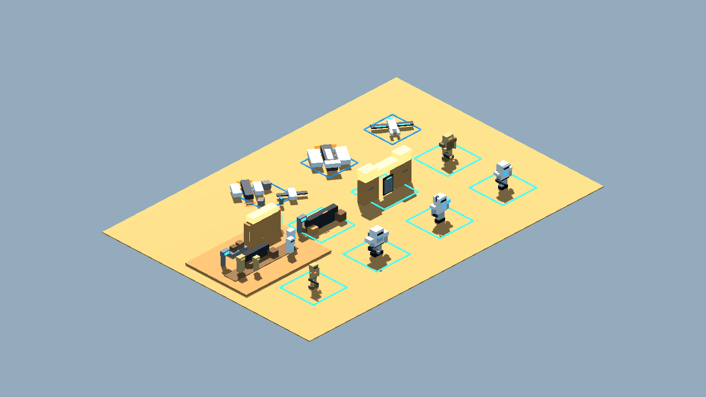
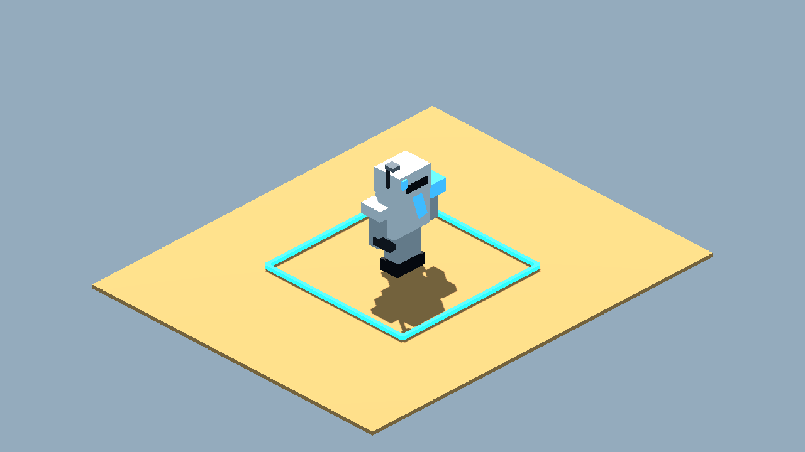
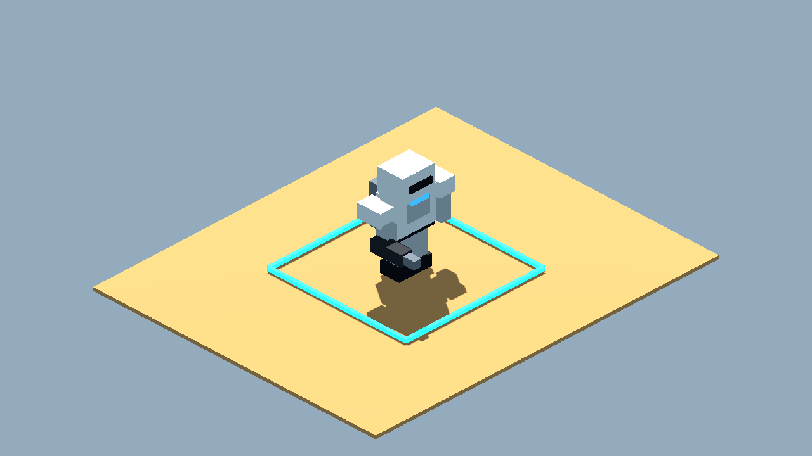
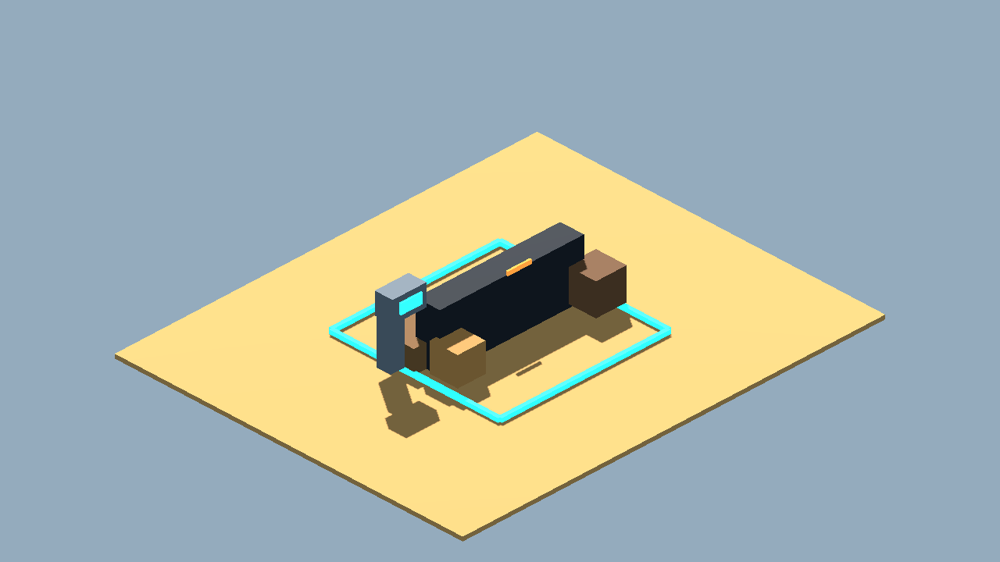
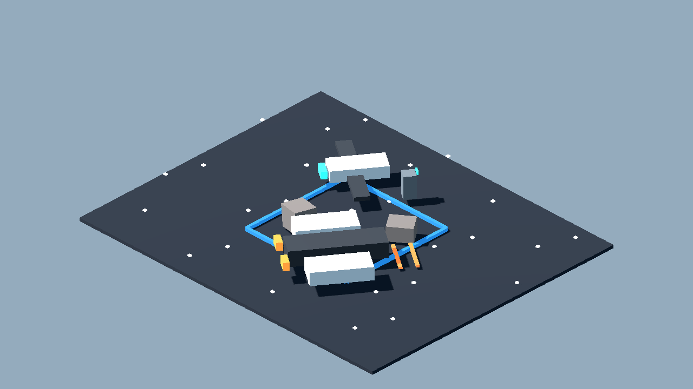

# Blockcraft Space Opera Prototype Pack v1 Review Board

Generated: 2026-07-03 23:42:37
Generator: `docs/gpt/asset_factory/scripts/godot_asset_factory.gd`
Spec pack: `blockcraft_space_opera_v1`

## What This Is

These images are captures from generated Godot `.tscn` scenes, not bitmap source art. The source scenes are in `scenes/`; the review camera scenes are in `review_scenes/`.

Pipeline:

```text
JSON spec -> Godot procedural scene -> review scene -> PNG capture -> approve/reject/polish
```

## Contact Sheets




## Individual Captures

| Asset | Category | Gameplay Role | Capture |
| --- | --- | --- | --- |
| Blockcraft Armored Rifleman 02 | character_token | friendly infantry scale and silhouette test |  |
| Blockcraft Armored Commander 02 | character_token | friendly command pawn silhouette test |  |
| Blockcraft Armored Heavy 02 | character_token | friendly heavy pawn silhouette test |  |
| Blockcraft Tan Droid Rifleman 02 | character_token | hostile droid infantry silhouette test |  |
| Blockcraft Heavy Droid 02 | character_token | hostile heavy droid silhouette test |  |
| Blockcraft Modular Wall Gate 02 | settlement_module | settlement wall kit piece with doorway and cover proportions |  |
| Blockcraft Cover And Terminal 02 | combat_cover | combat cover plus interaction terminal |  |
| Blockcraft Frontier Encounter Slice 02 | scene_slice | one-screen combat/social slice for judging the blockcraft MMO target |  |
| Blockcraft Isometric Splitnose Fighter 03 | space_ship_token | friendly flat-plane tactical fighter silhouette |  |
| Blockcraft Isometric Blockade Freighter 03 | space_ship_token | large flat-plane tactical freighter silhouette |  |
| Blockcraft Isometric Space Skirmish Slice 02 | space_scene_slice | proof of 2.5D flat tactical space readability |  |

## Review Tags

- `accept-prototype`: good enough to test in gameplay.
- `needs-style-pass`: useful silhouette but ugly detail/materials.
- `needs-remodel`: concept is useful, geometry is not.
- `api-candidate`: worth trying through a 3D generation provider.
- `human-candidate`: too important or too hard for procedural generation.
