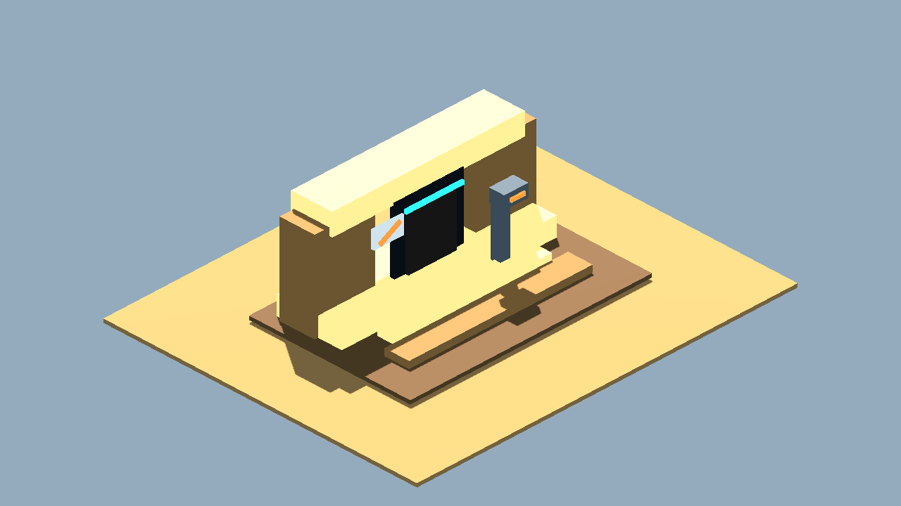

# Cantina Entrance Detail V1 Iteration Review

Date: 2026-07-04  
Baseline: `generated/cantina_terrain_kit_v0/captures/assets/cantina_entrance_threshold_01.png`  
Changed variable: finer Minecraft-like cube granularity on entrance threshold only

## Verdict

Keep as the new entrance-detail baseline.

V1 is better than V0 because it preserves the same readable elevated no-droids threshold while adding smaller blocks, segmented steps, facade chips, top cap blocks, richer scanner bars, and more believable utility detail.

## Comparison

V0:

V1:

## What Improved

- More Minecraft-like small-block density.
- Stronger facade silhouette from split lintel/top blocks.
- Better scan-frame read around the doorway.
- Clearer "no droids" sign language without using logos or official symbols.
- Side rails and segmented floor tiles make the threshold feel more playable.

## What Still Needs Work

- The Godot primitive lane is good for spatial proof, but this should become editable Blockbench kit geometry before runtime promotion.
- The sign icon is symbolic, not final readable UI.
- Lighting is still too clean; a future pass should add dim interior contrast and grime via material/camera changes, not by changing layout.

## Next One-Variable Recommendation

Convert this entrance module to Blockbench `.bbmodel` while preserving the V1 silhouette and detail density. Do not change layout, color family, or gameplay role during that conversion pass.

