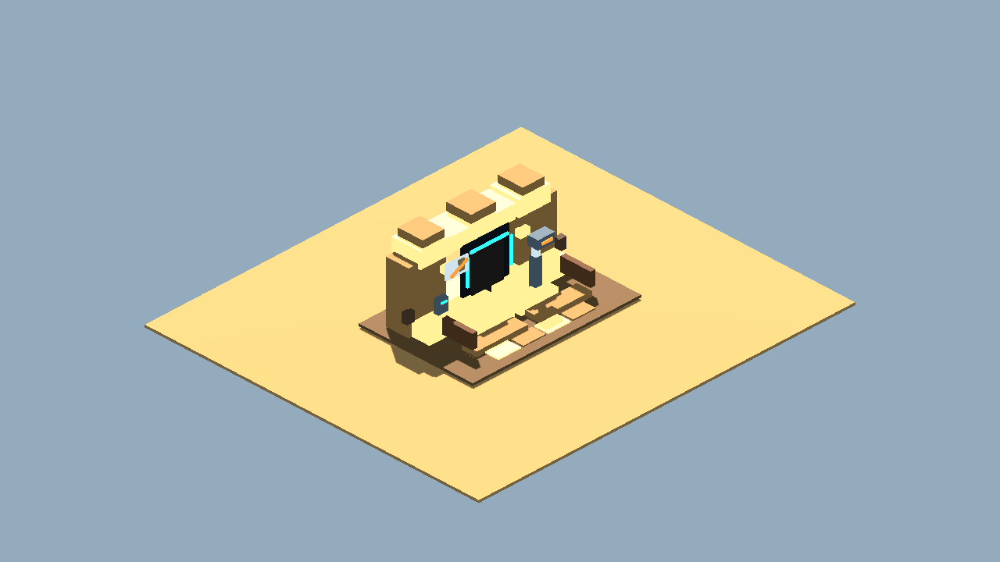
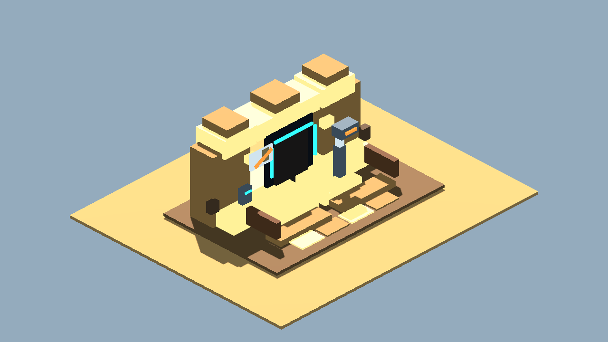

# Cantina Entrance Detail V1 Review Board

Generated: 2026-07-04 02:16:39
Generator: `docs/gpt/asset_factory/scripts/godot_asset_factory.gd`
Spec pack: `cantina_entrance_detail_v1`

## What This Is

These images are captures from generated Godot `.tscn` scenes, not bitmap source art. The source scenes are in `scenes/`; the review camera scenes are in `review_scenes/`.

Pipeline:

```text
JSON spec -> Godot procedural scene -> review scene -> PNG capture -> approve/reject/polish
```

## Contact Sheets





## Individual Captures

| Asset | Category | Gameplay Role | Capture |
| --- | --- | --- | --- |
| Cantina Entrance Threshold Detail 01 | terrain_module | finer-detail elevated no-droids entrance threshold |  |

## Review Tags

- `accept-prototype`: good enough to test in gameplay.
- `needs-style-pass`: useful silhouette but ugly detail/materials.
- `needs-remodel`: concept is useful, geometry is not.
- `api-candidate`: worth trying through a 3D generation provider.
- `human-candidate`: too important or too hard for procedural generation.
