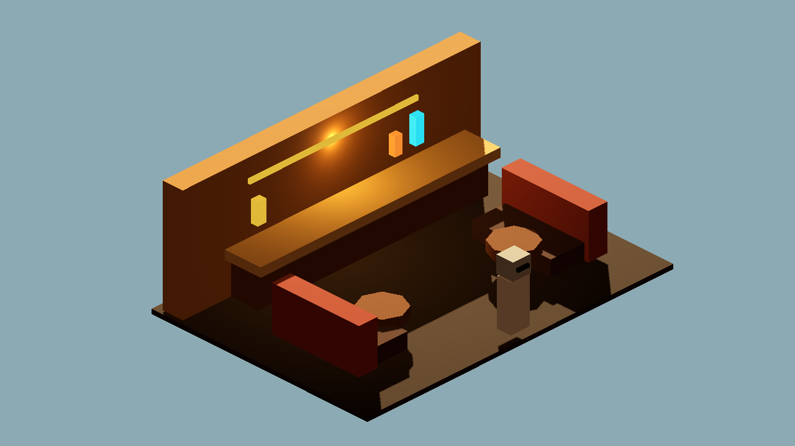
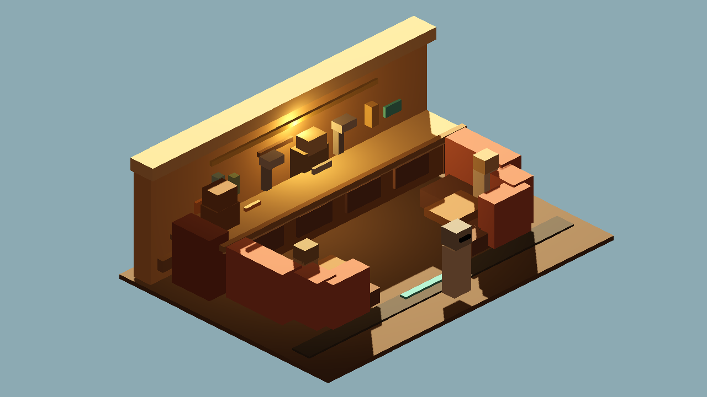

# Godot Cantina Bar Booth Bay v1

Generated: 2026-07-04 08:36:16
Generator: `docs/gpt/asset_factory/scripts/godot_cantina_bar_booth_bay_proof.gd`

## Purpose

Test whether the `cantina_bar_booth_bay_01` Godot-procedural proof can move into the locked editable Blockbench/GLB lane while improving main-bar and curved-booth readability.

## Controlled Change

Baseline: `generated/cantina_terrain_kit_v0/REVIEW.md` (`cantina_bar_booth_bay_01`).

Changed variable: Godot proof geometry -> imported Blockbench/Blender GLB with finer bar, booth, bottle, patron, and owner-booth detail.

Source constraints:

- high-tech bar stretches along one wall
- booths line curved walls
- room is dense with smugglers, hunters, clones, and varied patrons
- main bar sits between entrance and back hallway in the room graph

Import note: the Godot proof rotates the imported holder 180 degrees so the review camera sees the playable side of the bar wall. The GLB source model itself is unchanged.

## Source GLB

`generated/blockbench_cantina_bar_booth_bay_v1/glb/blockbench_cantina_bar_booth_bay_v1.glb`

## Captures

### bar_booth_baseline_procedural_control

Control capture: recreated Godot-procedural bar/booth proof from cantina_terrain_kit_v0.

### bar_booth_blockbench_candidate

Candidate capture: imported Blockbench/Blender GLB with denser booth, bar, bottle, patron, and owner-booth details.

### bar_booth_ab_pair

Left/control: old procedural bay. Right/candidate: imported editable Blockbench bar/booth bay GLB.

## Verdict

Candidate keep.

The Blockbench candidate is busier and more readable than the old proof: the bar has service taps and panel rhythm, the booths imply a curved perimeter through stepped backs, and the owner/bartender proxy details reinforce the social-hub purpose.

Caution: this is an identity module, not a final room. It still needs a connected multi-room composition with entrance, bandstand, and back hallway before buildings can be considered close to runtime-ready.

## Next One-Variable Recommendation

Convert the back hallway service module into Blockbench/GLB, then run a multi-room interior composition proof using entrance + bar/booth + hallway.
