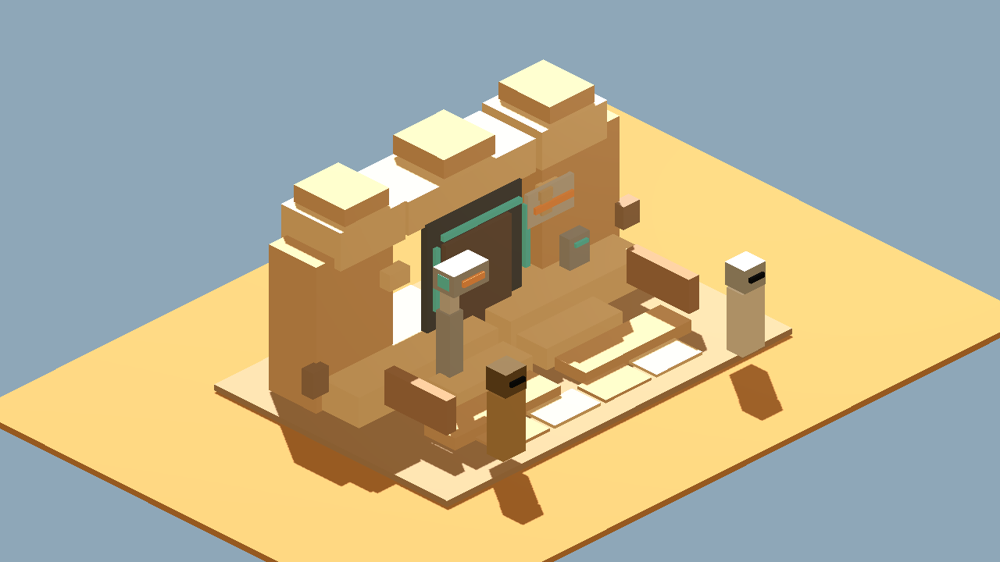
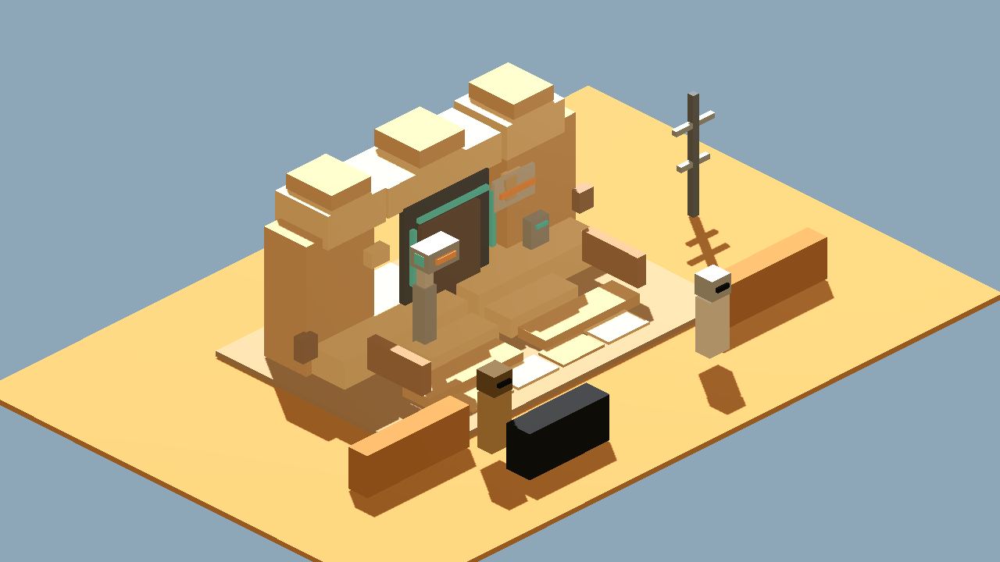

# Godot Cantina Entrance GLB Camera Proof

Generated: 2026-07-04 02:26:08
Generator: `docs/gpt/asset_factory/scripts/godot_cantina_glb_camera_proof.gd`

## Purpose

This docs-only proof imports the kept Blockbench Cantina entrance GLB into Godot and captures it with ground/plaza cameras before any runtime promotion.

Source GLB:

```text
res://docs/gpt/asset_factory/generated/blockbench_cantina_entrance_v1/glb/blockbench_cantina_entrance_v1.glb
```

## Captures

### cantina_entrance_ground_camera

Godot ground camera proof for the kept Blockbench Cantina entrance GLB.



### cantina_entrance_plaza_context

Godot plaza-context proof with player scale, low walls, and exterior approach.



## Verdict

Keep as a Godot import/camera proof.

The Blockbench/Blender GLB survives Godot import and still reads as the Cantina entrance threshold. The elevated steps, scanner frame, detector post, no-droids sign panel, and small-block facade detail remain visible in the ground camera.

The plaza-context capture also supports the intended gameplay read:

```text
outside trouble / waiting droid -> controlled threshold -> dark entrance
```

Known limitations:

- The no-droids sign still needs a texture/manual Blockbench pass because the current simple adapter does not preserve the diagonal slash.
- The surrounding plaza props here are proof-context boxes, not a finished exterior kit.
- Lighting is still clean prototype lighting; grime/dim interior contrast should be a separate material/camera pass.

Next one-variable recommendation:

```text
Convert the bar/booth bay or back hallway module to Blockbench using the same lane, or do a material/lighting-only Cantina mood pass. Do not change the kept entrance model during that next pass.
```
