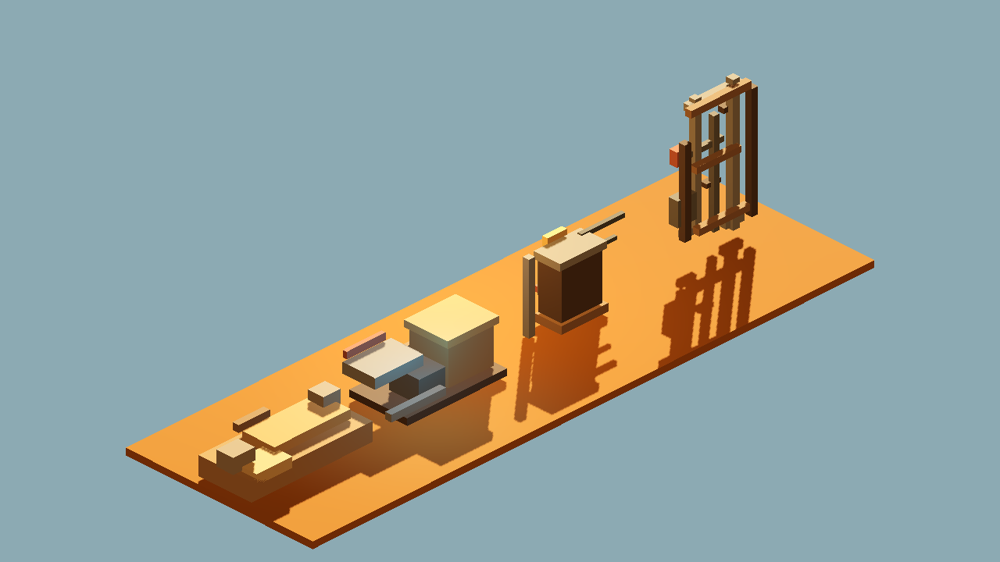
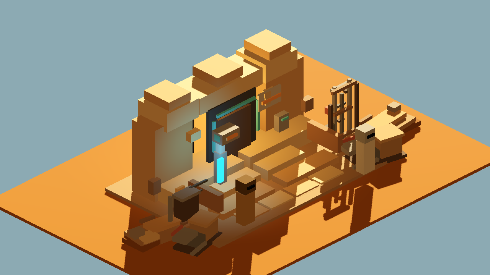
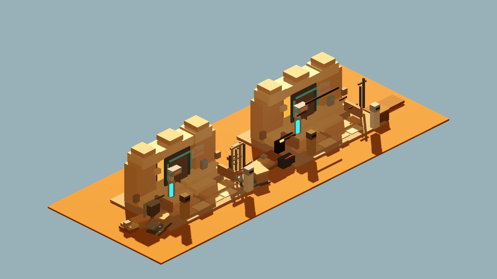

# Godot Cantina Exterior Clutter Kit v1

Generated: 2026-07-04 08:16:35
Generator: `docs/gpt/asset_factory/scripts/godot_cantina_exterior_clutter_kit_proof.gd`

## Purpose

Test whether the `cantina_mood_ab_v1` proof clutter can become reusable editable Blockbench GLBs without losing the lived-in frontier Cantina read.

## Controlled Change

Baseline: `generated/cantina_mood_ab_v1/REVIEW.md`

Changed variable: proof-box pipes/utility/crates/dust clutter -> imported Blockbench/Blender GLB clutter modules.

Kept fixed:

- kept entrance GLB and orientation
- no-droids sign workflow
- camera family
- warm exterior / dim doorway mood family
- private/friends blockcraft target

## Source GLBs

- `generated/blockbench_cantina_exterior_clutter_v1/glb/cantina_pipe_cluster_v1.glb`
- `generated/blockbench_cantina_exterior_clutter_v1/glb/cantina_utility_box_v1.glb`
- `generated/blockbench_cantina_exterior_clutter_v1/glb/cantina_crate_scrap_stack_v1.glb`
- `generated/blockbench_cantina_exterior_clutter_v1/glb/cantina_dust_berm_v1.glb`

## Captures

### cantina_clutter_kit_modules

Standalone imported GLB modules: pipe cluster, utility box, crate/scrap stack, and dust berm.

### cantina_clutter_kit_context

Kept entrance GLB plus the new Blockbench exterior-clutter kit in the same mood/camera family.

### cantina_clutter_kit_ab_pair

Left/control: old Godot proof clutter boxes. Right/candidate: imported editable Blockbench clutter GLBs.

## Verdict

Candidate keep.

The imported kit preserves the mood-pass read while making the clutter reusable and editable. It is stronger than raw proof boxes because the modules have their own source files, palette texture, GLBs, and validation path.

Caution: the A/B capture is a composition proof, not final placement. Before runtime promotion, Claude should choose which module instances belong in each Cantina room/exterior chunk instead of stamping the entire kit everywhere.

## Next One-Variable Recommendation

Convert the bar/booth bay or back hallway into a Blockbench/GLB module using the same locked lane, or create one focused request for an interior clutter kit.
