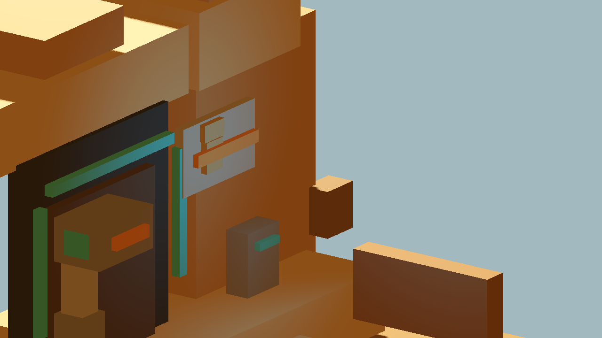
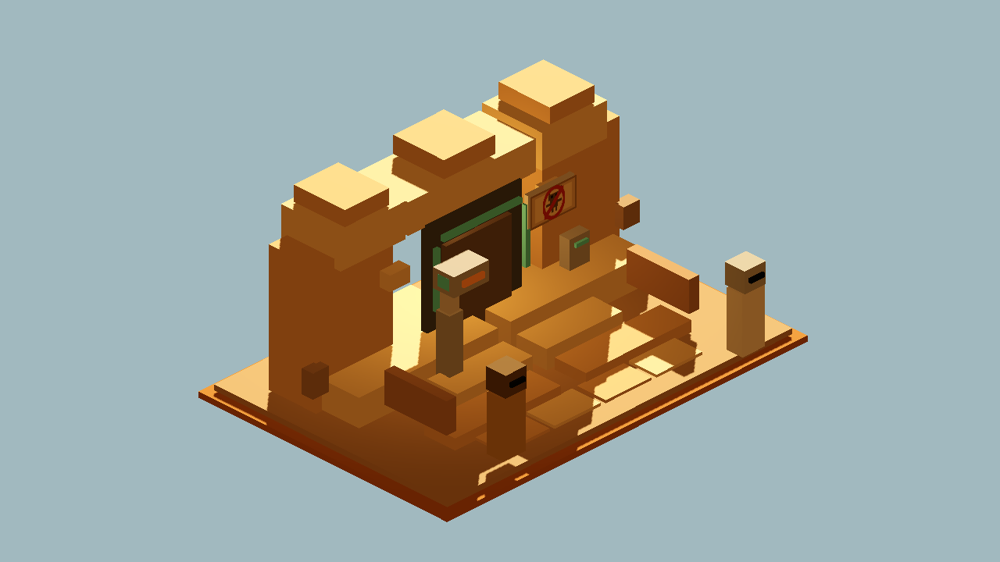
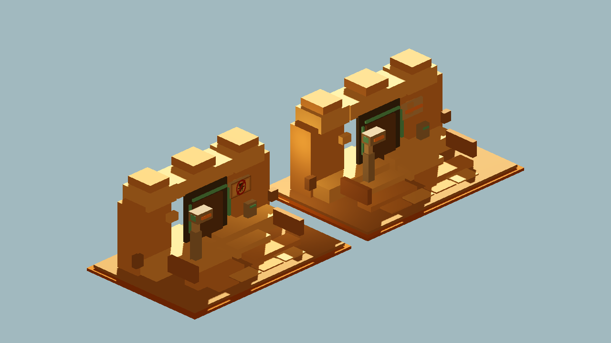

# Godot Cantina Sign Texture Proof

Generated: 2026-07-04 07:47:01
Generator: `docs/gpt/asset_factory/scripts/godot_cantina_sign_texture_proof.gd`

## Purpose

Compare the cube-only no-droids sign baseline against a texture/manual-style sign candidate in Godot.

Baseline GLB:

```text
res://docs/gpt/asset_factory/generated/blockbench_cantina_entrance_v1/glb/blockbench_cantina_entrance_v1.glb
```

Candidate GLB:

```text
res://docs/gpt/asset_factory/generated/blockbench_cantina_sign_texture_v1/glb/blockbench_cantina_sign_texture_v1.glb
```

## Captures

### cube_sign_closeup

Baseline closeup: cube-only no-droids sign from `blockbench_cantina_entrance_v1`.



### texture_sign_closeup

Candidate closeup: original pixel-texture no-droids sign panel, same entrance geometry.


### texture_sign_ground_camera

Candidate ground camera: textured sign in the same entrance model family.



### sign_workflow_ab_pair

A/B pair: cube-sign baseline and texture-sign candidate. Use the closeups for final sign readability judgment.



## Verdict

Candidate keep.

The texture/manual sign panel is stronger than the cube-only baseline. In closeup, the baseline reads as a gray panel with stacked cubes and a horizontal orange bar; the candidate reads as a no-droids/prohibition sign. From the ground camera, the sign is still small but the red circle/slash reads better than the straight cube slash.

Keep the method for tiny signs/decals where cube glyphs fail. Do not generalize this into a full high-resolution texture workflow.

Next one-variable recommendation:

```text
Stop tweaking the entrance sign unless the owner wants a different droid pictogram. Move to either a Blockbench exterior-clutter kit from the mood pass, or a bar/booth bay Blockbench conversion.
```
