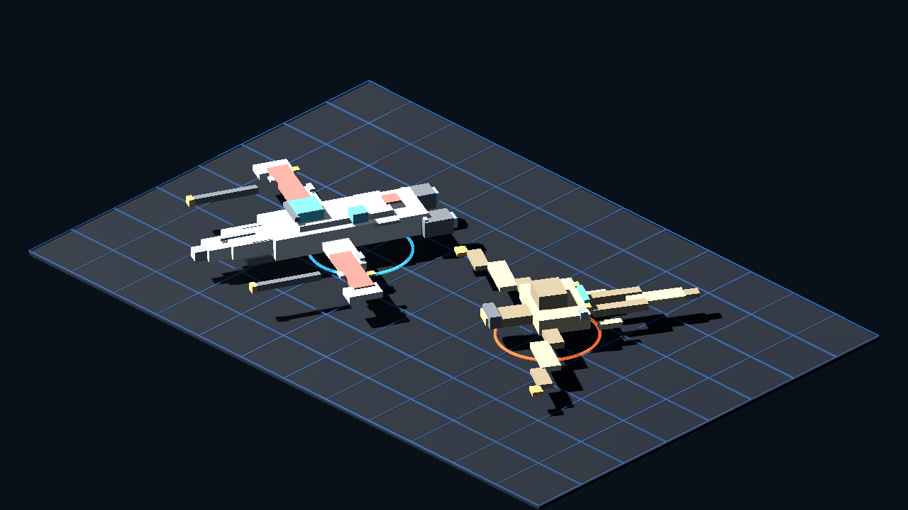

# Godot Phase 0 Camera Proof

Generated: 2026-07-04 01:52:28
Generator: `docs/gpt/asset_factory/scripts/godot_glb_camera_proof.gd`

## Purpose

This is a docs-only proof that the kept Blockbench/Blender GLBs can be loaded and photographed by Godot before any runtime promotion.

It changes only `docs/gpt/asset_factory/generated/godot_phase0_camera_v0/`.

## Captures

### ground_identity

Ground identity camera: clone/droid character readability

### space_isometric

Isometric space camera: friendly/hostile ship readability

### mixed_scale

Mixed scale camera: character plus ship scale sanity

## Initial Verdict

Partial keep.

- `space_isometric`: keep as a promising tactical-space camera proof. Friendly and hostile ships remain distinct in Godot, and the panel-detail pass survives runtime lighting.
- `mixed_scale`: keep as a basic ship/player scale sanity check. The fighter/player relationship is plausible for a landing-pad review, though real gameplay scale still needs owner judgment.
- `ground_identity`: usable but not final. Character scale is now sane, clone/droid body roles read, but front-facing helmet/weapon contrast needs a dedicated character pass.
- Do not promote these GLBs into runtime until the owner accepts the Godot camera read.
- Next controlled change should be character contrast/detail only: stronger visors, role stripes, weapon silhouettes, and droid head/limb exaggeration. Keep camera and import path stable.
