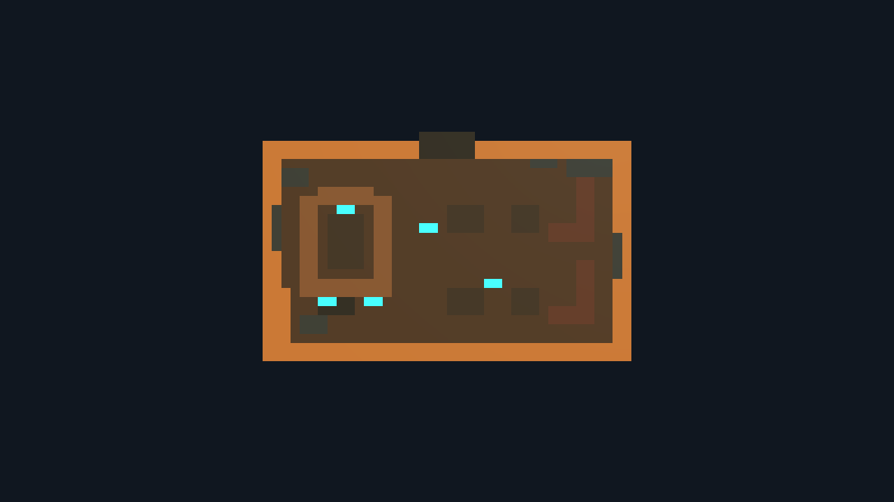
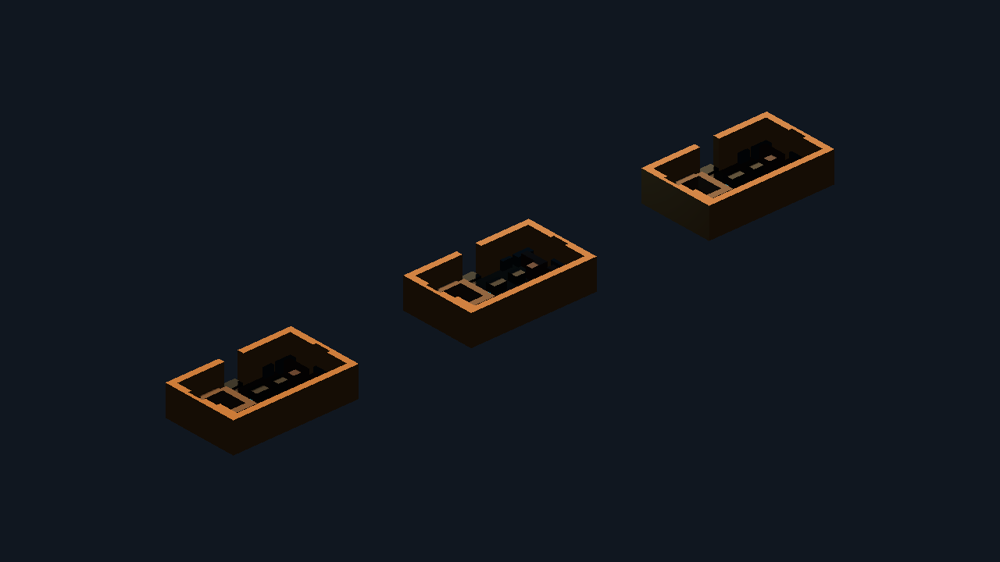
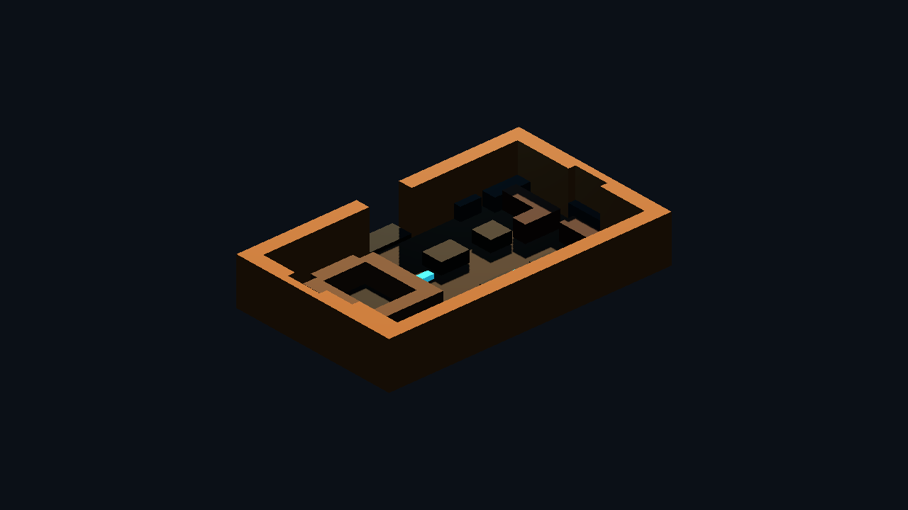
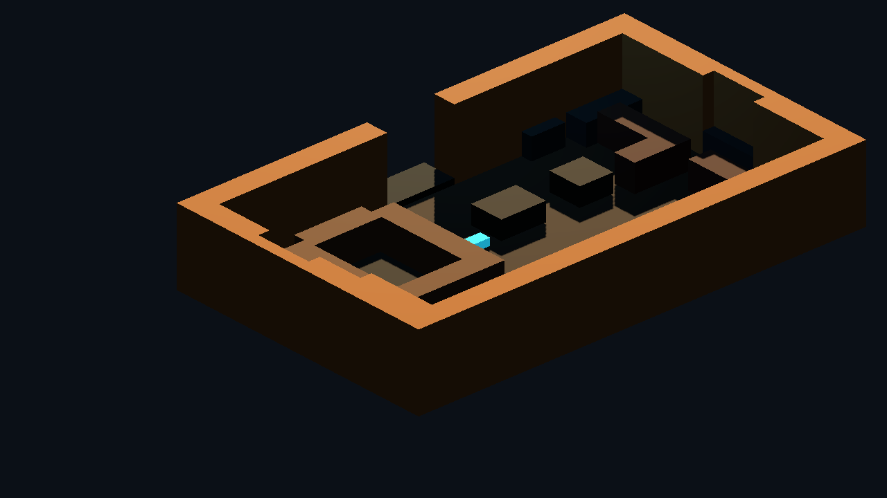

# Godot Pixel Cantina Kit Proof v0

Generated: 2026-07-04 15:33:25
Generator: `docs/gpt/asset_factory/scripts/godot_pixel_cantina_kit_proof.gd`

## Purpose

Test whether the deterministic pixel-card lane works for a Cantina room kit, and whether it is compute-efficient enough to matter.

This is a top-down semantic pixel card, not a texture. Each color means a tile class: floor, wall, door, bar, booth, table, clutter, or light.

## Source Card

`source_images/cantina_floorplan_48x32.png`

## Efficiency Stats

| Metric | Value |
| --- | ---: |
| Grid size | `48x32` |
| Non-empty source pixels | 966 |
| Per-pixel boxes/nodes | 966 |
| Same-row run boxes | 206 |
| Greedy rectangle boxes | 74 |
| Material-batched mesh nodes | 8 |
| Box reduction vs per-pixel | 92.3% |
| Node reduction vs per-pixel | 99.2% |
| Per-pixel triangle estimate | 11592 |
| Greedy rectangle triangle estimate | 888 |
| Batched triangle estimate | 888 |

Used categories: `bar, booth, clutter, door, floor, light, table, wall`

## Captures

### pixel_cantina_source_card

Original 48x32 top-down pixel source card for the Cantina kit. Each color is a semantic tile class, not a copied texture.

### pixel_cantina_merge_ab

Left: one cube per non-empty pixel. Center: greedy rectangle merge. Right: same merged rectangles emitted as material-batched meshes.

### pixel_cantina_batched_isometric

Material-batched pixel Cantina kit from the gameplay/isometric review camera.

### pixel_cantina_room_read_closeup

Close review of the bar, booths, entrance, back hallway, and clutter readability using batched geometry.

## Verdict

Candidate keep for Cantina blockouts, distant/interior LOD, minimap-derived geometry, and fast room-graph visualization.

The batched version is much more compute-friendly than one cube per pixel because it turns a 48x32 semantic card into a small number of material meshes. It is not a replacement for authored Blockbench identity modules such as the kept entrance and bar/booth bay. The best production split is: pixel/GDScript for layout, collision, room LOD, and cheap filler; Blockbench for hero thresholds, signs, bars, booths, and recognizable set pieces.

Next improvement: add a second card for wall elevation/detail so the pixel kit can generate stronger door frames, arches, booth backs, and Cantina clutter without hand placing every module.
