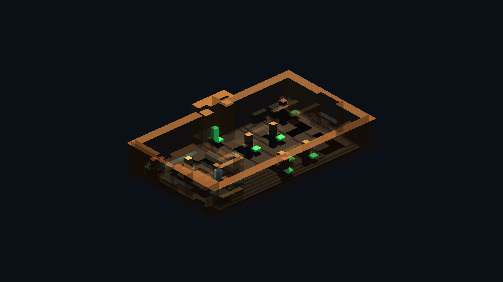
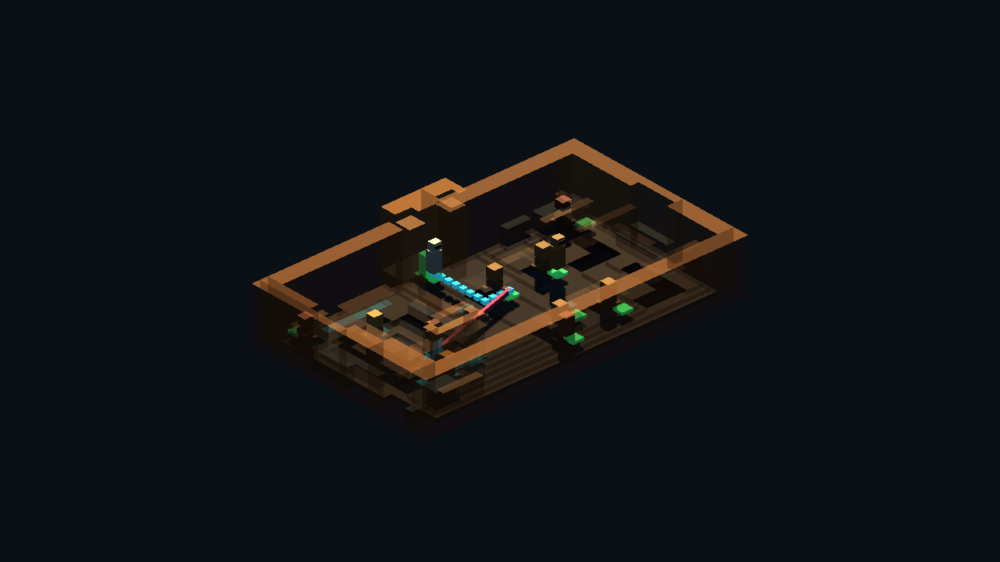
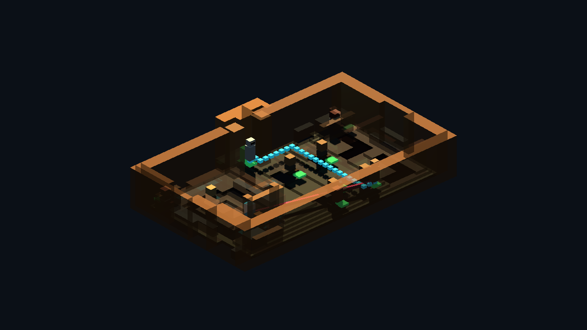

# Godot Pixel Cantina Runtime Proof v1

Generated: 2026-07-04 15:52:32
Generator: `docs/gpt/asset_factory/scripts/godot_pixel_cantina_runtime_proof.gd`

## Purpose

Move the layered pixel Cantina lane from visual generator toward runtime room infrastructure: collision rectangles, walkable rectangles, named sockets, and actor/path probes from the same semantic cards.

## Source Masks

- `source_images/cantina_floorplan_48x32.png`
- `source_images/cantina_detail_elevation_48x32.png`
- `source_images/cantina_walkable_mask_48x32.png`
- `source_images/cantina_collision_mask_48x32.png`

## Runtime Stats

| Metric | Value |
| --- | ---: |
| Grid size | `48x32` |
| Walkable pixels | 439 |
| Walkable rectangles | 40 |
| Blocker pixels | 527 |
| Collision rectangles/shapes | 38 |
| Socket count | 12 |
| Non-walkable raw sockets | 8 |
| Sockets resolved to walk cells | 8 |
| Actor probe route cells | 10 |
| Composite probe route cells | 25 |
| Walk mask reduction vs pixels | 90.9% |
| Collision reduction vs pixels | 92.8% |

## Named Sockets

| Id | Kind | Raw grid | Walkable | Resolved path grid | Tags |
| --- | --- | --- | --- | --- | --- |
| `entrance_spawn` | `spawn` | `24,25` | `false` | `24,24` | `entry, player` |
| `bar_order_anchor` | `interaction` | `34,13` | `true` | `34,13` | `bar, social` |
| `bartender_anchor` | `npc_anchor` | `35,20` | `true` | `35,20` | `bar, staff` |
| `left_booth_table` | `social_table` | `15,10` | `false` | `15,8` | `booth, seated` |
| `rear_booth_table` | `social_table` | `15,19` | `false` | `15,17` | `booth, seated` |
| `center_table_a` | `social_table` | `21,10` | `false` | `19,10` | `table, seated` |
| `center_table_b` | `social_table` | `21,19` | `false` | `21,17` | `table, seated` |
| `service_door_anchor` | `transition` | `35,10` | `true` | `35,10` | `service, door` |
| `no_droids_sign_socket` | `prop_socket` | `22,8` | `false` | `22,7` | `sign, wall` |
| `bar_light_socket` | `light_socket` | `35,10` | `true` | `35,10` | `bar, light` |
| `clutter_socket_left` | `prop_socket` | `8,24` | `false` | `7,22` | `clutter` |
| `clutter_socket_rear` | `prop_socket` | `40,24` | `false` | `40,25` | `clutter` |

## Captures

### runtime_collision_nav_overlay

Walkable rectangles in green and merged collision rectangles in red, generated from the same layered Cantina cards.

### runtime_socket_map

Named interaction and spawn sockets generated from the semantic room cards: entrance, bar, booths, service door, lights, and clutter sockets.

### runtime_actor_path_probe

Grid-routed actor/path probe using nearest-walkable socket resolution and the generated walkable mask.

### runtime_room_pipeline_composite

Layered room geometry, collision/walkable overlay, sockets, and placeholder actors together as a runtime-pipeline proof.

## Verdict

Candidate runtime keep. This proves the layered pixel room-kit lane can emit more than visuals: merged collision shapes, a walkable mask, named interaction sockets, socket-to-walk-cell resolution, and coordinate-stable routed actor/path probes. It is still a docs-only proof, not a runtime integration, but it is now a credible room-production pipeline.

Next improvement: promote the generator into a reusable adapter that reads external semantic PNG/JSON cards instead of hard-coded test grids, then run it on a second SW_MUSH Cantina room to prove repeatability.
