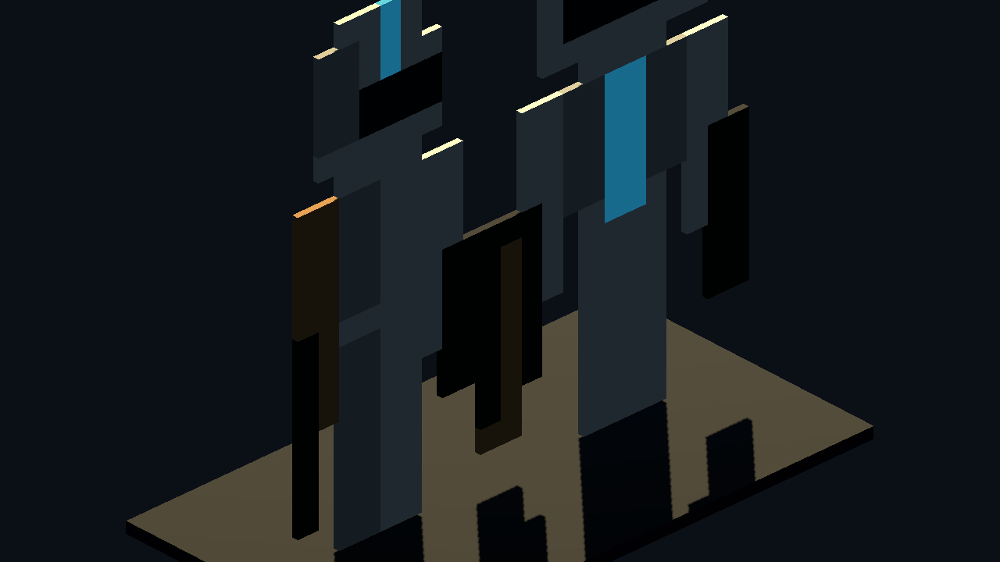
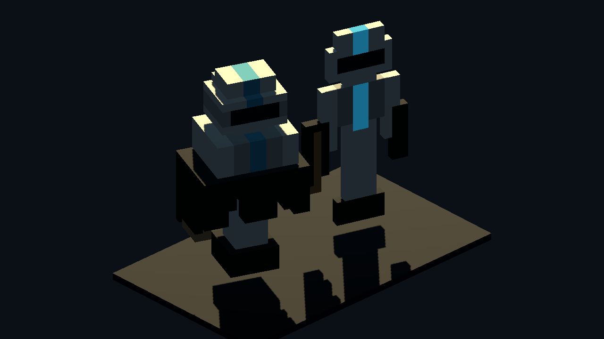
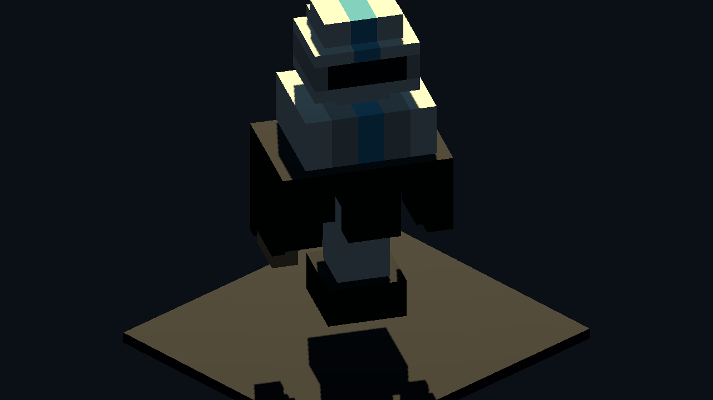

# Godot Pixel Hull Character Proof v0

Generated: 2026-07-04 14:37:33
Generator: `docs/gpt/asset_factory/scripts/godot_pixel_hull_character_proof.gd`

## Purpose

Test a more-3D extension of the deterministic pixel-card lane: use an original front card and side card as silhouette masks, then fill the overlapping volume with voxel bars.

This keeps geometric control while moving beyond a flat cutout.

## Source Cards

- `source_images/trooper_front_card_16x28.png`
- `source_images/trooper_side_card_10x28.png`

## Stats

| Node | Mode | Boxes | Raw voxels |
| --- | --- | ---: | ---: |
| `front_card_display` | `front_card_same_color_horizontal_runs` | 92 |  |
| `side_card_display` | `front_card_same_color_horizontal_runs` | 72 |  |
| `flat_front_extrude` | `front_card_same_color_horizontal_runs` | 92 |  |
| `front_side_visual_hull` | `front_side_visual_hull_z_runs` | 247 | 1376 |
| `trooper_visual_hull` | `front_side_visual_hull_z_runs` | 247 | 1376 |
| `trooper_visual_hull_yaw_0` | `front_side_visual_hull_z_runs` | 247 | 1376 |
| `trooper_visual_hull_yaw_90` | `front_side_visual_hull_z_runs` | 247 | 1376 |
| `trooper_visual_hull_yaw_180` | `front_side_visual_hull_z_runs` | 247 | 1376 |
| `trooper_visual_hull_yaw_270` | `front_side_visual_hull_z_runs` | 247 | 1376 |

## Captures

### pixel_hull_source_cards

Original project-owned front and side pixel cards used as deterministic volume masks. No external art source.

### pixel_hull_flat_vs_volume

Same front card. Left: flat front extrusion. Right: front+side visual hull with z-run merged voxels.

### pixel_hull_trooper_three_quarter

Three-quarter Godot camera proof for a deterministic front+side pixel-card humanoid volume.

### pixel_hull_trooper_rotation_contact_sheet

Rotation contact sheet at 0, 90, 180, and 270 degree yaw. This checks whether the visual-hull character has real 3D volume or just a paper cutout.

## Verdict

Candidate research keep.

The method is deterministic and more genuinely 3D than single-card extrusion. It is promising for low-detail NPCs, icon-scale actors, and AI/card-assisted body-plan exploration. It is not yet a replacement for Blockbench characters because limbs, gear, and animation sockets need stable part boundaries.

Best next improvement: generate separate front/side cards per body part (head, torso, arm, leg, weapon, backpack), build each as its own voxel hull, and animate the parts as rigid cuboid bones.
