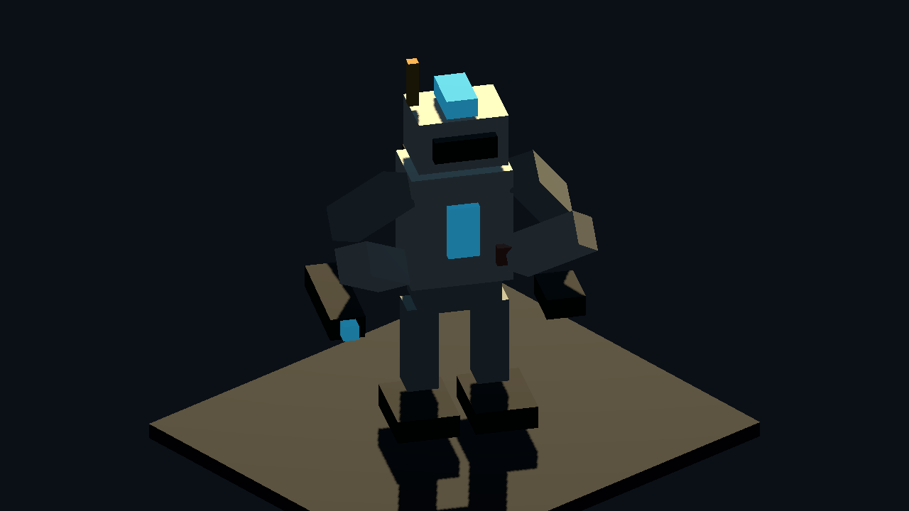

# Meshy Image Droid Source Proof v0

Generated: 2026-07-04 15:19:46
Generator: `docs/gpt/asset_factory/scripts/godot_meshy_image_droid_source_proof.gd`

## Purpose

Create an original, deterministic, blockcraft segmented droid source image before spending Meshy credits on image-to-3D. This lets the Meshy result be compared against an exact zero-credit baseline.

## Meshy Source

`source_reference/blockcraft_segmented_droid_source.png`

## Captures

### droid_source_three_quarter

Deterministic blockcraft segmented service/battle droid source image for Meshy image-to-3D. This is original project-generated geometry, not external art.

### droid_baseline_dark_review

Same deterministic droid under the darker asset-factory review lighting, used as the zero-credit baseline.

### droid_pose_contact_sheet

Rigid segmented droid pose sheet. This checks whether the hand-rolled lane is already sufficient for droids before spending Meshy credits.

## Baseline Verdict

The zero-credit droid is already serviceable as a background segmented NPC/proof actor. The Meshy question should therefore be narrow: can image-to-3D preserve or improve this blockcraft silhouette without melting the cube grammar?
