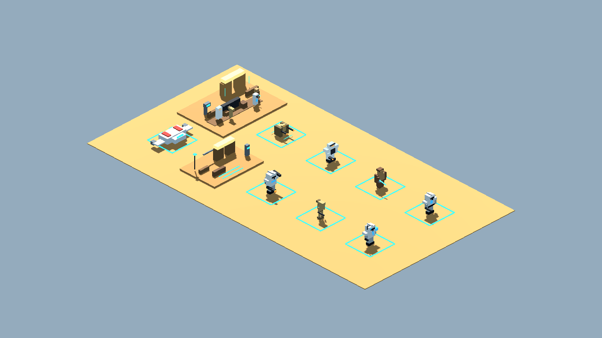
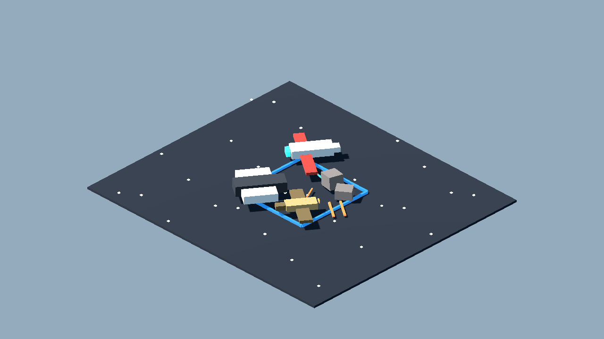
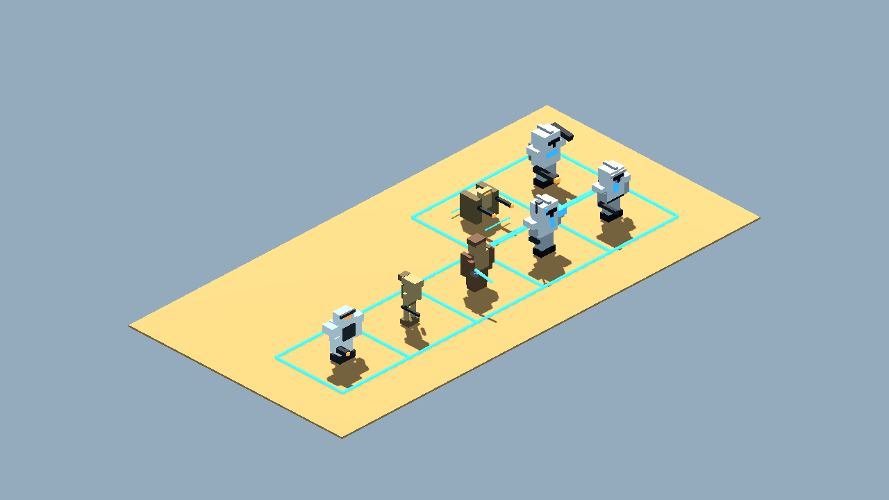
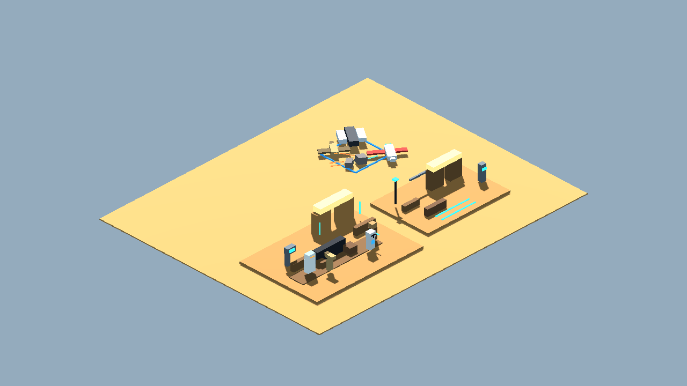
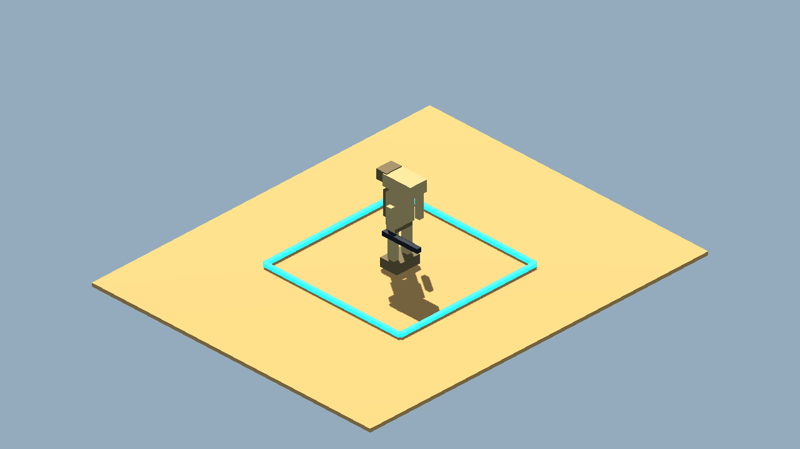
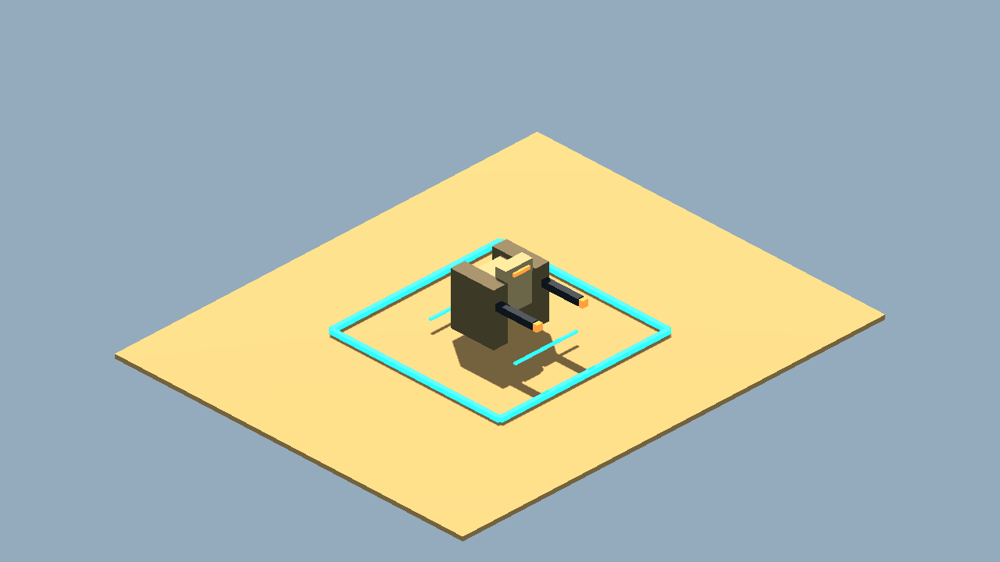
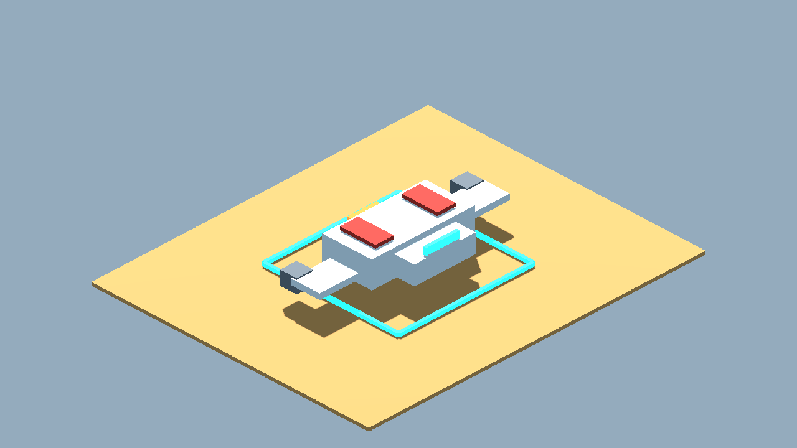

# Private Clone Wars Blockcraft Fan Pack v0 Review Board

Generated: 2026-07-03 23:53:08
Generator: `docs/gpt/asset_factory/scripts/godot_asset_factory.gd`
Spec pack: `private_clone_wars_blockcraft_v0`

## What This Is

These images are captures from generated Godot `.tscn` scenes, not bitmap source art. The source scenes are in `scenes/`; the review camera scenes are in `review_scenes/`.

Pipeline:

```text
JSON spec -> Godot procedural scene -> review scene -> PNG capture -> approve/reject/polish
```

## Contact Sheets










## Individual Captures

| Asset | Category | Gameplay Role | Capture |
| --- | --- | --- | --- |
| Fan Clone Rifleman Block 01 | character_token | clone trooper infantry pawn for private fan table |  |
| Fan Clone Commander Block 01 | character_token | clone commander pawn for private fan table |  |
| Fan Jedi Field Adept Block 01 | character_token | Jedi-style hero support pawn for private fan table |  |
| Fan B1 Battle Droid Block 01 | character_token | B1-style battle droid pawn for private fan table |  |
| Fan B2 Super Battle Droid Block 01 | character_token | B2-style heavy droid pawn for private fan table |  |
| Fan Clone Heavy Block 01 | character_token | clone heavy trooper pawn for private fan table |  |
| Fan Rolling Droid Threat Block 01 | character_token | droideka-inspired rolling shield threat for private fan table |  |
| Fan Outpost Modular Gate Kit 01 | scene_slice | modular desert gate kit test for private fan table |  |
| Fan Clone Wars Outpost Slice 01 | scene_slice | private fan one-screen Clone Wars blockcraft vibe test |  |
| Fan Republic Gunship Token 01 | vehicle_prop | LAAT-like blockcraft gunship landing token for private fan table |  |
| Fan Clone Wars Space Skirmish 01 | space_scene_slice | private fan 2.5D starfighter skirmish readability test |  |

## Review Tags

- `accept-prototype`: good enough to test in gameplay.
- `needs-style-pass`: useful silhouette but ugly detail/materials.
- `needs-remodel`: concept is useful, geometry is not.
- `api-candidate`: worth trying through a 3D generation provider.
- `human-candidate`: too important or too hard for procedural generation.
