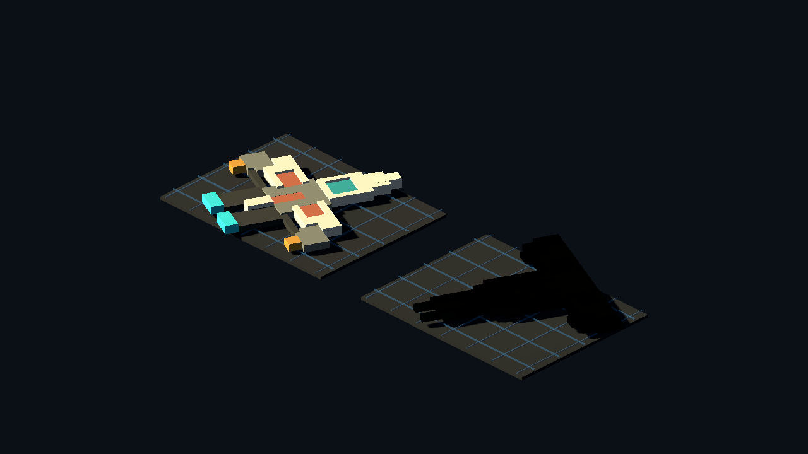

# Vengi Pixel-Card Evaluation v0

Generated: 2026-07-04 14:50:57
Generator: `docs/gpt/asset_factory/scripts/godot_vengi_pixel_card_eval_proof.gd`

## Purpose

Evaluate the installed Vengi 0.5.0 tools against the current deterministic pixel-card lane.

## Local Tool Paths

- `C:/Program Files/vengi/voxconvert/vengi-voxconvert.exe`
- `C:/Program Files/vengi/voxedit/vengi-voxedit.exe`
- `C:/Program Files/vengi/thumbnailer/vengi-thumbnailer.exe`
- `C:/Program Files/vengi/palconvert/vengi-palconvert.exe`

## Tested Commands

PNG source cards converted successfully to flat GLB/VOX. Attempts to use image volume import and `.bbmodel` -> GLB hung in this first probe and were stopped.

## Generated Files

- `pixel_service_terminal_vengi_plane.glb`
- `glb/pixel_patrol_ship_vengi_plane.glb`
- `vox/pixel_service_terminal_vengi_plane.vox`

`gltf-transform validate` found no errors for the tested Vengi GLBs. It reported data-URI-in-GLB warnings, so these are proof artifacts rather than promotion-ready runtime GLBs.

## Captures

### vengi_terminal_same_source_ab

Same 24x24 terminal source card. Left: Godot run-merged voxel bars. Right: Vengi PNG->GLB plane conversion.

### vengi_ship_same_source_ab

Same 32x32 tactical ship source card. Left: Godot run-merged height token. Right: Vengi PNG->GLB plane conversion.

## Verdict

Candidate bridge keep, not a replacement for Godot pixel extrusion or Blender conversion yet.

Vengi is useful immediately as a local installed converter/editor bridge: project pixel cards can become `.vox` for manual voxel-editor work and can become simple flat GLBs. It did not beat the Godot run-merged extrusion for true in-engine voxel props because the successful GLB path is still a flat textured mesh, not cube bars.

Best next Vengi slice: debug a single image-volume conversion command or use `vengi-voxedit` manually on the generated `.vox`, then export GLB and compare again.
