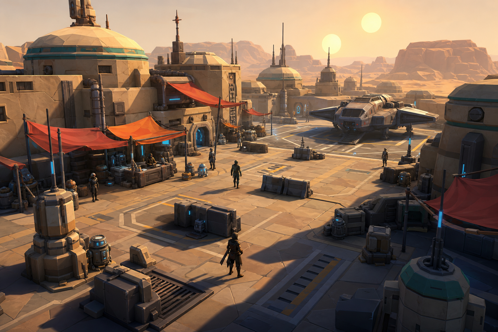
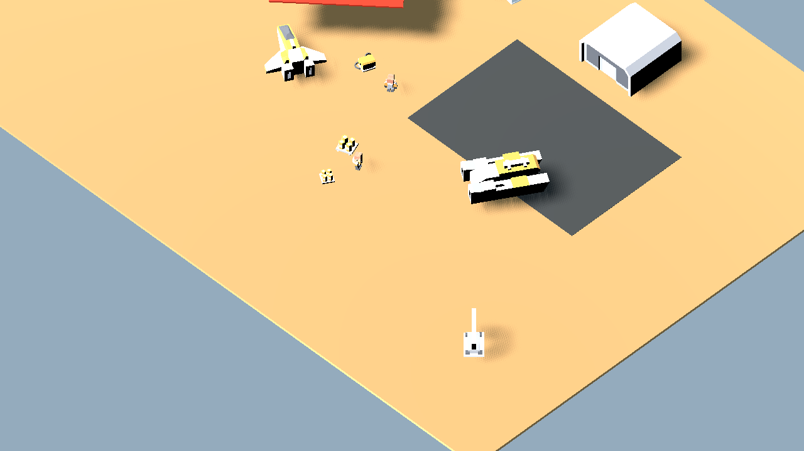
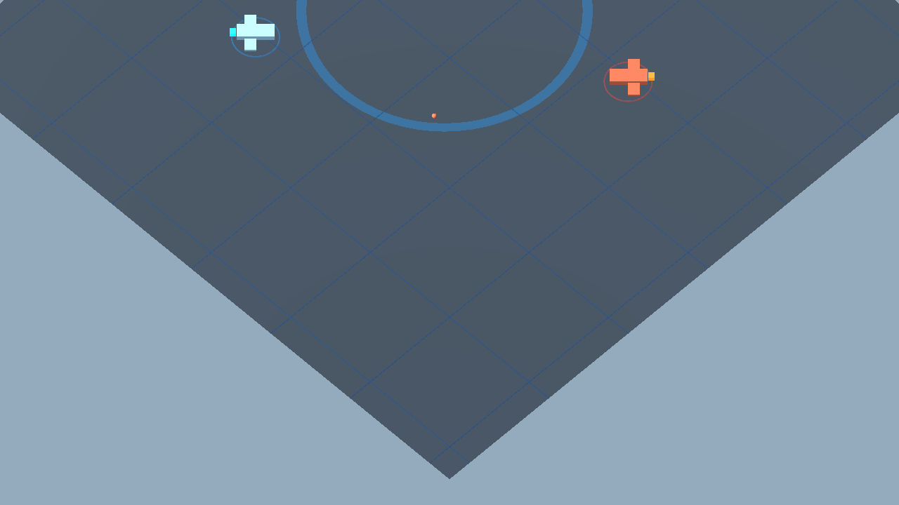
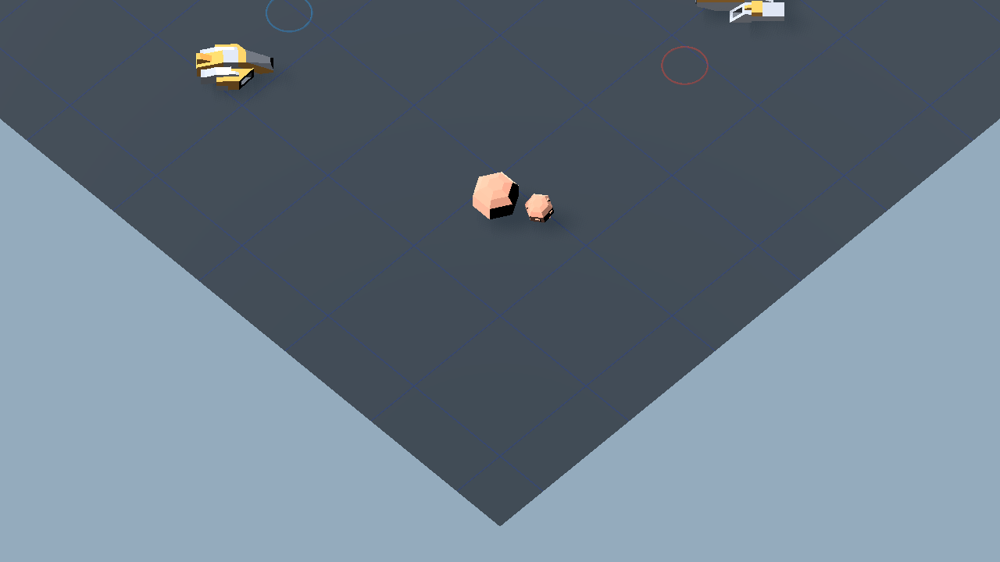

# Visual Evaluation Contact Sheet

Date: 2026-07-03

This page is for quickly comparing three different things:

1. Aspirational concept bitmaps.
2. Primitive Godot blockout scenes.
3. Existing Kenney-asset Godot scenes rendered in Godot.

The concept images are prettier than what the project can currently produce directly. The Godot captures are the more honest implementation reference.

## Ground MMO Direction

### Concept Target



This image is not a production asset. It shows the desired mood: desert spaceport, cohesive lighting, warm/cool palette, cargo clusters, awnings, readable landing bay, and character scale.

### Primitive Godot Blockout


This is made from primitive Godot meshes. It shows the basic camera/composition idea, but it is not visually shippable.

### Existing Kenney Asset Kitbash



This uses existing project GLB assets. It is closer to what Claude can implement cheaply. It is cohesive because the assets share a style, but it still looks toy-like and too white/yellow for Mos Eisley. It needs material overrides, better scale tuning, more grounded desert architecture, and stronger lighting.

## 2.5D Isometric Space Direction

### Concept Target


This captures the intended correction: flat x/y tactical mechanics, but presented through an isometric camera with ship silhouettes, selection rings, movement paths, grid, nebula/parallax, and tactical depth.

### Primitive Godot Blockout



This proves the projection idea: flat tactical plane plus orthographic isometric camera. The ship models here are only primitive placeholder shapes.

### Existing Kenney Asset Kitbash



This uses existing project GLB ships/meteors on a flat tactical plane. It is the most realistic cheap starting point for the 2.5D space layer. It still needs camera framing, material normalization, glow, starfield/nebula layers, and better tactical UI rings/pathing.

## Honest Take

The concept targets are gorgeous because they are rendered art-direction images, not live game scenes. They should guide composition and mood, not be mistaken for assets.

The Godot captures show the real current gap:

- cheap geometry can communicate the projection and layout;
- existing free assets can create a coherent prototype language;
- raw assets alone will not look good;
- a technical art pass is required;
- getting close to the concept art requires either a lot of kitbashing/material work or a human 3D artist.

The practical path is:

```text
Use concept images to choose the target.
Use Kenney/Quaternius/CC0 GLBs as geometry.
Normalize materials and scale.
Compose small hero slices.
Render in Godot with deliberate lighting and cameras.
Only commission/custom-model the pieces that matter most.
```

## Recommendation For Claude

Do not promise that generated bitmaps can become this quality in-game automatically.

Instead:

1. Use Kenney as the first house style for environment geometry.
2. Use Quaternius selectively for characters, creatures, mechs, and ships where Kenney lacks coverage.
3. Normalize Quaternius scale/materials before mixing with Kenney.
4. Create a small polished hero slice rather than improving the whole world at once.
5. Build space as a separate isometric visual mode, not as an overlay.
6. Render screenshots from Godot after each visual pass so the owner judges actual in-engine output.

