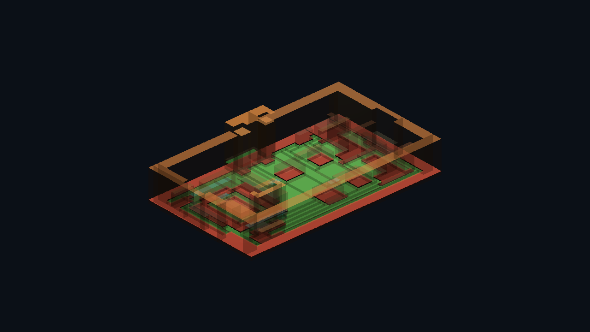
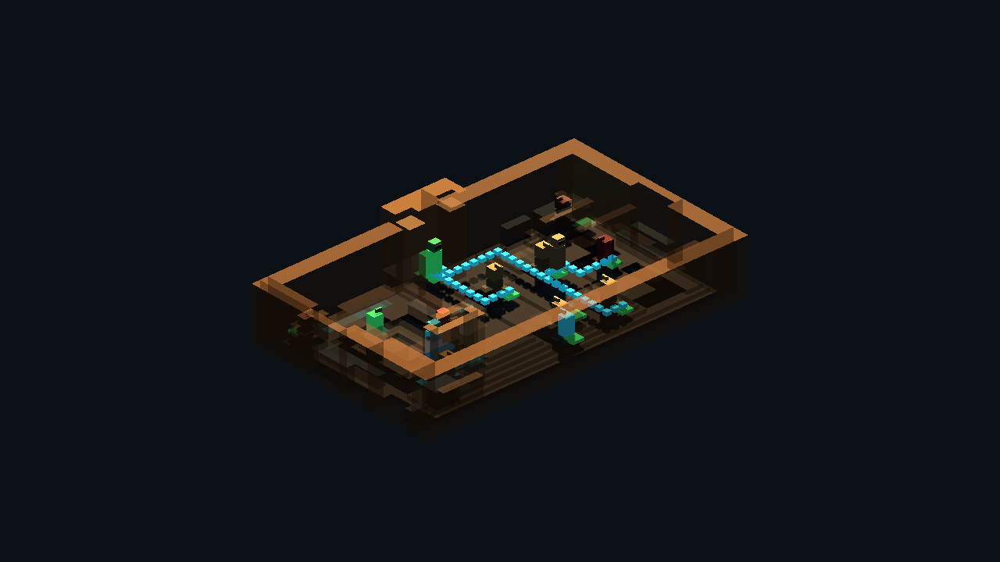

# Pixel Room Runtime Adapter v0

Generated: 2026-07-04 20:08:45
Spec: `res://docs/gpt/asset_factory/specs/pixel_room_cantina_runtime_adapter_v0.json`
Generator: `docs/gpt/asset_factory/scripts/godot_pixel_room_runtime_adapter.gd`

## Purpose

Prove that the Cantina runtime room pipeline can read external JSON semantic cards, explicit socket roles, and path definitions instead of hard-coded GDScript room data.

## Runtime Stats

| Metric | Value |
| --- | ---: |
| Grid size | `48x32` |
| Floor non-empty pixels | 966 |
| Detail non-empty pixels | 141 |
| Walkable pixels | 439 |
| Walkable rectangles | 40 |
| Blocker pixels | 527 |
| Collision shapes | 38 |
| Socket count | 14 |
| Socket roles | `cover:2, inspect:1, light:1, prop:2, seat:4, spawn:1, stand:1, transition:1, use:1` |
| Seat sockets | 4 |
| Stand/spawn sockets | 2 |
| Use/inspect sockets | 2 |
| Cover sockets | 2 |
| Sockets resolved to walk cells | 10 |
| Path probes | 3 |
| Path probe cells | 61 |
| Walk mask reduction vs pixels | 90.9% |
| Collision reduction vs pixels | 92.8% |

## External Source Cards

- `source_images/floor_card.png`
- `source_images/detail_card.png`
- `source_images/walkable_mask.png`
- `source_images/collision_mask.png`

## Named Sockets

| Id | Kind | Role | Facing | Action | Raw grid | Walkable | Resolved path grid | Tags |
| --- | --- | --- | --- | --- | --- | --- | --- | --- |
| `entrance_spawn` | `spawn` | `spawn` | `north` | `` | `24,25` | `false` | `24,24` | `entry, player` |
| `bar_order_anchor` | `interaction` | `use` | `east` | `order_drink` | `34,13` | `true` | `34,13` | `bar, social` |
| `bartender_anchor` | `npc_anchor` | `stand` | `west` | `` | `35,20` | `true` | `35,20` | `bar, staff` |
| `left_booth_table` | `social_table` | `seat` | `south` | `sit` | `15,10` | `false` | `15,8` | `booth, seated` |
| `rear_booth_table` | `social_table` | `seat` | `north` | `sit` | `15,19` | `false` | `15,17` | `booth, seated` |
| `center_table_a` | `social_table` | `seat` | `south` | `sit` | `21,10` | `false` | `19,10` | `table, seated` |
| `center_table_b` | `social_table` | `seat` | `north` | `sit` | `21,19` | `false` | `21,17` | `table, seated` |
| `service_door_anchor` | `transition` | `transition` | `north` | `enter_service_hall` | `35,10` | `true` | `35,10` | `service, door` |
| `no_droids_sign_socket` | `prop_socket` | `inspect` | `south` | `inspect_sign` | `22,8` | `false` | `22,7` | `sign, wall` |
| `bar_light_socket` | `light_socket` | `light` | `down` | `` | `35,10` | `true` | `35,10` | `bar, light` |
| `clutter_socket_left` | `prop_socket` | `prop` | `east` | `` | `8,24` | `false` | `7,22` | `clutter` |
| `clutter_socket_rear` | `prop_socket` | `prop` | `west` | `` | `40,24` | `false` | `40,25` | `clutter` |
| `cover_left_partition` | `cover_anchor` | `cover` | `east` | `take_cover` | `10,16` | `false` | `10,15` | `booth, cover` |
| `cover_bar_corner` | `cover_anchor` | `cover` | `west` | `take_cover` | `31,14` | `false` | `32,14` | `bar, cover` |

## Captures

### adapter_clean_room

External JSON semantic cards rendered as deterministic voxel room geometry.

### adapter_collision_nav_overlay

External JSON semantic cards emitted walkable rectangles, merged collision boxes, and debug overlays.

### adapter_socket_path_probe

Named sockets and grid-routed path probes resolved from the external socket/path JSON.

## Verdict

Candidate adapter keep. This keeps the same deterministic voxel room geometry while moving gameplay affordance roles into the external JSON card spec: seats, stand/spawn anchors, use/inspect prompts, cover anchors, transitions, props, and lights.

Next improvement: run this adapter on a second SW_MUSH Cantina room with a new JSON spec, then compare whether socket/collision stats, role counts, and camera captures stay predictable.
